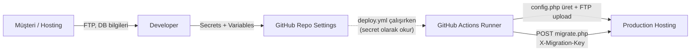
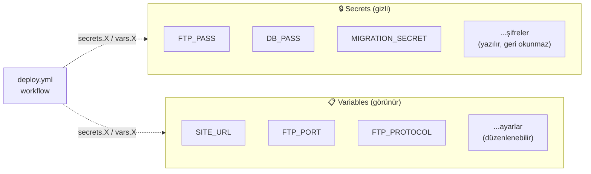
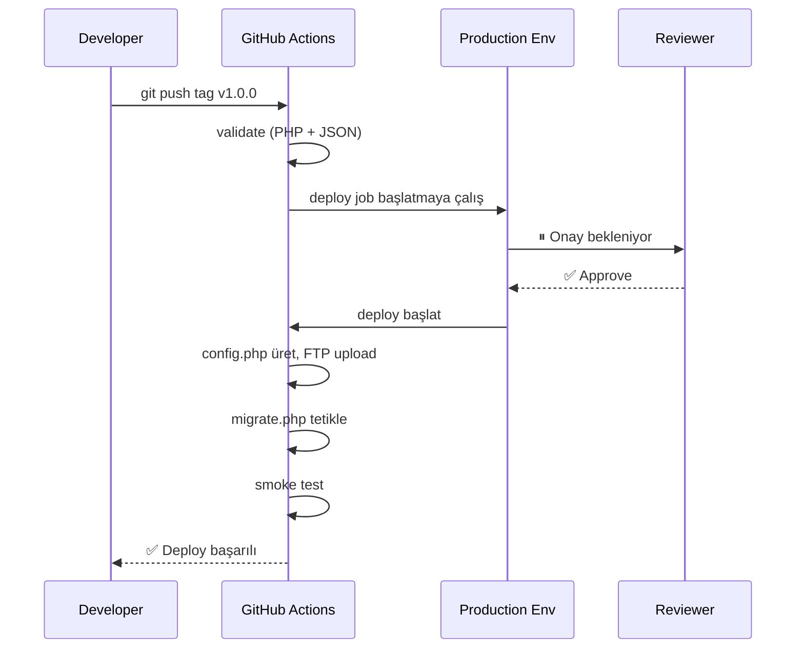
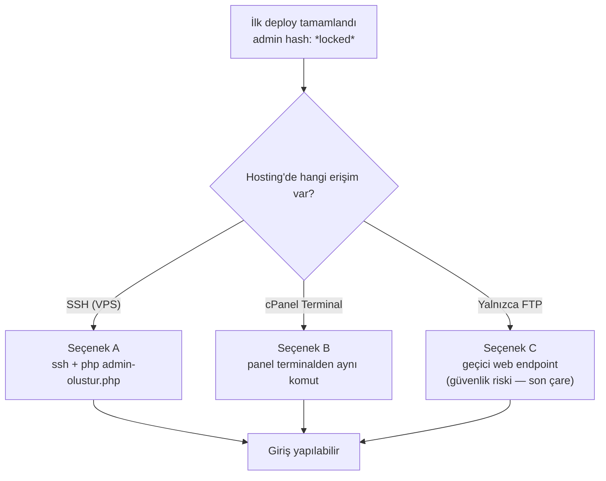
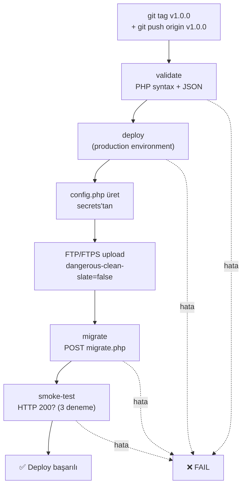
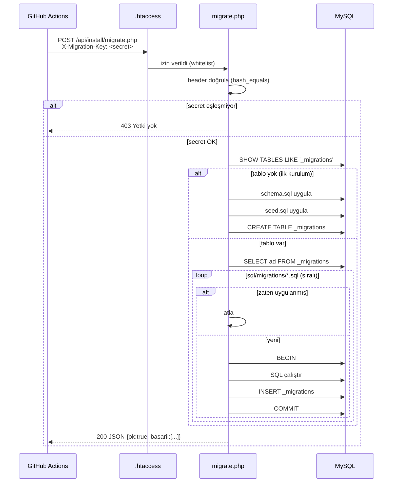
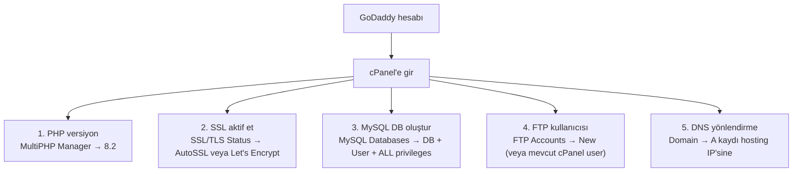

# GitHub Secrets ve Variables Kurulumu

Bu dosya, **deploy.yml** workflow'unun çalışması için GitHub'da yapılacak
ayarların kontrol listesidir.

## Genel akış — kim nereden nereye



> **Müşteriden gelen kritik bilgiler hiçbir yerde clear-text saklanmaz.**
> Yerel notlardan / mesaj geçmişinden temizleyip yalnızca GitHub Secrets'a koy.

---

## 1. Repository Settings'e git

```
GitHub → Repo (cemililik/Ferizli-lkad-m-Akademi) →
  Settings → Secrets and variables → Actions
```

İki sekme görürsün: **Secrets** (gizli) ve **Variables** (görünür).



> **Secret**: şifreler, hassas bilgiler — değer GitHub'da bile geri okunmaz, sadece yazılır.
> **Variable**: hassas olmayan ayarlar (URL, port, protokol vb.) — görüntülenebilir, daha rahat düzenlenir.

---

## 2. Eklenecek Secrets (gizli, 9 adet)

| Ad | GoDaddy / cPanel'de nereden alınır | Örnek değer |
|---|---|---|
| `FTP_HOST` | cPanel → **FTP Accounts** → "Configure FTP Client" → FTP Server | `ftp.ferizliilkadimakademi.com` veya numeric IP |
| `FTP_USER` | cPanel → **FTP Accounts** → Username | `user@ferizliilkadimakademi.com` veya cPanel ana user |
| `FTP_PASS` | FTP hesabı oluşturulurken set ettiğin şifre | (şifre) |
| `DB_HOST` | cPanel → **MySQL Databases** (uzaktan erişim kapalıysa) | `localhost` |
| `DB_PORT` | (sabit) | `3306` |
| `DB_NAME` | cPanel → **MySQL Databases** → "Create New Database" | `cpaneluser_ferizli` (GoDaddy prefix ekler) |
| `DB_USER` | cPanel → **MySQL Databases** → "Add User to Database" | `cpaneluser_ferizli` |
| `DB_PASS` | DB kullanıcısı oluştururken set ettiğin şifre | (şifre) |
| `MIGRATION_SECRET` | **Biz üretiyoruz** (aşağıdaki komutla) | 64 karakter hex |

### MIGRATION_SECRET üretmek

Terminalde:

```bash
openssl rand -hex 32
# Çıktı: 64 hexadecimal karakter, örn:
# a3f5d8e9c2b1a7f6e5d4c3b2a1f0e9d8c7b6a5f4e3d2c1b0a9f8e7d6c5b4a3f2
```

Bu değeri:
1. GitHub'da `MIGRATION_SECRET` secret'ı olarak ekle
2. **Hiçbir yere yazma** — yalnızca workflow çalışırken kullanılır

---

## 3. Eklenecek Variables (gizli değil, 5 zorunlu + 1 opsiyonel)

| Ad | Değer | Açıklama |
|---|---|---|
| `SITE_URL` | `https://ferizliilkadimakademi.com` | Site URL'i, **trailing slash YOK** |
| `FTP_PORT` | `21` | FTPS = 21, SFTP = 22. GoDaddy default `21`. |
| `FTP_PROTOCOL` | `ftps` | `ftps` (önerilen), `sftp` veya `ftp` (son çare) |
| `FTP_REMOTE_PATH` | `/public_html/` | GoDaddy varsayılan web kökü |
| `DEPLOY_DRY_RUN` | `true` (ilk deneme), sonra `false` | Dosyaları yüklemeden simule eder |
| `DEPLOY_METHOD` *(opsiyonel)* | (boş) veya `ssh` | Sadece VPS'de `ssh` yap; GoDaddy shared'da set etme |

---

## 4. Opsiyonel: SSH/VPS yöntemi için ek secrets

`DEPLOY_METHOD=ssh` ise yukarıdaki FTP_* yerine bunları ekle:

| Ad | Tipi | Açıklama |
|---|---|---|
| `SSH_HOST` | secret | VPS IP veya hostname |
| `SSH_USER` | secret | SSH kullanıcı adı (genelde `deploy` veya `ubuntu`) |
| `SSH_PRIVATE_KEY` | secret | Tam private key içeriği (BEGIN/END dahil) |
| `SSH_PORT` | variable | Varsayılan 22 |
| `SSH_REMOTE_PATH` | variable | `/var/www/html/` benzeri tam yol |

### SSH key üretmek

```bash
ssh-keygen -t ed25519 -C "github-deploy-ferizli" -f ~/.ssh/ferizli_deploy
# Şifre sormaz (boş bırak — CI/CD için gerekli)
# İki dosya oluşur:
#   ferizli_deploy       → private key (GitHub'a)
#   ferizli_deploy.pub   → public key (sunucuya ~/.ssh/authorized_keys'e ekle)
```

`ferizli_deploy` dosyasının **tam içeriğini** `SSH_PRIVATE_KEY` secret'ına yapıştır.
`ferizli_deploy.pub` içeriğini sunucudaki ilgili kullanıcının `~/.ssh/authorized_keys`
dosyasına ekle.

---

## 5. Environment koruma (ÖNERİLİR)

Settings → Environments → **production** environment oluştur.

Bu environment'a:
- **Required reviewers**: 1 kişi (kendin) → her deploy öncesi manuel onay
- **Wait timer**: 0 dakika
- Secret'ları **repository-level**'da tut (deploy.yml öyle bekliyor); bunları
  environment-scoped'a taşımak istersen workflow'da migration job da
  `environment: name: production` eklemek gerekir.

Workflow'da **sadece `deploy` job'unda** `environment: production` kullanılıyor.
Onayladığında deploy başlar; sonraki adımlar (`migrate`, `smoke-test`) onay
gerektirmeden otomatik akar.

> ℹ️ **Neden migrate ve smoke-test'te environment yok?**
> Tek bir manuel onay yeterli — onay verildiyse zaten tüm zincirin geçmesi
> isteniyor. Ayrı bir "migration onayı" gereksiz friction yaratırdı.



---

## 6. İlk Deploy Test Listesi

İlk release'e (`v0.1.0`) atmadan önce kontrol et:

**GoDaddy cPanel tarafı:**
- [ ] PHP versiyon **8.2** olarak ayarlandı (MultiPHP Manager)
- [ ] MySQL veritabanı oluşturuldu (DB + User + ALL PRIVILEGES)
- [ ] FTP hesabı bilgileri test edildi (FileZilla / Cyberduck ile manuel deneme)
- [ ] DNS yönlendirmesi yapıldı (domain → hosting IP) → `dig ferizliilkadimakademi.com` ile doğrula
- [ ] SSL aktif (https://ferizliilkadimakademi.com tarayıcıda kilit ikonu)

**GitHub tarafı:**
- [ ] 9 secret set edildi: `FTP_HOST` / `FTP_USER` / `FTP_PASS` / `DB_HOST` / `DB_PORT` / `DB_NAME` / `DB_USER` / `DB_PASS` / `MIGRATION_SECRET`
- [ ] 5 variable set edildi: `SITE_URL` / `FTP_PORT` / `FTP_PROTOCOL` / `FTP_REMOTE_PATH` / `DEPLOY_DRY_RUN`
- [ ] `MIGRATION_SECRET` üretildi (`openssl rand -hex 32`)
- [ ] `DEPLOY_DRY_RUN=true` ilk deneme için
- [ ] Production environment oluşturuldu (opsiyonel ama önerilen)
- [ ] **`api/config.php` veya `.env` dosyalarını git'e eklemedin** (gitignore'da kontrol et)

İlk gerçek deploy:

```bash
git tag v0.1.0
git push origin v0.1.0
# → GitHub Actions otomatik tetiklenir
# → Actions sekmesinden ilerlemeyi izle
```

İlk açılışta `_migrations` tablosu olmadığı için migration endpoint'i
**bootstrap modunda** çalışır: `sql/schema.sql` + `sql/seed.sql` otomatik kurulur.

---

## 7. İlk Deploy Sonrası Admin Şifresi

Bootstrap tamamlandığında `seed.sql` admin'i `*locked*` hash'le ekler.
**Giriş yapamazsın** — gerçek şifre atamak için:



### Seçenek A: SSH varsa
```bash
ssh user@host
cd /public_html/
php api/install/admin-olustur.php
# → kullanıcı adı, e-posta, şifre sorar
```

### Seçenek B: cPanel Terminal varsa
- cPanel → **Advanced → Terminal** → komut: `cd public_html && php api/install/admin-olustur.php`
- ⚠️ GoDaddy'de bu özellik **genelde kapalı**. Yoksa Seçenek C'ye geç.

### Seçenek C: cPanel Cron Jobs (GoDaddy için **önerilen** yöntem)
Detaylı adımlar **§11**'de. Kısaca:
1. Geçici `admin-girdi.txt` dosyası yarat (kullanıcı adı, e-posta, şifre satırları)
2. Cron job: `php api/install/admin-olustur.php < admin-girdi.txt` → 1 dakika sonra çalışır
3. Cron'u ve `admin-girdi.txt`'yi **derhal sil**

### Seçenek D: Hiçbir yöntem çalışmıyorsa (en kötü senaryo)
Geçici olarak `.htaccess`'teki "Require all denied" satırını bypass eden
bir admin-olustur web endpoint'i ekleyebiliriz. Müşteriyle bunu konuşmadan
yapmayalım — güvenlik riski.

---

## 8. CI/CD Akışı Özeti

### Job zinciri



### Migration HTTP isteği (detay)



---

## 9. Sık Sorulan Sorular

**Q: Production'da admin şifresini her seferinde resetlemem gerekir mi?**
A: Hayır. Bir kez admin oluşturduktan sonra DB'de kalır. Migration tekrar
   çalışsa bile `seed.sql` `ON DUPLICATE KEY UPDATE` kullandığı için
   şifreni silmez.

**Q: FTPS desteklemeyen bir hosting'de ne yaparım?**
A: `FTP_PROTOCOL=ftp` yap. Ama düz FTP **güvensizdir** (şifreler clear-text).
   Hosting değiştirmeyi öneririm. Ya da SSH varsa `DEPLOY_METHOD=ssh`'a geç.

**Q: Migration başarısız olursa ne olur?**
A: `migrate.php` her migration'ı transaction içinde çalıştırır → hata olursa
   o migration rollback olur. Önceki başarılı olanlar etkilenmez. Hata
   loglanır, workflow başarısız sayılır, sonraki adımlar (smoke-test) atlanır.

**Q: Manuel olarak migration tetiklemek istiyorum**
A: GitHub Actions sekmesinde "Deploy to Production" workflow'una git →
   "Run workflow" → branch seç → çalıştır. `skip_migrations: false` ile
   migration de çalışır.

**Q: Sadece dosyayı update etmek istiyorum, DB'ye dokunma**
A: "Run workflow" → `skip_migrations: true` işaretle.

**Q: Bir dosyayı yanlışlıkla sildim, sunucudan da silinir mi?**
A: **HAYIR** — `dangerous-clean-slate: false` ayarı sunucuda olan ama
   git'te olmayan dosyaları (örn. veli yüklemeleri) korur. Sadece git'te
   değişen dosyalar update edilir.

---

## 10. GoDaddy Hosting — cPanel'de Yapılması Gerekenler

GoDaddy hesabı satın alındıktan sonra cPanel'e giriş yap:
`https://hosting.godaddy.com` → "My Hosting" → ilgili paket → **cPanel Admin**



### 10.1 PHP versiyon ayarı (kritik)

GoDaddy default PHP 7.4 veya 8.0 ile gelir. Kodumuz **PHP 8.2 gerektirir**.

1. cPanel → **Software → MultiPHP Manager**
2. `ferizliilkadimakademi.com` domain satırını seç
3. Sağ taraftan **PHP 8.2** seç → **Apply**
4. Doğrulama: `https://ferizliilkadimakademi.com/api/` adresine git → JSON cevap görmelisin

### 10.2 SSL sertifikası

GoDaddy'de iki yol:

| Yol | Nasıl |
|---|---|
| **AutoSSL** (önerilen, ücretsiz) | cPanel → **SSL/TLS Status** → "Run AutoSSL" |
| **Manuel Let's Encrypt** | cPanel → "Let's Encrypt SSL" eklentisi varsa → domain seç → kur |

DNS yönlendirmesi tamamlandıktan ~1 saat içinde otomatik aktif olur.

### 10.3 MySQL veritabanı oluşturma

1. cPanel → **Databases → MySQL Databases**
2. **Create New Database** kutusuna `ferizli` yaz → Create
   - GoDaddy prefix ekler: `cpaneluser_ferizli` (cpaneluser = GoDaddy hesap adın)
3. **MySQL Users → Add New User** → kullanıcı adı `ferizli_user` (yine prefix ile birleşir)
4. Güçlü şifre üret (Password Generator)
5. **Add User to Database** → kullanıcıyı oluşturduğun DB'ye bağla → **ALL PRIVILEGES** seç → Make Changes

**GitHub'a koyacağın bilgiler:**
- `DB_NAME` = `cpaneluser_ferizli` (tam ad)
- `DB_USER` = `cpaneluser_ferizli_user`
- `DB_PASS` = (oluşturduğun şifre)
- `DB_HOST` = `localhost`

### 10.4 FTP hesabı

İki seçenek:

**A) cPanel ana hesabını kullan (basit):**
- FTP_HOST: `ftp.ferizliilkadimakademi.com` (DNS yönlendirildikten sonra çalışır)
- FTP_USER: cPanel kullanıcı adı
- FTP_PASS: cPanel şifresi
- ✅ Tam erişim, hızlı kurulum
- ❌ Şifre değişirse her yer etkilenir

**B) Ayrı FTP hesabı oluştur (önerilen):**
1. cPanel → **Files → FTP Accounts**
2. **Add FTP Account**: username `deploy`, directory `/public_html`, quota Unlimited
3. **Create**
4. **Configure FTP Client** → manual settings sekmesinden bilgileri al

### 10.5 DNS yönlendirme

Domain GoDaddy'de, hosting de GoDaddy'de ise **otomatik bağlanmış olabilir**. Kontrol:

```bash
dig +short ferizliilkadimakademi.com
# Çıkış: hosting IP'si (örn. 185.157.232.x)
```

Eğer bağlı değilse:
1. GoDaddy hesabı → **My Products → Domains → DNS**
2. **A** kaydı: `@` → hosting IP'si (cPanel'in sağ üstündeki "Shared IP Address")
3. **CNAME**: `www` → `@`
4. Propagasyon: 15 dk - 24 saat

### 10.6 GoDaddy'ye özel notlar

| Konu | GoDaddy davranışı |
|---|---|
| **SSH erişimi** | "Deluxe" ve üstü paketlerde var, "Economy"de yok. Çoğu shared paketinde **yok** → `DEPLOY_METHOD=ssh` set etme. |
| **Terminal (cPanel)** | Genelde devre dışı. Admin şifre atama için **Cron Jobs** kullan (aşağıda). |
| **Remote MySQL** | Default **kapalı**. CI içinden DB'ye direkt erişmiyoruz zaten — migrate.php HTTPS üzerinden çalışır. |
| **Mod_rewrite** | Açık ✓ (`.htaccess` çalışır) |
| **PHP extensions** | PDO, GD, mbstring varsayılan açık ✓ |
| **Upload max** | Default 64 MB — admin/galeri için yeterli |

---

## 11. İlk Admin Şifresi Atama — GoDaddy Cron Job ile

GoDaddy shared'da terminal yok. Tek seferlik cron job ile `admin-olustur.php` çalıştır:

1. cPanel → **Advanced → Cron Jobs**
2. **Add New Cron Job**:
   - Common Settings: **Once per minute** (geçici)
   - Command:
     ```
     /usr/local/bin/php /home/CPANEL_USER/public_html/api/install/admin-olustur.php < /home/CPANEL_USER/admin-girdi.txt
     ```
3. `/home/CPANEL_USER/admin-girdi.txt` dosyası oluştur (File Manager'dan):
   ```
   admin
   admin@ferizliilkadimakademi.com
   Kurum Yöneticisi
   YENİ_GÜÇLÜ_ŞİFRE
   YENİ_GÜÇLÜ_ŞİFRE
   ```
4. 1 dakika bekle → admin'e giriş yapabilirsin
5. **Cron'u sil + admin-girdi.txt dosyasını sil** (güvenlik için kritik!)

> [!UYARI]
> `admin-girdi.txt` dosyasını **kalıcı bırakma** — düz metin şifre içerir.
> Cron çalıştıktan sonra hem cron'u hem dosyayı sil.

Alternatif (daha temiz): kurum çalışanından kısa bir süreliğine SSH erişimi
verilmesini iste — sadece bu komutu çalıştır:
```bash
ssh user@ferizliilkadimakademi.com
cd public_html
php api/install/admin-olustur.php
# interaktif: kullanıcı adı, eposta, şifre sorar
```

---

## 12. VS Code IDE Uyarıları Hakkında

GitHub Actions extension'ı `deploy.yml`'i açtığında şu **uyarılar (warning, hata değil)** gösterebilir:

```
Context access might be invalid: FTP_HOST
Context access might be invalid: SITE_URL
Context access might be invalid: MIGRATION_SECRET
...
```

**Bunlar hata değil.** Extension repo'da hangi secret/variable'ların tanımlı
olduğunu bilmediği için her `${{ secrets.X }}` ve `${{ vars.Y }}` için bu
uyarıyı veriyor.

**Çözüm:**
1. GitHub'a tüm secret/variable'ları ekle (bu dosyadaki listeden)
2. VS Code'u kapatıp tekrar aç (`Cmd+Q` → yeniden aç) → extension repo'yu
   yeniden tarar, uyarılar kaybolur
3. Veya hiçbir şey yapma — uyarılar push/run'ı engellemez; sadece editör görsel

> ⚠️ **Production environment uyarısı:** `Value 'production' is not valid` hatası
> görürsen, Settings → Environments → **production** environment'ı oluşturduktan
> sonra kaybolur. Bu adım opsiyonel ama önerilen (manuel onay koruma için).
