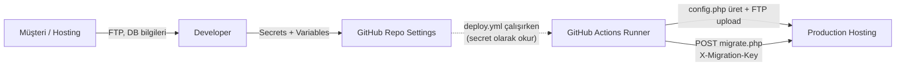
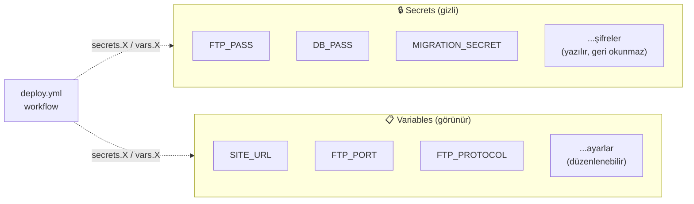
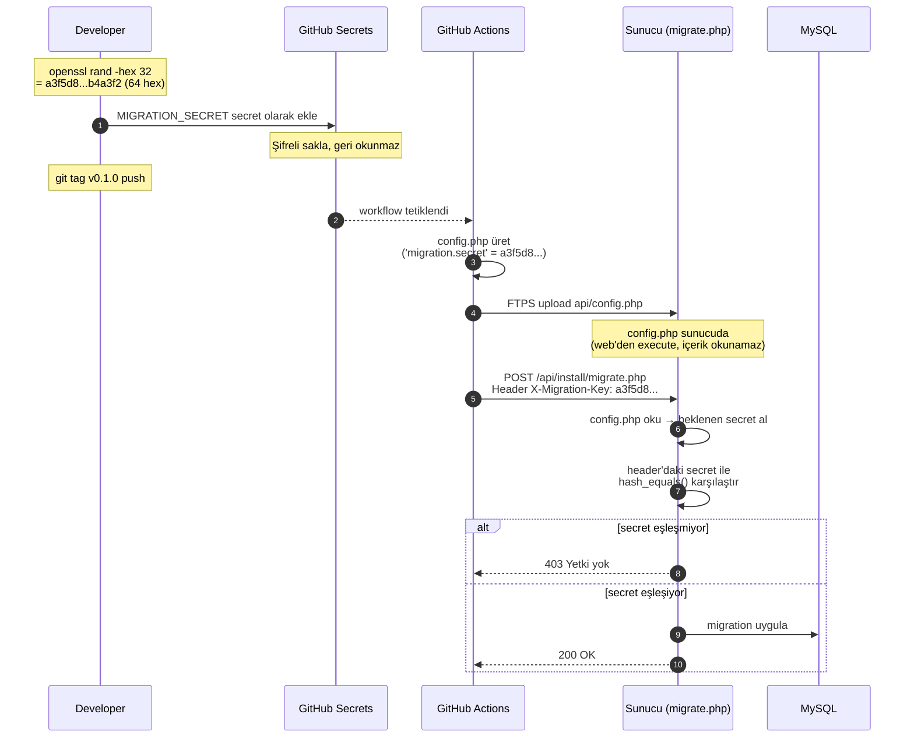
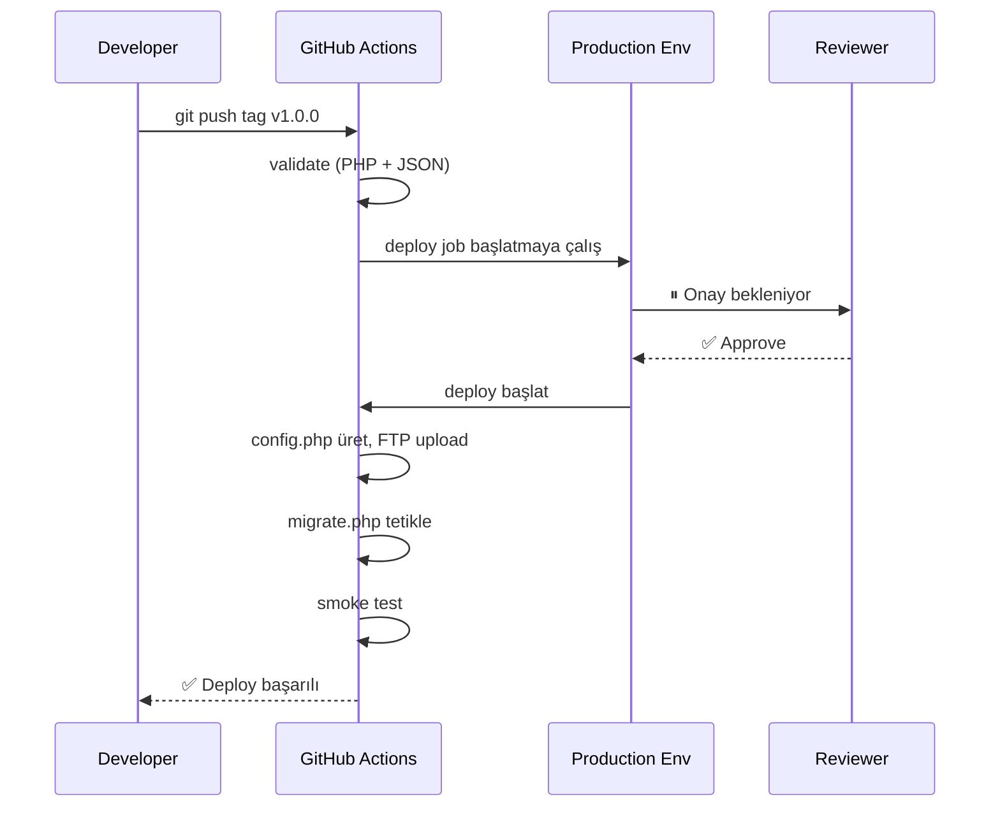
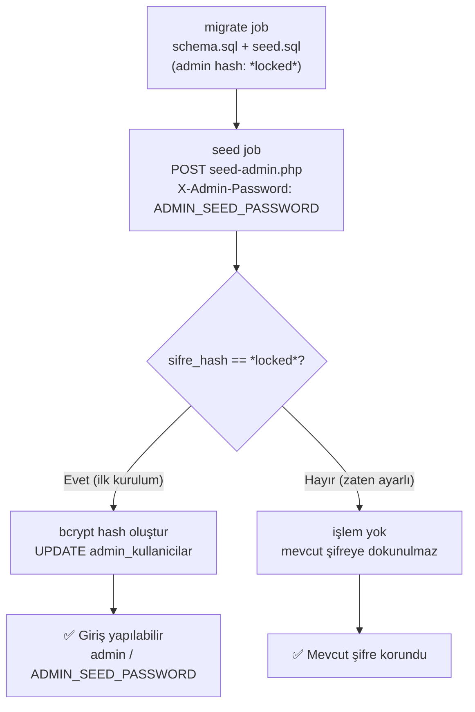
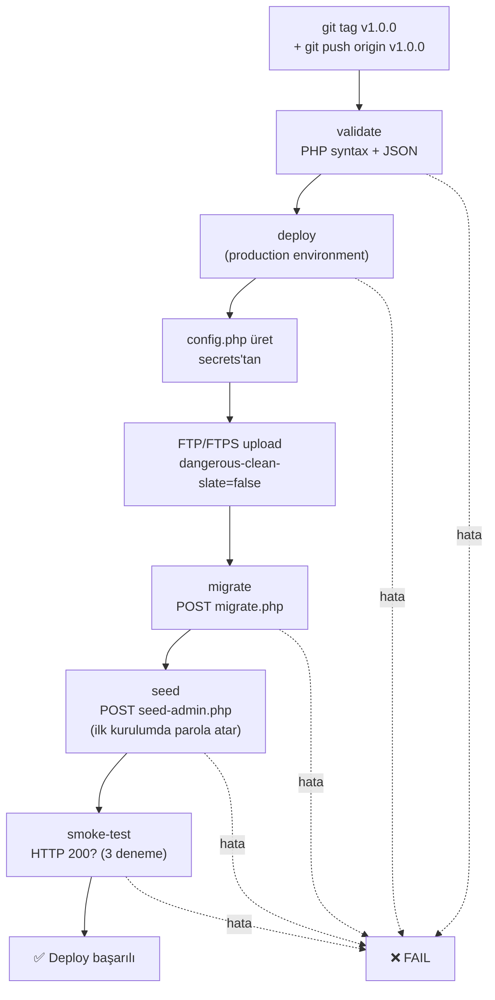
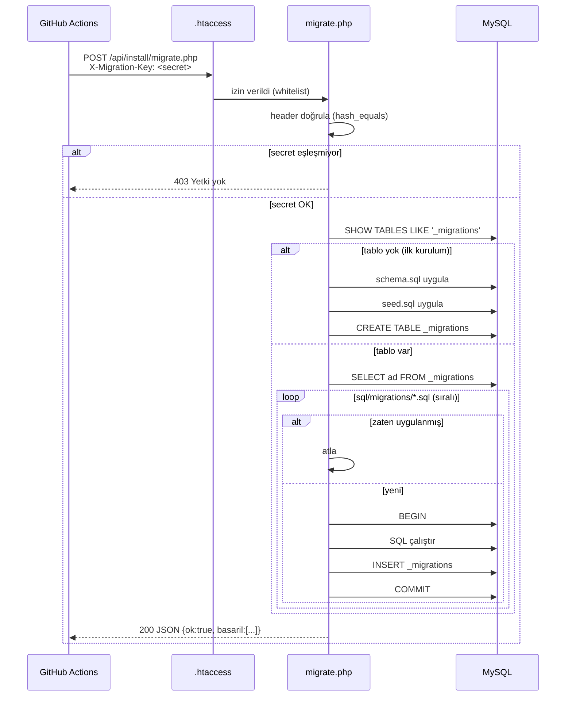
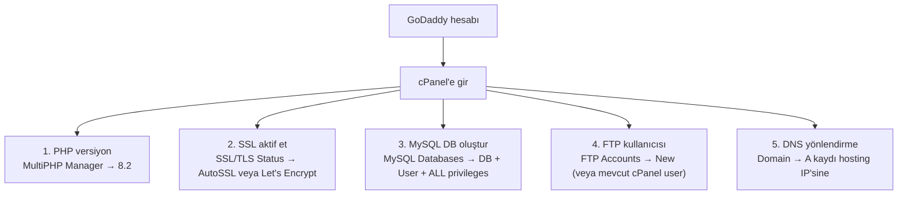

# GitHub Secrets ve Variables Kurulumu

Bu dosya, **deploy.yml** workflow'unun çalışması için GitHub'da yapılacak
ayarların kontrol listesidir.

## Genel akış — kim nereden nereye



> **Müşteriden gelen kritik bilgiler hiçbir yerde clear-text saklanmaz.**
> Yerel notlardan / mesaj geçmişinden temizleyip yalnızca GitHub Secrets'a koy.

---

## 1. Repository Settings'e git

```
GitHub → Repo (cemililik/Ferizli-lkad-m-Akademi) →
  Settings → Secrets and variables → Actions
```

İki sekme görürsün: **Secrets** (gizli) ve **Variables** (görünür).



> **Secret**: şifreler, hassas bilgiler — değer GitHub'da bile geri okunmaz, sadece yazılır.
> **Variable**: hassas olmayan ayarlar (URL, port, protokol vb.) — görüntülenebilir, daha rahat düzenlenir.

---

## 2. Eklenecek Secrets (gizli, 10 adet)

| Ad | GoDaddy / cPanel'de nereden alınır | Örnek değer |
|---|---|---|
| `FTP_HOST` | cPanel → **FTP Accounts** → "Configure FTP Client" → FTP Server | `ftp.ferizliilkadimakademi.com` veya numeric IP |
| `FTP_USER` | cPanel → **FTP Accounts** → Username | `user@ferizliilkadimakademi.com` veya cPanel ana user |
| `FTP_PASS` | FTP hesabı oluşturulurken set ettiğin şifre | (şifre) |
| `DB_HOST` | cPanel → **MySQL Databases** (uzaktan erişim kapalıysa) | `localhost` |
| `DB_PORT` | (sabit) | `3306` |
| `DB_NAME` | cPanel → **MySQL Databases** → "Create New Database" | `cpaneluser_ferizli` (GoDaddy prefix ekler) |
| `DB_USER` | cPanel → **MySQL Databases** → "Add User to Database" | `cpaneluser_ferizli` |
| `DB_PASS` | DB kullanıcısı oluştururken set ettiğin şifre | (şifre) |
| `MIGRATION_SECRET` | **Biz üretiyoruz** (aşağıdaki komutla) | 64 karakter hex |
| `ADMIN_SEED_PASSWORD` | **Biz belirliyoruz** — ilk kurulumda admin parolası | `12345678` (sonra değiştir!) |

> **`ADMIN_SEED_PASSWORD` notu:** Sadece ilk kurulumda (`sifre_hash = '*locked*'`) çalışır.
> Admin parolası bir kez atandıktan sonra bu secret'ın değiştirilmesi etki etmez —
> şifreyi değiştirmek için admin panelinden "Şifre Değiştir" kullan.

### MIGRATION_SECRET üretmek

Terminalde:

```bash
openssl rand -hex 32
# Çıktı: 64 hexadecimal karakter, örn:
# a3f5d8e9c2b1a7f6e5d4c3b2a1f0e9d8c7b6a5f4e3d2c1b0a9f8e7d6c5b4a3f2
```

Bu değeri:
1. GitHub'da `MIGRATION_SECRET` secret'ı olarak ekle
2. **Hiçbir yere yazma** — yalnızca workflow çalışırken kullanılır

---

## 3. Eklenecek Variables (gizli değil, 5 adet)

| Ad | Değer | Açıklama |
|---|---|---|
| `SITE_URL` | `https://ferizliilkadimakademi.com` | Site URL'i, **trailing slash YOK** |
| `FTP_PORT` | `21` | FTPS = 21, SFTP = 22. GoDaddy default `21`. |
| `FTP_PROTOCOL` | `ftps` | `ftps` (önerilen), `sftp` veya `ftp` (son çare) |
| `FTP_REMOTE_PATH` | `/public_html/` | GoDaddy varsayılan web kökü |
| `DEPLOY_DRY_RUN` | `true` (ilk deneme), sonra `false` | Dosyaları yüklemeden simule eder |

---

## 4. MIGRATION_SECRET — Nasıl çalışır?

Diğer secret'lar (FTP/DB credentials) basit: müşteriden alınır, GitHub'a konur,
deploy ediliyor. `MIGRATION_SECRET` ise **paylaşılan parola** mantığıyla çalışır —
CI ve sunucu aynı değeri bilir, eşleştirme yaparak yetkilendirme yapar.

### 4.1 Hangi soruna çözüm getiriyor?

`migrate.php` dosyası internetten erişilebilir bir endpoint'tir:

```
https://ferizliilkadimakademi.com/api/install/migrate.php
```

Eğer korumasız olsa, **herkes** bu URL'e POST atıp DB'yi sıfırlayabilir veya
istenmeyen migration tetikleyebilir. Bu yüzden migrate.php "Sen kimsin?" sorusunu
sorar — cevabı sadece **CI** ve **sunucudaki `config.php`** bilir.

### 4.2 Üç tarafın senkron çalışması



### 4.3 Adım adım akış

| # | Olay | Nerede |
|---|---|---|
| 1 | `openssl rand -hex 32` → 64 karakter hex değer üret | Senin yerel terminalin |
| 2 | Bu değeri GitHub `MIGRATION_SECRET` secret'ı olarak ekle | GitHub Settings → Secrets |
| 3 | Tag push → workflow başlar | GitHub Actions |
| 4 | Workflow `api/config.php` üretir; içine `'migration' => ['secret' => '<DEĞER>']` yazar | CI runner |
| 5 | Bu `config.php` FTPS ile sunucuya yüklenir | `/public_html/api/config.php` |
| 6 | Workflow `POST /api/install/migrate.php` çağrısı yapar<br/>Header'da `X-Migration-Key: <DEĞER>` | CI → Sunucu |
| 7 | `migrate.php` config'den beklenen değeri okur, header'daki ile `hash_equals()` ile karşılaştırır | Sunucu (migrate.php) |
| 8 | Eşleşirse migration uygulanır; eşleşmezse `403 Forbidden` | Sunucu |

### 4.4 Bu yöntem neden güvenli?

| Özellik | Açıklama |
|---|---|
| **256-bit entropi** | 64 hex = 32 byte = 256 bit. Brute-force pratik olarak imkânsız |
| **`hash_equals()`** | Timing-attack güvenli karşılaştırma — saldırgan response süresinden bilgi çıkaramaz |
| **`X-Migration-Key` header** | URL'de değil header'da → server log'larında ve referer'da görünmez |
| **`config.php` web'den okunamaz** | PHP dosyası direkt browse edilince **execute** olur, içeriği görünmez |
| **Git'te yok** | `api/config.php` `.gitignore`'da; sadece sunucuda ve CI runner runtime'ında exists |
| **GitHub at-rest encryption** | Secret store şifrelenmiş; sadece workflow runtime'da decrypt edilir |
| **Log maskelemesi** | GitHub Actions log'larında `***` olarak gizlenir (gördüğün maskeleme bu) |

### 4.5 Secret'ı değiştirmek istersem?

İki yerde aynı anda değişmeli — pratikte sıralı:
1. GitHub Secret → **Update** → yeni 64-hex değer
2. Bir sonraki deploy'da `config.php` otomatik yeni değeri alır ve sunucuya yüklenir

Geçiş anında sorun olmaz çünkü deploy zinciri sıralı: önce config.php upload,
sonra migrate.php tetik. Aynı workflow run'ında iki tarafta aynı değer.

### 4.6 Yeni MIGRATION_SECRET üretmek (zorunlu adım)

```bash
openssl rand -hex 32
# Çıktı: 64 karakter hex, örn:
# a3f5d8e9c2b1a7f6e5d4c3b2a1f0e9d8c7b6a5f4e3d2c1b0a9f8e7d6c5b4a3f2
```

Bu değeri:
1. **Hemen** GitHub'a `MIGRATION_SECRET` secret'ı olarak ekle (clipboard'tan paste)
2. Hiçbir yere yazma — clipboard'ı temizle (`pbcopy < /dev/null` Mac'te)
3. Sadece workflow ve sunucu `config.php`'i bilir

> Bu secret kaybolur veya değişirse `migrate.php` çalışmaz — yeni bir tane üretip
> hem GitHub'a hem (yeni deploy ile) sunucuya senkron yayman gerekir.

---

## 5. Environment koruma (ÖNERİLİR)

Settings → Environments → **production** environment oluştur.

Bu environment'a:
- **Required reviewers**: 1 kişi (kendin) → her deploy öncesi manuel onay
- **Wait timer**: 0 dakika
- Secret'ları **repository-level**'da tut (deploy.yml öyle bekliyor); bunları
  environment-scoped'a taşımak istersen workflow'da migration job da
  `environment: name: production` eklemek gerekir.

Workflow'da **sadece `deploy` job'unda** `environment: production` kullanılıyor.
Onayladığında deploy başlar; sonraki adımlar (`migrate`, `smoke-test`) onay
gerektirmeden otomatik akar.

> ℹ️ **Neden migrate ve smoke-test'te environment yok?**
> Tek bir manuel onay yeterli — onay verildiyse zaten tüm zincirin geçmesi
> isteniyor. Ayrı bir "migration onayı" gereksiz friction yaratırdı.



---

## 6. İlk Deploy Test Listesi

İlk release'e (`v0.1.0`) atmadan önce kontrol et:

**GoDaddy cPanel tarafı:**
- [ ] PHP versiyon **8.2** olarak ayarlandı (MultiPHP Manager)
- [ ] MySQL veritabanı oluşturuldu (DB + User + ALL PRIVILEGES)
- [ ] FTP hesabı bilgileri test edildi (FileZilla / Cyberduck ile manuel deneme)
- [ ] DNS yönlendirmesi yapıldı (domain → hosting IP) → `dig ferizliilkadimakademi.com` ile doğrula
- [ ] SSL aktif (https://ferizliilkadimakademi.com tarayıcıda kilit ikonu)

**GitHub tarafı:**
- [ ] 10 secret set edildi: `FTP_HOST` / `FTP_USER` / `FTP_PASS` / `DB_HOST` / `DB_PORT` / `DB_NAME` / `DB_USER` / `DB_PASS` / `MIGRATION_SECRET` / `ADMIN_SEED_PASSWORD`
- [ ] 5 variable set edildi: `SITE_URL` / `FTP_PORT` / `FTP_PROTOCOL` / `FTP_REMOTE_PATH` / `DEPLOY_DRY_RUN`
- [ ] `MIGRATION_SECRET` üretildi (`openssl rand -hex 32`)
- [ ] `DEPLOY_DRY_RUN=true` ilk deneme için
- [ ] Production environment oluşturuldu (opsiyonel ama önerilen)
- [ ] **`api/config.php` veya `.env` dosyalarını git'e eklemedin** (gitignore'da kontrol et)

İlk gerçek deploy:

```bash
git tag v0.1.0
git push origin v0.1.0
# → GitHub Actions otomatik tetiklenir
# → Actions sekmesinden ilerlemeyi izle
```

İlk açılışta `_migrations` tablosu olmadığı için migration endpoint'i
**bootstrap modunda** çalışır: `sql/schema.sql` + `sql/seed.sql` otomatik kurulur.

---

## 7. İlk Deploy Sonrası Admin Şifresi

**Bu adım artık tamamen otomatik.** Deploy zinciri şöyle çalışır:



İlk açılışta `ADMIN_SEED_PASSWORD` secret'ındaki değerle (`12345678`) giriş yapabilirsin.
**Açılıştan hemen sonra admin panelinden şifreyi değiştir.**

> **Mevcut sunucuya tekrar deploy:** `sifre_hash` artık `*locked*` değilse
> `seed` adımı "zaten_ayarlı" döner ve mevcut şifreye dokunmaz — idempotent.

---

## 8. CI/CD Akışı Özeti

### Job zinciri



### Migration HTTP isteği (detay)



---

## 9. Sık Sorulan Sorular

**Q: Production'da admin şifresini her seferinde resetlemem gerekir mi?**
A: Hayır. Bir kez admin oluşturduktan sonra DB'de kalır. Migration tekrar
   çalışsa bile `seed.sql` `ON DUPLICATE KEY UPDATE` kullandığı için
   şifreni silmez.

**Q: FTPS desteklemeyen bir hosting'de ne yaparım?**
A: `FTP_PROTOCOL=ftp` yap. Ama düz FTP **güvensizdir** (şifreler clear-text).
   Hosting değiştirmeyi öneririm.

**Q: Migration başarısız olursa ne olur?**
A: `migrate.php` her migration'ı transaction içinde çalıştırır → hata olursa
   o migration rollback olur. Önceki başarılı olanlar etkilenmez. Hata
   loglanır, workflow başarısız sayılır, sonraki adımlar (smoke-test) atlanır.

**Q: Manuel olarak migration tetiklemek istiyorum**
A: GitHub Actions sekmesinde "Deploy to Production" workflow'una git →
   "Run workflow" → branch seç → çalıştır. `skip_migrations: false` ile
   migration de çalışır.

**Q: Sadece dosyayı update etmek istiyorum, DB'ye dokunma**
A: "Run workflow" → `skip_migrations: true` işaretle.

**Q: Bir dosyayı yanlışlıkla sildim, sunucudan da silinir mi?**
A: **HAYIR** — `dangerous-clean-slate: false` ayarı sunucuda olan ama
   git'te olmayan dosyaları (örn. veli yüklemeleri) korur. Sadece git'te
   değişen dosyalar update edilir.

---

## 10. GoDaddy Hosting — cPanel'de Yapılması Gerekenler

GoDaddy hesabı satın alındıktan sonra cPanel'e giriş yap:
`https://hosting.godaddy.com` → "My Hosting" → ilgili paket → **cPanel Admin**



### 10.1 PHP versiyon ayarı (kritik)

GoDaddy default PHP 7.4 veya 8.0 ile gelir. Kodumuz **PHP 8.2 gerektirir**.

1. cPanel → **Software → MultiPHP Manager**
2. `ferizliilkadimakademi.com` domain satırını seç
3. Sağ taraftan **PHP 8.2** seç → **Apply**
4. Doğrulama: `https://ferizliilkadimakademi.com/api/` adresine git → JSON cevap görmelisin

### 10.2 SSL sertifikası

GoDaddy'de iki yol:

| Yol | Nasıl |
|---|---|
| **AutoSSL** (önerilen, ücretsiz) | cPanel → **SSL/TLS Status** → "Run AutoSSL" |
| **Manuel Let's Encrypt** | cPanel → "Let's Encrypt SSL" eklentisi varsa → domain seç → kur |

DNS yönlendirmesi tamamlandıktan ~1 saat içinde otomatik aktif olur.

### 10.3 MySQL veritabanı oluşturma

1. cPanel → **Databases → MySQL Databases**
2. **Create New Database** kutusuna `ferizli` yaz → Create
   - GoDaddy prefix ekler: `cpaneluser_ferizli` (cpaneluser = GoDaddy hesap adın)
3. **MySQL Users → Add New User** → kullanıcı adı `ferizli_user` (yine prefix ile birleşir)
4. Güçlü şifre üret (Password Generator)
5. **Add User to Database** → kullanıcıyı oluşturduğun DB'ye bağla → **ALL PRIVILEGES** seç → Make Changes

**GitHub'a koyacağın bilgiler:**
- `DB_NAME` = `cpaneluser_ferizli` (tam ad)
- `DB_USER` = `cpaneluser_ferizli_user`
- `DB_PASS` = (oluşturduğun şifre)
- `DB_HOST` = `localhost`

### 10.4 FTP hesabı

İki seçenek:

**A) cPanel ana hesabını kullan (basit):**
- FTP_HOST: `ftp.ferizliilkadimakademi.com` (DNS yönlendirildikten sonra çalışır)
- FTP_USER: cPanel kullanıcı adı
- FTP_PASS: cPanel şifresi
- ✅ Tam erişim, hızlı kurulum
- ❌ Şifre değişirse her yer etkilenir

**B) Ayrı FTP hesabı oluştur (önerilen):**
1. cPanel → **Files → FTP Accounts**
2. **Add FTP Account**: username `deploy`, directory `/public_html`, quota Unlimited
3. **Create**
4. **Configure FTP Client** → manual settings sekmesinden bilgileri al

### 10.5 DNS yönlendirme

Domain GoDaddy'de, hosting de GoDaddy'de ise **otomatik bağlanmış olabilir**. Kontrol:

```bash
dig +short ferizliilkadimakademi.com
# Çıkış: hosting IP'si (örn. 185.157.232.x)
```

Eğer bağlı değilse:
1. GoDaddy hesabı → **My Products → Domains → DNS**
2. **A** kaydı: `@` → hosting IP'si (cPanel'in sağ üstündeki "Shared IP Address")
3. **CNAME**: `www` → `@`
4. Propagasyon: 15 dk - 24 saat

### 10.6 GoDaddy'ye özel notlar

| Konu | GoDaddy davranışı |
|---|---|
| **SSH erişimi** | Bu workflow yalnızca FTPS kullanır. SSH gerekmez. |
| **Terminal (cPanel)** | Genelde devre dışı. Admin şifre atama için **Cron Jobs** kullan (aşağıda). |
| **Remote MySQL** | Default **kapalı**. CI içinden DB'ye direkt erişmiyoruz zaten — migrate.php HTTPS üzerinden çalışır. |
| **Mod_rewrite** | Açık ✓ (`.htaccess` çalışır) |
| **PHP extensions** | PDO, GD, mbstring varsayılan açık ✓ |
| **Upload max** | Default 64 MB — admin/galeri için yeterli |

---

## 11. İlk Admin Şifresi Atama — GoDaddy Cron Job ile

GoDaddy shared'da terminal yok. Tek seferlik cron job ile `admin-olustur.php` çalıştır:

1. cPanel → **Advanced → Cron Jobs**
2. **Add New Cron Job**:
   - Common Settings: **Once per minute** (geçici)
   - Command:
     ```
     /usr/local/bin/php /home/CPANEL_USER/public_html/api/install/admin-olustur.php < /home/CPANEL_USER/admin-girdi.txt
     ```
3. `/home/CPANEL_USER/admin-girdi.txt` dosyası oluştur (File Manager'dan):
   ```
   admin
   admin@ferizliilkadimakademi.com
   Kurum Yöneticisi
   YENİ_GÜÇLÜ_ŞİFRE
   YENİ_GÜÇLÜ_ŞİFRE
   ```
4. 1 dakika bekle → admin'e giriş yapabilirsin
5. **Cron'u sil + admin-girdi.txt dosyasını sil** (güvenlik için kritik!)

> [!UYARI]
> `admin-girdi.txt` dosyasını **kalıcı bırakma** — düz metin şifre içerir.
> Cron çalıştıktan sonra hem cron'u hem dosyayı sil.

Alternatif (daha temiz): kurum çalışanından kısa bir süreliğine SSH erişimi
verilmesini iste — sadece bu komutu çalıştır:
```bash
ssh user@ferizliilkadimakademi.com
cd public_html
php api/install/admin-olustur.php
# interaktif: kullanıcı adı, eposta, şifre sorar
```

---

## 12. VS Code IDE Uyarıları Hakkında

GitHub Actions extension'ı `deploy.yml`'i açtığında şu **uyarılar (warning, hata değil)** gösterebilir:

```
Context access might be invalid: FTP_HOST
Context access might be invalid: SITE_URL
Context access might be invalid: MIGRATION_SECRET
Context access might be invalid: ADMIN_SEED_PASSWORD
...
```

**Bunlar hata değil.** Extension repo'da hangi secret/variable'ların tanımlı
olduğunu bilmediği için her `${{ secrets.X }}` ve `${{ vars.Y }}` için bu
uyarıyı veriyor.

**Çözüm:**
1. GitHub'a tüm secret/variable'ları ekle (bu dosyadaki listeden)
2. VS Code'u kapatıp tekrar aç (`Cmd+Q` → yeniden aç) → extension repo'yu
   yeniden tarar, uyarılar kaybolur
3. Veya hiçbir şey yapma — uyarılar push/run'ı engellemez; sadece editör görsel

> ⚠️ **Production environment uyarısı:** `Value 'production' is not valid` hatası
> görürsen, Settings → Environments → **production** environment'ı oluşturduktan
> sonra kaybolur. Bu adım opsiyonel ama önerilen (manuel onay koruma için).
