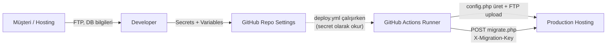
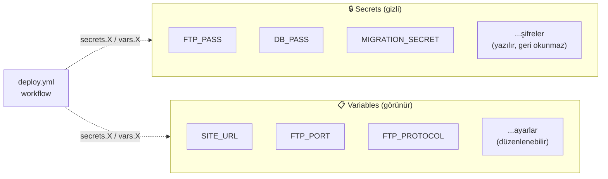
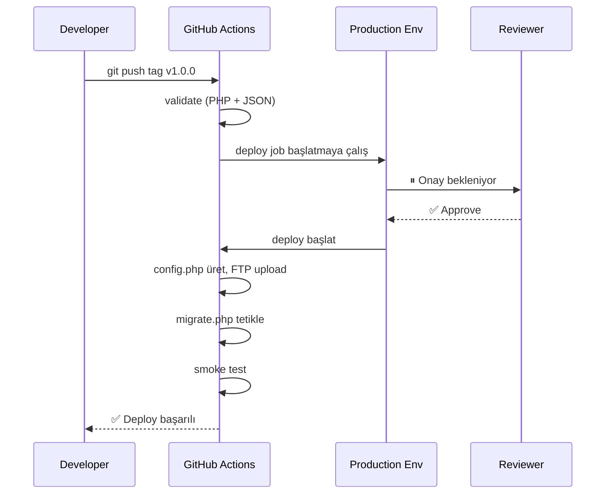
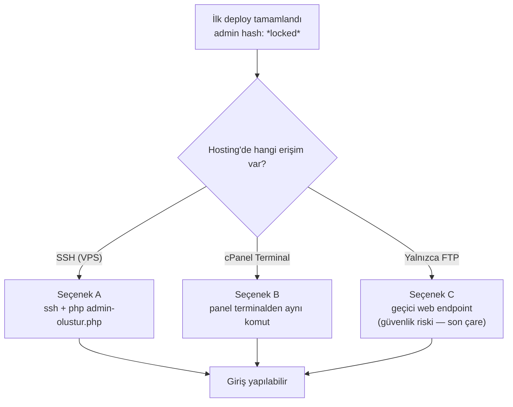
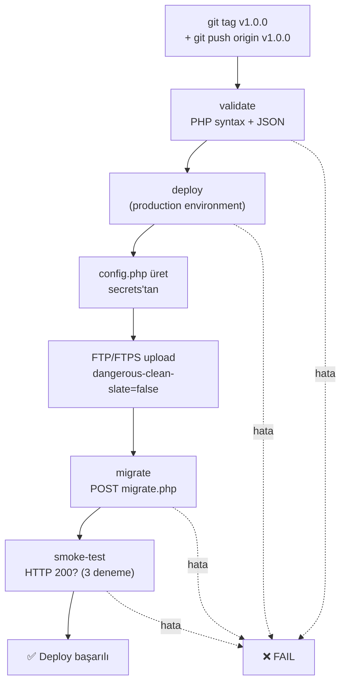
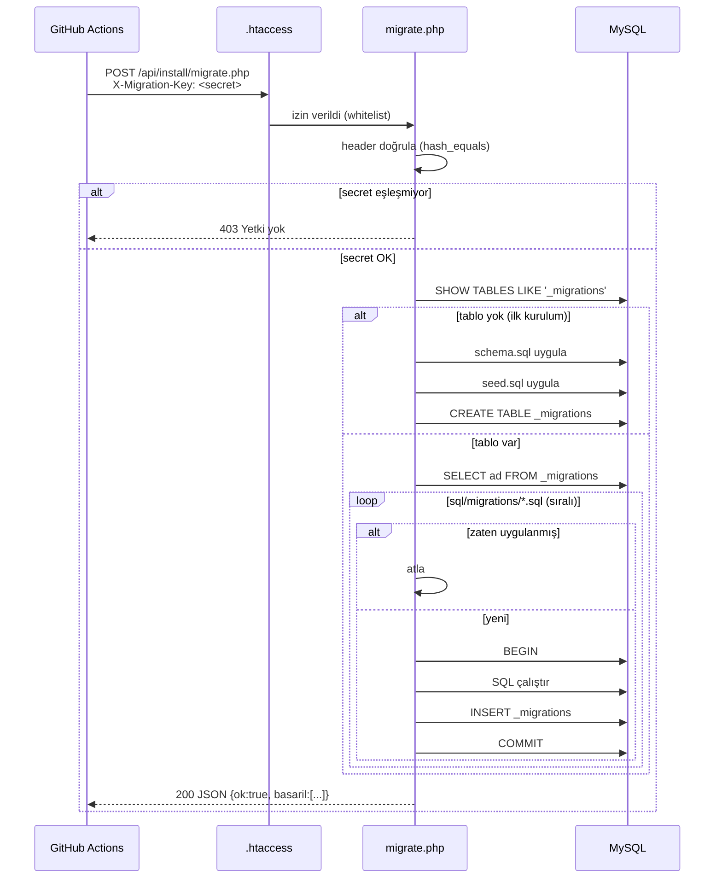

# GitHub Secrets ve Variables Kurulumu

Bu dosya, **deploy.yml** workflow'unun çalışması için GitHub'da yapılacak
ayarların kontrol listesidir.

## Genel akış — kim nereden nereye



> **Müşteriden gelen kritik bilgiler hiçbir yerde clear-text saklanmaz.**
> Yerel notlardan / mesaj geçmişinden temizleyip yalnızca GitHub Secrets'a koy.

---

## 1. Repository Settings'e git

```
GitHub → Repo (cemililik/Ferizli-lkad-m-Akademi) →
  Settings → Secrets and variables → Actions
```

İki sekme görürsün: **Secrets** (gizli) ve **Variables** (görünür).



> **Secret**: şifreler, hassas bilgiler — değer GitHub'da bile geri okunmaz, sadece yazılır.
> **Variable**: hassas olmayan ayarlar (URL, port, protokol vb.) — görüntülenebilir, daha rahat düzenlenir.

---

## 2. Eklenecek Secrets (gizli, 8 adet)

| Ad | Örnek değer | Açıklama |
|---|---|---|
| `FTP_HOST` | `ftp.ferizliilkadim.com` veya `185.x.x.x` | Hosting FTP sunucusu |
| `FTP_USER` | `ferizli@ferizliilkadim.com` veya `u123456789` | FTP kullanıcı adı |
| `FTP_PASS` | `********` | FTP şifresi |
| `DB_HOST` | `localhost` veya `mysql.hostingsiteniz.com` | MySQL sunucu adresi |
| `DB_PORT` | `3306` | Genelde 3306 (yine de secret olarak tut) |
| `DB_NAME` | `u123456789_ferizli` | Veritabanı adı |
| `DB_USER` | `u123456789_ferizli` | Veritabanı kullanıcısı |
| `DB_PASS` | `********` | Veritabanı şifresi |
| `MIGRATION_SECRET` | (aşağıdaki komutla üret) | Migration HTTP endpoint koruma anahtarı |

### MIGRATION_SECRET üretmek

Terminalde:

```bash
openssl rand -hex 32
# Çıktı: 64 hexadecimal karakter, örn:
# a3f5d8e9c2b1a7f6e5d4c3b2a1f0e9d8c7b6a5f4e3d2c1b0a9f8e7d6c5b4a3f2
```

Bu değeri:
1. GitHub'da `MIGRATION_SECRET` secret'ı olarak ekle
2. **Hiçbir yere yazma** — yalnızca workflow çalışırken kullanılır

---

## 3. Eklenecek Variables (gizli değil, 5 adet)

| Ad | Örnek değer | Açıklama |
|---|---|---|
| `SITE_URL` | `https://ferizliilkadim.com` | Site URL'i, **trailing slash YOK** |
| `FTP_PORT` | `21` | FTPS = 21, SFTP = 22 |
| `FTP_PROTOCOL` | `ftps` | `ftps` (önerilen), `sftp` veya `ftp` (son çare) |
| `FTP_REMOTE_PATH` | `/public_html/` veya `/htdocs/` | Hosting'in web kök dizini |
| `DEPLOY_METHOD` | `ftp` veya `ssh` | VPS kullanılıyorsa `ssh` |
| `DEPLOY_DRY_RUN` | `false` veya `true` | İlk denemede `true` yap — dosyaları yüklemeden simule eder |

---

## 4. Opsiyonel: SSH/VPS yöntemi için ek secrets

`DEPLOY_METHOD=ssh` ise yukarıdaki FTP_* yerine bunları ekle:

| Ad | Tipi | Açıklama |
|---|---|---|
| `SSH_HOST` | secret | VPS IP veya hostname |
| `SSH_USER` | secret | SSH kullanıcı adı (genelde `deploy` veya `ubuntu`) |
| `SSH_PRIVATE_KEY` | secret | Tam private key içeriği (BEGIN/END dahil) |
| `SSH_PORT` | variable | Varsayılan 22 |
| `SSH_REMOTE_PATH` | variable | `/var/www/html/` benzeri tam yol |

### SSH key üretmek

```bash
ssh-keygen -t ed25519 -C "github-deploy-ferizli" -f ~/.ssh/ferizli_deploy
# Şifre sormaz (boş bırak — CI/CD için gerekli)
# İki dosya oluşur:
#   ferizli_deploy       → private key (GitHub'a)
#   ferizli_deploy.pub   → public key (sunucuya ~/.ssh/authorized_keys'e ekle)
```

`ferizli_deploy` dosyasının **tam içeriğini** `SSH_PRIVATE_KEY` secret'ına yapıştır.
`ferizli_deploy.pub` içeriğini sunucudaki ilgili kullanıcının `~/.ssh/authorized_keys`
dosyasına ekle.

---

## 5. Environment koruma (ÖNERİLİR)

Settings → Environments → **production** environment oluştur.

Bu environment'a:
- **Required reviewers**: 1 kişi (kendin) → her deploy öncesi manuel onay
- **Wait timer**: 0 dakika
- Yukarıdaki secrets'ı buraya da koy (yalnız environment-scoped olur, daha güvenli)

Workflow zaten `environment: production` kullanıyor — bu adımı yaparsan deploy öncesi
GitHub'da bir "Approve" düğmesi görürsün. Yanlışlıkla deploy'a karşı koruma.



---

## 6. İlk Deploy Test Listesi

İlk release'e (`v0.1.0`) atmadan önce kontrol et:

- [ ] `FTP_HOST` / `FTP_USER` / `FTP_PASS` set edildi
- [ ] FTP bilgileri bir FTP istemcisinden (FileZilla, Cyberduck) test edildi
- [ ] `FTP_REMOTE_PATH` doğru dizin (`/public_html/`, vb.)
- [ ] `DB_*` set edildi ve hosting panelinden test edildi
- [ ] `SITE_URL` doğru (https ile)
- [ ] `MIGRATION_SECRET` üretildi ve eklendi
- [ ] `DEPLOY_DRY_RUN=true` → kuru çalıştırma yap, ne yükleneceğini gör
- [ ] Production environment oluşturuldu (opsiyonel ama önerilen)
- [ ] **`api/config.php` veya `.env` dosyalarını eklemedin** (gitignore'da, doğru)

İlk gerçek deploy:

```bash
git tag v0.1.0
git push origin v0.1.0
# → GitHub Actions otomatik tetiklenir
# → Actions sekmesinden ilerlemeyi izle
```

İlk açılışta `_migrations` tablosu olmadığı için migration endpoint'i
**bootstrap modunda** çalışır: `sql/schema.sql` + `sql/seed.sql` otomatik kurulur.

---

## 7. İlk Deploy Sonrası Admin Şifresi

Bootstrap tamamlandığında `seed.sql` admin'i `*locked*` hash'le ekler.
**Giriş yapamazsın** — gerçek şifre atamak için:



### Seçenek A: SSH varsa
```bash
ssh user@host
cd /public_html/
php api/install/admin-olustur.php
# → kullanıcı adı, e-posta, şifre sorar
```

### Seçenek B: SSH yoksa (cPanel terminali / hosting paneli)
- Çoğu cPanel paneli "Terminal" özelliği sunar → aynı komut
- Veya cron job olarak tek seferlik scheduled: `php /home/user/public_html/api/install/admin-olustur.php`

### Seçenek C: Hiçbir terminal yoksa (en kötü senaryo)
Geçici olarak `.htaccess`'teki "Require all denied" satırını bypass eden
bir admin-olustur web endpoint'i ekleyebiliriz. Müşteriyle bunu konuşmadan
yapmayalım — güvenlik riski.

---

## 8. CI/CD Akışı Özeti

### Job zinciri



### Migration HTTP isteği (detay)



---

## 9. Sık Sorulan Sorular

**Q: Production'da admin şifresini her seferinde resetlemem gerekir mi?**
A: Hayır. Bir kez admin oluşturduktan sonra DB'de kalır. Migration tekrar
   çalışsa bile `seed.sql` `ON DUPLICATE KEY UPDATE` kullandığı için
   şifreni silmez.

**Q: FTPS desteklemeyen bir hosting'de ne yaparım?**
A: `FTP_PROTOCOL=ftp` yap. Ama düz FTP **güvensizdir** (şifreler clear-text).
   Hosting değiştirmeyi öneririm. Ya da SSH varsa `DEPLOY_METHOD=ssh`'a geç.

**Q: Migration başarısız olursa ne olur?**
A: `migrate.php` her migration'ı transaction içinde çalıştırır → hata olursa
   o migration rollback olur. Önceki başarılı olanlar etkilenmez. Hata
   loglanır, workflow başarısız sayılır, sonraki adımlar (smoke-test) atlanır.

**Q: Manuel olarak migration tetiklemek istiyorum**
A: GitHub Actions sekmesinde "Deploy to Production" workflow'una git →
   "Run workflow" → branch seç → çalıştır. `skip_migrations: false` ile
   migration de çalışır.

**Q: Sadece dosyayı update etmek istiyorum, DB'ye dokunma**
A: "Run workflow" → `skip_migrations: true` işaretle.

**Q: Bir dosyayı yanlışlıkla sildim, sunucudan da silinir mi?**
A: **HAYIR** — `dangerous-clean-slate: false` ayarı sunucuda olan ama
   git'te olmayan dosyaları (örn. veli yüklemeleri) korur. Sadece git'te
   değişen dosyalar update edilir.
