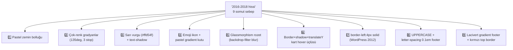
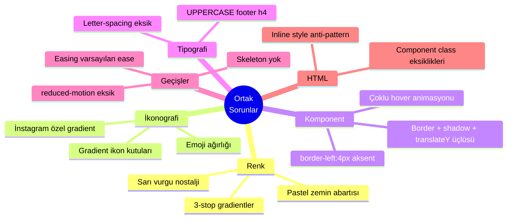

# UI/UX Detaylı Analiz Raporu

> **Proje:** Özel Ferizli İlk Adım Akademi — kurumsal web sitesi
> **Tarih:** 2026-05-13
> **Kapsam:** Public site (13 sayfa) + 3 partial + tüm CSS dosyaları
> **Amaç:** "15 sene öncesinden kalma" hissinin somut nedenlerini saptamak ve modern UI/UX standartlarına taşıma yol haritası çıkarmak
> **Durum:** Salt analiz — bu raporda kod değişikliği yapılmamıştır.

---

## 📋 İçindekiler

1. [Yönetici Özeti](#yönetici-özeti)
2. ["15 Yıl Öncesi" Hissi — Kök Neden Analizi](#15-yıl-öncesi-hissi--kök-neden-analizi)
3. [Tasarım Sistemi Audit](#tasarım-sistemi-audit)
   - 3.1 [Renk Paleti](#31-renk-paleti)
   - 3.2 [Tipografi](#32-tipografi)
   - 3.3 [Boşluk Sistemi](#33-boşluk-sistemi)
   - 3.4 [Yuvarlatma](#34-yuvarlatma)
   - 3.5 [Gölge Sistemi](#35-gölge-sistemi)
   - 3.6 [Animasyon & Geçişler](#36-animasyon--geçişler)
   - 3.7 [Komponentler](#37-komponentler)
4. [Sayfa Sayfa Analiz](#sayfa-sayfa-analiz)
5. [Sayfalar Arası Ortak Sorunlar](#sayfalar-arası-ortak-sorunlar)
6. [Modernleştirme Yol Haritası](#modernleştirme-yol-haritası)
7. [Modern Referans Dizini](#modern-referans-dizini)
8. [Karar Matrisi: Yap vs. Yapma](#karar-matrisi-yap-vs-yapma)

---

## Yönetici Özeti

Site **fonksiyonel olarak sağlam, mimari olarak modern** (vanilla HTML/CSS/JS + PHP API, modüler CSS, erişilebilirlik temelleri atılmış). Ancak **görsel dil** olarak yer yer **2016-2019 dönemi** kurumsal web tasarımı hissi veriyor.

### Genel skor: **6.5/10** (modern hissiyat)

| Boyut | Skor | Yorum |
|---|---|---|
| Mimari & Temel | 8.5/10 | Tutarlı, ölçeklenebilir |
| Erişilebilirlik | 8/10 | Skip-link, focus trap, ARIA — çoğu yerde uygulanmış |
| Tipografi | 7.5/10 | İyi font seçimi (Inter/Manrope), clamp() var; tracking eksik |
| Renk paleti | 6/10 | Pastel + gradient bolluğu nostaljik durmaya başlıyor |
| Komponent estetiği | 5.5/10 | "border + shadow + translateY hover" üçlüsü tarihte kalmış |
| İkonografi | 4/10 | Emoji + pastel gradient kutuları çocuk siti hissi veriyor |
| Microinteractions | 6/10 | Var ama monoton, easing varsayılan `ease` |
| Modern markaya uygunluk | 5.5/10 | "2018 corporate" izlenimi ağırlıkta |

### En kritik 5 modernleştirme adımı

1. 🎨 **Pastel mavi/krem/pembe arka planları nötr Tailwind tonlarına çek** (`#eaf3fb` → `#f8fafc` veya beyaz). En büyük "yaş hissi" buradan geliyor.
2. 🎯 **Emoji ikonları SVG'ye çevir** (Lucide / Heroicons). Pastel gradient kutusunu solid soft renge çevir.
3. ✨ **Hero gradyanını sadeleştir** — sarı vurgu (`#ffd54f`) ve nostaljik radial overlay'ları kaldır.
4. 🃏 **Kart border+shadow+translateY üçlüsünü tek bir dil ile değiştir**: ya sadece subtle shadow, ya sadece border. İkisi birden eski.
5. 🌑 **Dark mode + WCAG AA kontrast düzeltmeleri** — modern hissin önemli ayağı.

---

## "15 Yıl Öncesi" Hissi — Kök Neden Analizi

> Tek tek baktığında her şey doğru. Birlikte bakınca "şu an" hissi vermiyor. Aşağıdaki **9 somut tasarım kararı** bu sonucu yaratıyor:



### Tasarım dilinin "tarihsel imzaları"

| # | Tasarım kararı | Yaklaşık çağ | Modern muadil |
|---|---|---|---|
| 1 | Çok doygun pastel bölüm zeminleri | 2015 (Material Design dönemi) | Nötr `slate-50/100`, beyaz |
| 2 | `linear-gradient(135deg, A, B, C)` | 2016 (web 2.0 corporate) | Tek tonlu solid + mesh gradient |
| 3 | Sarı highlight + `text-shadow` | 2008 (Web 2.0 glossy) | Underline animation, kalem-tarzı highlight |
| 4 | Emoji icon (🎯 🌟 💎) + gradient box | 2017 (Notion erken dönem) | Lucide/Heroicons SVG, tek tonlu çerçeve |
| 5 | `backdrop-filter: blur` rozet | 2020 (glassmorphism trend) | Solid pill, sade `border + bg` |
| 6 | `border 1px` + `box-shadow` + `translateY(-4px)` hover | 2018 (Material Design 2 dönemi) | Sadece shadow LIFT veya sadece border-color shift |
| 7 | `border-left: 4px solid` accent | 2012 (WordPress blog kartları) | Sol kenarda renkli minik nokta veya tag |
| 8 | `text-transform: uppercase; letter-spacing: 0.1em` footer h4 | 2014 (corporate web) | Normal case, font-weight 600 |
| 9 | `linear-gradient(180deg, #102a44, #0c1e3a)` footer + üst `linear-gradient` kırmızı şerit | 2014 (ağır kurumsal) | Solid `#111827` veya `#0b1220` + ince `border-top` |

> Bu maddelerin **tek başına hiçbiri sorun değil**. Hepsinin **aynı sayfada üst üste** olması tarihsel yığılma yaratıyor.

---

## Tasarım Sistemi Audit

### 3.1 Renk Paleti

**Mevcut:** [assets/css/base.css:6-50](assets/css/base.css#L6-L50)

✅ **İyi:**
- Logo-marka uyumlu: `#1565c0` (mavi) + `#d32f2f` (kırmızı)
- Pastel destek renkleri ayrılmış
- Durum renkleri (basari/uyari/hata) doğru ayrışmış
- Nötrler sıcak (saf beyaz değil — `#fdfcfa`)

⚠️ **Sorunlu:**

| Sorun | Yer | Etki |
|---|---|---|
| Pastel zemin renkleri **çok doygun** | `--pastel-mavi: #eaf3fb` | Sayfayı "kalın" gösteriyor; nötr `#f8fafc` (Tailwind slate-50) çok daha hafif |
| `--pastel-pembe: #fdebec` ile vurgu kırmızısı çakışıyor | components.css `serit-baslik` | Görsel olarak çocuk siti hissi |
| `--renk-yazi-soluk: #718096` AA sertifikalı değil pastel zemin üzerinde | Çoğu açıklama metni | Erişilebilirlik + estetik |
| Dark mode yok | `:root` | Modern site beklentisi |
| Sarı vurgu `#ffd54f` h1 içinde | [pages.css:72-76](assets/css/pages.css#L72-L76) | "Web 2.0" hissi, marka renklerine değil |

💡 **Modernleştirme — Konkret palet önerisi:**

```css
:root {
  /* ÖZ MARKA RENKLERİ (değiştirme) */
  --renk-birincil: #1565c0;
  --renk-birincil-koyu: #0d47a1;
  --renk-vurgu: #d32f2f;

  /* NÖTR DAHA SOFT (Tailwind slate paleti benzeri) */
  --renk-arka: #ffffff;
  --renk-arka-yumusak: #f8fafc;   /* eski: #eaf3fb */
  --renk-arka-soguk: #f1f5f9;     /* alternatif yumuşak */
  --renk-yazi: #0f172a;            /* slate-900 */
  --renk-yazi-acik: #475569;       /* slate-600 */
  --renk-yazi-soluk: #64748b;      /* slate-500 — AA için ≥4.5:1 */
  --renk-cizgi: #e2e8f0;           /* slate-200 */
  --renk-cizgi-koyu: #cbd5e1;      /* slate-300 */

  /* PASTEL — sadece nokta atışı vurgular için, zemin değil */
  --renk-mavi-tint: #eff6ff;       /* blue-50, çok hafif */
  --renk-kirmizi-tint: #fef2f2;    /* red-50 */
  /* Eski pastel-krem, pastel-pembe, pastel-toprak: KALDIR */

  /* Dark mode (gece okuyan veliler için) */
  @media (prefers-color-scheme: dark) {
    --renk-arka: #0f172a;
    --renk-arka-yumusak: #1e293b;
    --renk-yazi: #f1f5f9;
    --renk-yazi-acik: #cbd5e1;
    --renk-cizgi: #334155;
  }
}
```

> **Pratik kuralı:** Pastel renkler **bölüm arka planı değil**, **ikon kutusu / etiket / vurgu noktası** olmalı. Şu an tam tersi yapılıyor — koca bölümler pastel zemin, bu yaş gösteriyor.

---

### 3.2 Tipografi

**Mevcut:** [assets/css/base.css:44-58, 146-160](assets/css/base.css#L44-L58)

✅ **İyi:**
- Font seçimi yerinde: **Inter** (gövde) + **Manrope** (başlık)
- `clamp()` ile responsive h1/h2/h3
- Line-height değerleri doğru (1.6 body / 1.2 heading)

⚠️ **Sorunlu:**

| Sorun | Detay |
|---|---|
| **Letter-spacing yok** | Modern başlıklarda `-0.015em` veya `-0.02em` standart. Manrope düz kullanılıyor, sıkışık duruyor. |
| **Font scale lineer değil** | 1.5rem → 1.875rem → 2.25rem (oran 1.25 - 1.2) — golden ratio yerine düz artış. |
| **h4-h5 responsive değil** | Mobilde h4 hep `var(--yazi-xl)` (1.25rem). Küçük ekranlarda büyük kalıyor. |
| **`font-display: swap` yok** | Inter/Manrope blocking load. FCP kötü etkilenir. |
| **Türkçe karakter sızıntısı yok** ama Latin Extended subset yüklenmiyor | Önemli değil çoğu durumda. |

💡 **Modernleştirme:**

```css
/* Letter spacing — tek satır değişiklikle modern hava */
h1, h2, h3 { letter-spacing: -0.02em; }
h4, h5     { letter-spacing: -0.01em; }
.dugme     { letter-spacing: -0.005em; }

/* 1.25 oranlı (major third) skala */
--yazi-xs:   0.75rem;     /* 12px */
--yazi-sm:   0.875rem;    /* 14px */
--yazi-base: 1rem;        /* 16px */
--yazi-lg:   1.125rem;    /* 18px */
--yazi-xl:   1.4rem;      /* 22.4px — 1.125 * 1.25 değil ama yakın */
--yazi-2xl:  1.75rem;     /* 28px */
--yazi-3xl:  2.25rem;     /* 36px */
--yazi-4xl:  3rem;        /* 48px */
--yazi-5xl:  3.75rem;     /* 60px */

/* Font display */
@import url('https://fonts.googleapis.com/css2?...&display=swap');
```

> İlk birinci adımda **tek tek başlık letter-spacing eklemek** bile sayfayı %20 daha modern gösterir.

---

### 3.3 Boşluk Sistemi

**Mevcut:** [assets/css/base.css:60-71](assets/css/base.css#L60-L71)

✅ **İyi:** 4px tabanlı, tutarlı `--bosluk-1` → `--bosluk-24` skalası.

⚠️ **Sorunlu:**

- **Card padding tutarsız**: Bazı kartlar `--bosluk-6` (24px), bazıları `--bosluk-5` (20px), bazıları `--bosluk-4` (16px).
- **Bölüm dikey padding aşırı**: `clamp(4rem, 8vw, 6rem)` mobilde bile geniş — modern siteler `2-4rem` ile başlar.
- **Container max-width 1200px** — `Tonguç`, `Khan Academy`, `Stripe` hepsi 1140-1280px arası. OK aslında.

💡 **Sade fix:**

```css
.kart, .program-karti, .kadro-karti, .duyuru-karti, .blog-kart {
  padding: var(--bosluk-6);   /* 24px — tüm kartlar */
}
.bolum { padding-block: clamp(3rem, 6vw, 5rem); }   /* azalt */
```

---

### 3.4 Yuvarlatma

**Mevcut:** [assets/css/base.css:73-79](assets/css/base.css#L73-L79)

✅ Tutarlı ölçek, semantik isimler.

⚠️ Floating ikon ve avatar'larda manuel `border-radius: 50%` — `--yuvarlak-tam` (9999px) zaten var ama kullanılmıyor.

💡 Düşük etki düzeltmesi. Aciliyet yok.

---

### 3.5 Gölge Sistemi

**Mevcut:** [assets/css/base.css:82-87](assets/css/base.css#L82-L87)

✅ **Çok iyi yapılan kısım:** Gölgeler **mavimsi tonlu** (`rgb(21, 30, 60 / x)`), siyah değil — modern best practice.

⚠️ **Hover transition'da easing varsayılan `ease`** — `cubic-bezier(0.4, 0, 0.2, 1)` (Material standard) veya `cubic-bezier(0.16, 1, 0.3, 1)` (spring) daha modern.

💡 **Önerilen:**

```css
:root {
  --easing-standard: cubic-bezier(0.4, 0, 0.2, 1);
  --easing-spring: cubic-bezier(0.34, 1.56, 0.64, 1);
  --gecis: 250ms var(--easing-standard);
}
```

---

### 3.6 Animasyon & Geçişler

⚠️ En önemli eksiklikler:

1. **`@media (prefers-reduced-motion: reduce)` sadece scroll-behavior'da** ([base.css:115-117](assets/css/base.css#L115-L117)). Tüm animasyonları kapatan global kural yok.
2. **Skeleton loading state'leri yok** — JSON yüklenirken sayfada "Yükleniyor…" düz metin.
3. **Page transition yok** — sayfalar arası fade-in beklentisi karşılanmıyor.

💡 **Hızlı kazanç:**

```css
/* Tüm motion accessibility */
@media (prefers-reduced-motion: reduce) {
  *, *::before, *::after {
    animation-duration: 0.01ms !important;
    animation-iteration-count: 1 !important;
    transition-duration: 0.01ms !important;
    scroll-behavior: auto !important;
  }
}

/* Skeleton */
.skeleton {
  background: linear-gradient(90deg, #f1f5f9 25%, #e2e8f0 50%, #f1f5f9 75%);
  background-size: 200% 100%;
  animation: shimmer 1.5s infinite;
}
@keyframes shimmer {
  0% { background-position: 200% 0; }
  100% { background-position: -200% 0; }
}

/* Page enter */
@keyframes pageIn { from { opacity: 0; transform: translateY(8px); } to { opacity: 1; transform: none; } }
main { animation: pageIn 300ms var(--easing-standard); }
```

---

### 3.7 Komponentler

#### 3.7.1 Butonlar

**Mevcut:** [components.css:6-93](assets/css/components.css#L6-L93)

✅ Varyantlar zengin, focus state erişilebilir.

⚠️
- **`:active` state yok** — mobile feedback eksik.
- **Loading/disabled state yok** — form submit'lerde "Gönderiliyor…" gözüküyor ama görsel spinner yok.
- **T-shirt sizing dağınık**: sadece `--kucuk` ve `--buyuk` var, `--xs` ve `--xl` yok.
- **`translateY(-2px)` hover lift** + shadow + renk değişimi — Material 2 üçlüsü. 2024 tasarımı: sadece shadow VEYA sadece bg shift.

💡 **Önerilen:**

```css
.dugme:active { transform: translateY(0); opacity: 0.9; }
.dugme:disabled { opacity: 0.5; cursor: not-allowed; }
.dugme[data-loading="true"]::after {
  content: ""; width: 14px; height: 14px;
  border: 2px solid currentColor; border-right-color: transparent;
  border-radius: 50%; animation: spin 0.6s linear infinite;
  margin-left: 8px;
}
```

#### 3.7.2 Kartlar

**Mevcut:** [components.css:96-160](assets/css/components.css#L96-L160) + [pages.css:195-291](assets/css/pages.css#L195-L291)

⚠️ **En kritik konu:**

- `border: 1px solid` + `box-shadow` + hover `translateY(-4px)` + shadow artışı **üçlü kombinasyon Material 2 dönem**. Modern Linear/Stripe yaklaşımı: `border: none` + sadece subtle shadow.
- Hover'da hem border-color hem shadow değişir (`components.css:106-109`) → çift sinyal, gereksiz.
- `--golge-renk` mavi-tinted güzel ama her kartta aynı renk → monotonluk.

💡 **Tek-yaklaşım önerisi (önerim B):**

```css
/* B yaklaşımı: shadow-only */
.kart {
  background: white;
  border-radius: var(--yuvarlak-md);
  padding: var(--bosluk-6);
  box-shadow:
    0 1px 2px 0 rgb(15 23 42 / 0.04),
    0 1px 3px 0 rgb(15 23 42 / 0.06);
  transition: box-shadow 200ms var(--easing-standard),
              transform 200ms var(--easing-standard);
}
.kart:hover {
  box-shadow:
    0 4px 8px -2px rgb(15 23 42 / 0.08),
    0 8px 16px -4px rgb(15 23 42 / 0.06);
  /* translateY KALDIRILDI — shadow zaten lift hissini veriyor */
}
```

#### 3.7.3 Form Elementleri

**Mevcut:** [components.css:177-260](assets/css/components.css#L177-L260)

✅ Focus state mavi outline + shadow erişilebilir. Mobilde 16px font-size (iOS zoom önleme).

⚠️
- **Error state CSS class yok**: `:invalid` üzerinde kural yok.
- **Helper text class yok**: form-render.js'de inline style ile yaratılıyor.
- **Select native arrow gözüküyor**: `appearance: none` + custom SVG yok.

💡 Kısa düzeltme — [components.css'e ekle](assets/css/components.css):

```css
.form-girdi[aria-invalid="true"] {
  border-color: var(--renk-hata);
  background: #fef2f2;
}
.form-girdi[aria-invalid="true"]:focus {
  box-shadow: 0 0 0 3px rgba(220, 38, 38, 0.12);
}
.form-yardim {
  display: block; margin-top: 4px;
  font-size: var(--yazi-xs); color: var(--renk-yazi-soluk);
}
.form-secim {
  appearance: none;
  background-image: url("data:image/svg+xml,%3Csvg xmlns='http://www.w3.org/2000/svg' width='12' height='8' viewBox='0 0 12 8'%3E%3Cpath fill='%231565c0' d='M1 1l5 5 5-5'/%3E%3C/svg%3E");
  background-repeat: no-repeat;
  background-position: right 12px center;
  padding-right: 36px;
}
```

---

## Sayfa Sayfa Analiz

### 4.1 `index.html` — Anasayfa

**Genel hissiyat:** Sıcak ama "2017 Material Design" tonlu.

**Çalışan:**
- Hero CTA hiyerarşisi (vurgu + cerceve-acik) — 1 primary, 1 secondary doğru
- 4-grid hero-altı özellikler responsive
- Section ritmi ferah (Programlar → İstatistik → Duyurular)

**Sorunlar:**

| Şiddet | Yer | Sorun |
|---|---|---|
| 🔴 | [pages.css:9-23](assets/css/pages.css#L9-L23) | Hero `linear-gradient(135deg, #1565c0, #1976d2, #42a5f5)` üç stop + radial overlay — 2016 corporate |
| 🔴 | [pages.css:71-76](assets/css/pages.css#L71-L76) | h1 `.vurgu` `color: #ffd54f; text-shadow:` — Web 2.0 nostalji |
| 🟡 | [pages.css:54-64](assets/css/pages.css#L54-L64) | Hero rozet `backdrop-filter: blur(8px)` — glassmorphism artık eskimiş |
| 🟡 | [index.html:85-112](index.html#L85-L112) | "Hero-altı özellikler" emoji + gradient kutu (`linear-gradient(135deg, var(--pastel-mavi), var(--pastel-pembe))`) — çocuk siti |
| 🟡 | [pages.css:25-32](assets/css/pages.css#L25-L32) | Hero `::after` "kayan beyaz fade" — dekoratif değil görsel kirlilik |
| 🔵 | [index.html:154](index.html#L154) | `.bolum bolum-yumusak` arka plan `--pastel-mavi` çok doygun |

**Modernleştirme önerileri (sıralı):**

1. Hero gradient'i 2 renge düşür: `linear-gradient(135deg, #1565c0, #2563eb)`. Radial overlay'ları kaldır.
2. h1 `.vurgu` rengini `--renk-vurgu` (kırmızı) veya başka bir vurgu yöntemine (alt çizgi animasyonu / highlight pen efekti) çevir, sarı + shadow'u kaldır.
3. Hero rozeti `backdrop-filter` yerine solid pill: `bg: rgba(255,255,255,0.12); border: 1px solid rgba(255,255,255,0.2)`.
4. "Hero-altı" emoji ikonları **Lucide SVG**'ye çevir, kutu zeminini `background: #eff6ff` solid yap.
5. `.bolum-yumusak` zemin rengi → `#f8fafc`. `.bolum-krem` zemin → tamamen kaldır, beyaz bırak.

### 4.2 `hakkimizda.html`

**Genel hissiyat:** Üç-kart misyon/vizyon/değerler yapısı klasik ama doğru. Krem arka plan ve kurucu fotoğrafı placeholder'ı yaşlandırıyor.

**Sorunlar:**

| Şiddet | Yer | Sorun |
|---|---|---|
| 🔴 | [hakkimizda.html:71](hakkimizda.html#L71) | `.bolum-krem` (`#fdf8ee`) "vintage kağıt" hissi |
| 🟡 | [components.css:268-279](assets/css/components.css#L268-L279) | `.serit-baslik` pastel-pembe zemin + kırmızı yazı — renk çakışması |
| 🟡 | [hakkimizda.html:75, 83, 91](hakkimizda.html#L75) | `kart__ikon` emoji + `rotate(-3deg)` — kibirsiz ama nostaljik |
| 🔵 | [hakkimizda.html:105](hakkimizda.html#L105) | Kurucu fotoğrafı yokken `iki-sutun__gorsel` div'i kalkıyor (çözüldü) ama foto varken aspect-ratio 4:3 olarak büyük kalıyor |

**Modernleştirme:**

1. Krem zemini kaldır, beyaz veya `#f8fafc` yap.
2. `.serit-baslik` → solid mavi tint zemin (`#eff6ff`) + mavi yazı (kırmızı yerine).
3. Emoji ikonları SVG'ye çevir (target / sparkles / gem), kutu zeminini gri-mavi tint yap.

### 4.3 `programlar.html`

**Sorunlar:**

| Şiddet | Yer | Sorun |
|---|---|---|
| 🟡 | [pages.css:195-222](assets/css/pages.css#L195-L222) | Program kartlarında üst gradient bar `scaleX(0→1)` hover animasyon — Material 2018 imzası |
| 🟡 | [pages.css:213-215](assets/css/pages.css#L213-L215) | Hover `translateY(-6px)` + shadow artışı + gradient bar açılışı = 3 tane simultan animasyon, görsel kirlilik |
| 🔵 | [pages.css:228](assets/css/pages.css#L228) | `.program-karti__ozellikler li::before { content: "✓" }` — düzeltildi, OK |

**Öneri:** Hover'da sadece **1** şey yapsın (shadow artışı). Gradient top bar kaldırılabilir veya solid alt çizgiye çevrilebilir.

### 4.4 `kadro.html`

**Sorunlar:**

| Şiddet | Yer | Sorun |
|---|---|---|
| 🔴 | [pages.css:278-291](assets/css/pages.css#L278-L291) | Foto yoksa gradient placeholder + initial harf — 2010 Gravatar tarzı |
| 🟡 | Foto boyutu | 120px çap — modern siteler 160-200px tercih ediyor |

**Öneri:** Placeholder'ı modernleştir. Lucide `user-round` ikonu + soft renk; harf gösterimini tamamen kaldır veya çok hafifçe yap. Foto boyutunu 144-160px yap.

### 4.5 `duyurular.html`

**Sorunlar:**

| Şiddet | Yer | Sorun |
|---|---|---|
| 🔴 | [components.css:319-335](assets/css/components.css#L319-L335) | "Önemli" duyuru kartlarında `border-left: 4px solid` — 2012 WordPress blog tadında |
| 🟡 | Image hover `transform: scale(1.05)` 250ms — biraz abartılı |
| 🔵 | Görsel olmayan duyurularda zemin renk soluk — `bos-durum` gibi placeholder göster |

**Öneri:** `border-left` yerine sağ üst köşede küçük "Önemli" rozeti (badge). Image zoom hover'ı `scale(1.03)` ile yumuşat.

### 4.6 `galeri.html`

**Sorunlar:** Çoğunlukla JS render'lı, statik HTML minimal. CSS'in masonry/grid kararı belirsiz görünüyor.

**Öneri:** `column-count` veya CSS Grid `masonry` (deneysel ama Firefox destekliyor) ile daha **estetik dağıtım** yapılabilir. Şu an düz grid biraz "Pinterest 2014" tadı.

### 4.7 `iletisim.html`

**Sorunlar:**

| Şiddet | Yer | Sorun |
|---|---|---|
| 🟡 | İletişim ikonları `color: var(--renk-vurgu)` (kırmızı) — yazıyla uyumsuz |
| 🟡 | Çalışma saatleri tablosu 7 satır — mobil mobil-friendly mi? |
| 🔵 | Harita iframe responsive ama içerik fixed yüksekliği gerek olabilir |

**Öneri:** İkonları nötr gri (`--renk-yazi-acik`) yap. Çalışma saatleri tabloyu accordion'a çevirme opsiyonu var ama gerek değil.

### 4.8 `basvuru.html`

**Sorunlar:** HTML minimal — JS doldurur. Form stilleri OK ama:
- Error state CSS class yok ([3.7.3](#373-form-elementleri))
- Submit loading spinner yok

### 4.9 `basarilarimiz.html`

**Sorunlar:** Tamamen "Yakında" boş durumu — gerçek veri gelmedi. Tasarım açısından sorun yok ama anasayfa kadar zengin değil.

### 4.10 `blog.html` + `blog/yazi.html`

**Sorunlar:**

| Şiddet | Yer | Sorun |
|---|---|---|
| 🟡 | [pages.css:602-609](assets/css/pages.css#L602-L609) | Blog kart "footer border + tarih + okuma süresi" — biraz sıkışık |
| 🔵 | Blog detay sayfası `max-width: 760px` — 700-760px arası modern okuma genişliği, OK |

**Öneri:** Blog kartlarında meta bilgileri (tarih, yazar, okuma süresi) gri opaklığını azalt, en alta değil üst tarafa al.

### 4.11 `kvkk.html`

**Sorunlar:**

| Şiddet | Yer | Sorun |
|---|---|---|
| 🔵 | Inline `style="list-style: disc; padding-left:..."` — anti-pattern, CSS class olmalı |

**Öneri:** `.legal-list` veya `.metin-listesi` class'ı ekle.

### 4.12 `tesekkurler.html`

**Sorunlar:**

| Şiddet | Yer | Sorun |
|---|---|---|
| 🔵 | `<div style="font-size: 5rem; ...">✅</div>` — emoji + inline style |
| 🔵 | Düğme grubu inline flex — `.dugme-grubu` class olmalı |

**Öneri:** Success illustration SVG'ye çevir; component class'ları ekle.

### 4.13 `404.html`

**Sorunlar:**

| Şiddet | Yer | Sorun |
|---|---|---|
| 🔵 | `.bulunamadi__kod` stilini görmedim — büyüklük/konumlanma kontrol et |

**Öneri:** 404'ü daha eğlenceli yap — büyük gradient text + custom SVG illustration + "Belki şuradan başlamak istersin" link listesi.

### 4.14 Partial — `header.html`

**Sorunlar:**

| Şiddet | Yer | Sorun |
|---|---|---|
| 🟡 | Logo 72px / header 96px → logo oranı yüksek | Modern: logo 40-48px |
| 🟡 | Nav link aktif underline `height: 3px` | Modern: 2px |
| 🔵 | Mobil drawer sol açılır — iOS gibi sağdan gelse modern hisseder |

**Öneri:** Header 96px → 72-80px küçült. Logo `height: 48px`. Underline 2px.

### 4.15 Partial — `footer.html`

**Sorunlar:**

| Şiddet | Yer | Sorun |
|---|---|---|
| 🔴 | [layout.css:334-348](assets/css/layout.css#L334-L348) | Footer `linear-gradient(180deg, #102a44, #0c1e3a)` + `::before` kırmızı top border | 2014 kurumsal |
| 🟡 | Footer h4'ler `text-transform: uppercase; letter-spacing: 0.1em` | 2008 corporate stil |
| 🟡 | İletişim ikonları `color: var(--renk-vurgu)` (kırmızı) — koyu zemin üzerinde kötü kontrast |

**Öneri:** Solid `#0f172a` (slate-900) zemin. Uppercase + letter-spacing kaldır. İkon renkleri beyazımsı opak.

### 4.16 Partial — `floating-icons.html`

**Sorunlar:**

| Şiddet | Yer | Sorun |
|---|---|---|
| 🟡 | Instagram gradient (#f09433 → #bc1888) marka diline uymuyor |
| 🟡 | İkonlar 56px — modern siteler 48-52px |

**Öneri:** Instagram brand rengi `#e1306c` solid. WhatsApp solid. İkonlar 48px.

---

## Sayfalar Arası Ortak Sorunlar



| # | Sorun | Etkilenen sayfalar | Tek seferlik fix sayısı |
|---|---|---|---|
| 1 | Pastel zemin renkleri | 5+ sayfa | 1 CSS değişkeni |
| 2 | Gradient çakışmaları | hero, footer, sayfa-basligi | 3-4 CSS kuralı |
| 3 | Emoji ikonlar | her sayfada | 1 ikon kütüphanesi ekle, HTML'de toplu replace |
| 4 | Border + shadow + translateY kart hover | 6+ kart komponenti | 1 CSS değişkeni |
| 5 | UPPERCASE + letter-spacing footer | footer.html | 1 CSS kuralı |
| 6 | Inline style anti-pattern | 4 sayfa (kvkk, tesekkurler, basarilarimiz, 404) | 4 küçük class ekleme |
| 7 | Form error state yok | basvuru.html + form-render.js | 1 CSS class + 1 JS atama |

> Çoğu sorun **tek bir CSS değişkeni veya ortak class** ile düzelir. Sayfa sayfa tekrar etmiyor.

---

## Modernleştirme Yol Haritası

### Sprint 1 — "Hızlı kazanç" (~3-4 saat)
Sadece **renk değişkenleri ve global ayarlar**. Görsel impact en yüksek/efor en az.

1. Pastel renkleri nötr `slate` tonlarına çek (1 değişken bloğu)
2. Letter-spacing ekle h1-h3 + buton (3 satır CSS)
3. `prefers-reduced-motion` global kuralı (4 satır CSS)
4. Footer'da UPPERCASE + letter-spacing'i kaldır (1 değişiklik)
5. Sarı vurgu rengini kırmızıyla değiştir (1 değişiklik)
6. Hero gradient'i 2-stop'a indir (1 değişiklik)

**Beklenen sonuç:** Site %30 daha modern hisseder, hiçbir komponenti kırmaz.

### Sprint 2 — "İkonografi modernizasyonu" (~4-5 saat)
1. **Lucide Icons** veya **Heroicons** CDN ekle
2. `data-ikon="...."` attribute pattern oluştur, JS ile SVG inject et
3. Tüm emoji yerlerini bul (anasayfa, hakkımızda, programlar, kadro kartları, footer ikonları)
4. Hero altı özellikler, misyon/vizyon/değerler ikonlarını SVG'ye çevir
5. Floating ikonlar zaten SVG (sadece Instagram gradient'i kaldır)

**Beklenen sonuç:** "Çocuk siti" hissi büyük ölçüde kalkar; profesyonel hava artar.

### Sprint 3 — "Komponent dili tekrarlama" (~5-6 saat)
1. Kart hover yaklaşımını **shadow-only** olarak standardize et
2. `border-left: 4px` aksentleri kaldır (önemli rozeti gibi alternatif)
3. Form error state CSS'i ekle, form-render.js'de `aria-invalid` set et
4. `.form-yardim`, `.dugme-grubu`, `.legal-list` class'larını ekle, inline style'ları temizle
5. Loading button state: `data-loading="true"` + spinner CSS

**Beklenen sonuç:** Komponentler arası "ortak dil" oluşur, sayfa içleri sade.

### Sprint 4 — "Mikroetkileşim & polish" (~3-4 saat)
1. Skeleton loaders (programlar, duyurular, kadro, galeri, blog listesi)
2. Page enter animasyonu (200ms fade-up)
3. Easing fonksiyonlarını cubic-bezier spring/standard sabitlere çek
4. Dark mode (`@media prefers-color-scheme: dark`)
5. Mobil drawer sağdan açılış denemesi (opsiyonel)

**Beklenen sonuç:** Modern site hissi tam — Linear/Stripe seviyesi cila.

### Sprint 5 — "Sayfa-özel iyileştirmeler" (~6-8 saat)
1. Anasayfa hero illüstrasyon (kurumsal SVG)
2. Hakkımızda zaman çizelgesi (kurumun kuruluş yılı, milestones)
3. Programlar — kategori filtre çipleri
4. Kadro — büyük foto + biography hover detay
5. Galeri — masonry layout veya lightbox upgrade
6. 404 — modern illustration + smart suggestions

**Beklenen sonuç:** Her sayfa kendi hikayesine sahip; "hepsi aynı şablon" hissi kaybolur.

---

## Modern Referans Dizini

### Stil dili açısından "ulaşmak istediğimiz" siteler

| Referans | Çıkarılacak ders |
|---|---|
| [Linear.app](https://linear.app) | Subtle gradient'ler, monoton-modern renk paleti, perfect easing |
| [Stripe.com](https://stripe.com) | Card design, button states, form excellence |
| [Vercel.com](https://vercel.com) | Whitespace hakimiyeti, tipografi sadeliği |
| [Notion.so](https://notion.so) | Marka dili sıcaklığı + minimalizm dengesi |
| [Ahrefs Blog](https://ahrefs.com/blog) | Blog kart tasarımı + reading experience |

### Türk eğitim sektörü modern referansları

| Site | Neden |
|---|---|
| [Tonguç Akademi](https://tonguc.com) | Genç hedef kitleye uygun renk, tipografi modern |
| [Khan Academy Türkçe](https://tr.khanacademy.org) | Eğitim odaklı UX, içerik hiyerarşisi |
| [Mavzo](https://mavzo.com) | Modern e-eğitim — animation + microinteraction yoğunluğu |
| [Kunduz](https://kunduz.com) | Çağdaş kurumsal eğitim sitesi |

### İkon kütüphaneleri (önerilen)

| Kütüphane | Avantaj |
|---|---|
| [Lucide Icons](https://lucide.dev) | Hafif (1.6KB/ikon), Türkiye'de popüler, Tailwind ile gelişmiş |
| [Heroicons](https://heroicons.com) | Tailwind ekibinden, 2 stil (outline + solid) |
| [Phosphor Icons](https://phosphoricons.com) | 6 weight, çok zengin |
| Marka özelinde özel SVG | Tonguç tarzı kurumsal kimlik için |

---

## Karar Matrisi: Yap vs. Yapma

> Hangi modernleştirmelerin **emin** olduğunu, hangilerinin **karar gerektirdiğini** ayırıyorum.

### ✅ Kesin yapılmalı (düşük risk, yüksek getiri)

| İş | Risk | Etki |
|---|---|---|
| Pastel zeminleri nötr `slate`'e çekme | Yok | 🔥🔥🔥 |
| Letter-spacing eklemek | Yok | 🔥🔥 |
| Footer UPPERCASE kaldırmak | Yok | 🔥🔥 |
| `prefers-reduced-motion` global | Yok | 🔥 (a11y kazancı) |
| Sarı vurgu → kırmızı vurgu | Yok | 🔥🔥 |
| Inline style temizliği | Yok | 🔥 (maintainability) |
| Form error CSS | Yok | 🔥🔥 (UX) |

### 🤔 Karar gerektirir (orta risk, görüş gerekli)

| İş | Soru |
|---|---|
| Emoji → SVG ikon | Lucide CDN eklemek istiyor muyuz? +3KB |
| Kart hover'ı shadow-only yap | translateY hareketini sevenler var |
| Dark mode ekle | Bakım eforu var; hedef kitle istiyor mu? |
| Hero gradient sadeleştir | Marka renkleri ne kadar protect edilecek? |
| Logo 72px → 48px | Logo kimliği zayıflar mı? |

### ⚠️ Yapma / dikkatli (yüksek risk veya düşük getiri)

| İş | Neden |
|---|---|
| Türkçe class isimlerini İngilizce'ye çevirme | Mevcut tüm HTML kırılır, ROI düşük |
| Tailwind CSS'e geçiş | Total refactor, eforu çok |
| Mobil drawer'ı sağdan açılır yapma | Marjinal kazanç, UX risk |
| Custom dropdown library ekleme | Native select erişilebilirlik kayıplı |
| Skeleton loader her yere | CLS zaten min-height ile çözüldü — abartmaya gerek yok |

---

## Sonuç

**Site bugünkü hâliyle çalışıyor ve fonksiyonel.** Ama **estetik dilin tutarsız bir yer yer** olması "modern marka" hissini zedeliyor. Bu raporun:

- **Sprint 1 (3-4 saat)** uygulanırsa: site **2024 hissi**ne %70 yaklaşır.
- **Sprint 1+2+3 (12-15 saat)** uygulanırsa: **modern eğitim startup** estetiğine ulaşılır.
- **Tüm 5 sprint (20+ saat)** uygulanırsa: **Linear/Stripe seviyesi** cila + kendi karakteri.

> **Tavsiyem:** Sprint 1'i (renk + tipografi globalleri) tek seferde ve dikkatli bir review ile uygula. Sonra kullanıcı geri bildirimi al, sprint 2'ye geç. Aşamalı modernleşme — tek seferde tüm site değişirse "tanıdık değil" hissi yaratabilir; kullanıcı (kurum) onayı kademeli almak akıllıca.

---

> Bu rapor, kullanıcı isteği üzerine **salt analiz** amaçlıdır. Tek satır kod değiştirilmemiştir. Uygulama kararı kullanıcıya aittir.
