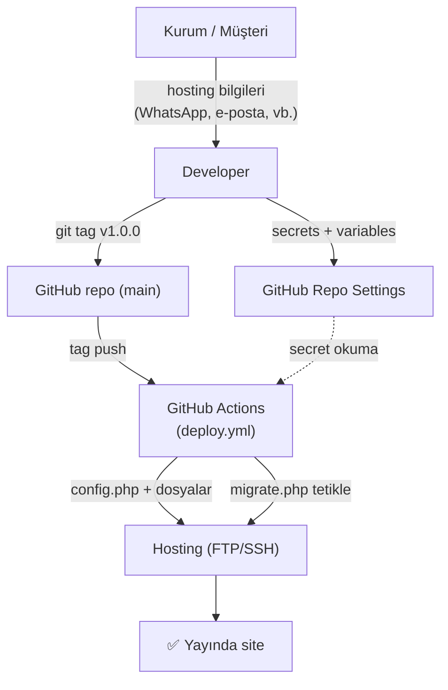
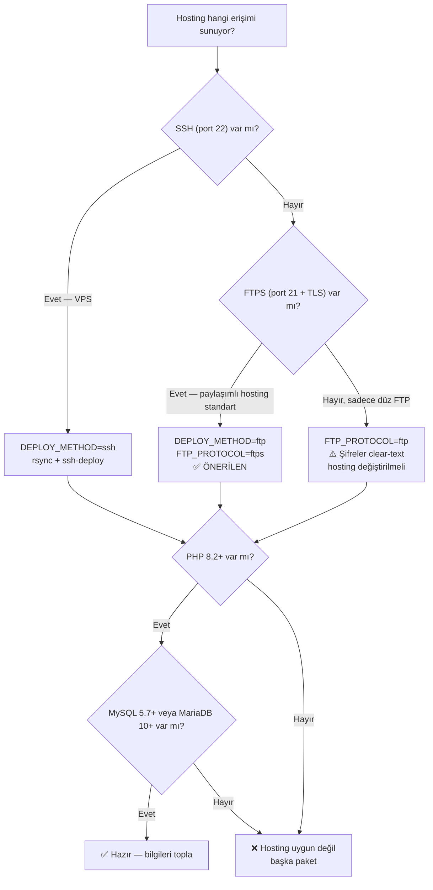

# Hosting Bilgileri — Müşteriye Sorulacak Liste

> Bu dosyayı doldurup kuruma gönder, dönen yanıtları GitHub secrets/variables'a aktarırız.
> CI/CD release tag'i (v1.0.0 gibi) push edildiğinde dosyaları sunucuya yükler ve
> DB migration'larını çalıştırır.

## Bilgi akışı — kim ne veriyor, nereye gidiyor



> **Müşteri** yalnızca **hosting bilgilerini** sağlar; developer bunları
> GitHub'a aktarır. Bundan sonraki tüm akış otomatiktir.

---

## 📤 Müşteriye gönderilecek mesaj

```
Merhabalar,

Web sitesinin yayına alınması için hosting bilgilerini almamız gerekiyor.
Hosting firmanızdan aşağıdaki bilgileri rica edin (hostingci panelinden veya
satın alma e-postanızdan çıkarabilirler):

*1) Domain*
• Tam adres (örn. ferizliilkadimakademi.com)
• DNS yönetimi sizde mi yoksa hosting tarafında mı?
• HTTPS / SSL sertifikası aktif mi? (genelde "Let's Encrypt" otomatik
  yenilenir, hosting firması açar)

*2) FTP / SFTP Bilgileri (dosya yüklemek için)*
• FTP sunucu adresi (örn. ftp.ferizliilkadimakademi.com veya bir IP)
• FTP kullanıcı adı
• FTP şifresi
• Port (21 = FTP/FTPS, 22 = SFTP, 2222 olabilir)
• Hangi protokol destekleniyor?
  - FTPS (port 21, AUTH TLS) — TERCİH EDİLEN
  - SFTP (port 22, SSH üzerinden) — VPS varsa
  - Düz FTP — güvensiz, son çare
• Web kök dizini neresi? (örn. /public_html, /htdocs, /www)

*3) MySQL Veritabanı*
• Veritabanı sunucu adresi (genelde "localhost", bazen
  "mysql.hostingsiteniz.com")
• Veritabanı adı (genelde panelden oluşturulur, örn. "ferizli_ilkadim")
• Veritabanı kullanıcı adı
• Veritabanı şifresi
• Port (varsayılan 3306)
• Veritabanı bağlantısı yalnızca sunucudan mı (en yaygın) yoksa dışarıdan
  da açık mı?

*4) E-posta*
• info@... gibi kurumsal bir e-posta açtırmak ister misiniz?
• Veya bizim sitemiz form alıp size yönlendirebilir — kişisel bir adres
  yeterli olur.

*5) Yedekleme*
• Hosting firması düzenli yedek alıyor mu?
• Sıklığı? (günlük / haftalık)

Bu bilgiler güvenli kanaldan (örneğin WhatsApp Web yerine direkt görüşmeyle
veya geçici bir şifre yöneticisi linki ile) iletilirse iyi olur. Aldıktan
sonra sitenin yayına alınması ~30 dakikalık bir iştir.

Teşekkürler!
```

---

## 📋 Bilgi alındığında dolduracağımız form

> ⚠️ Bu bilgileri **bu dosyaya yazmayın**. Sadece GitHub Settings → Secrets'a girin.
> Bu liste sadece neyi nereye koyacağımızı hatırlatmak için.

### Hosting & dosya transferi

| Bilgi | Tipi | GitHub'da yer |
|---|---|---|
| FTP sunucu adresi | secret | `FTP_HOST` |
| FTP kullanıcı adı | secret | `FTP_USER` |
| FTP şifresi | secret | `FTP_PASS` |
| FTP portu (21/22/...) | variable | `FTP_PORT` |
| FTP protokolü (ftps/ftp/sftp) | variable | `FTP_PROTOCOL` |
| Sunucudaki hedef dizin | variable | `FTP_REMOTE_PATH` |

### MySQL veritabanı

| Bilgi | Tipi | GitHub'da yer |
|---|---|---|
| MySQL sunucu adresi | secret | `DB_HOST` |
| MySQL portu | secret | `DB_PORT` (genelde 3306) |
| Veritabanı adı | secret | `DB_NAME` |
| Veritabanı kullanıcısı | secret | `DB_USER` |
| Veritabanı şifresi | secret | `DB_PASS` |

### Site & migration

| Bilgi | Tipi | GitHub'da yer |
|---|---|---|
| Site URL'i (https://...) | variable | `SITE_URL` |
| Migration secret (biz üretiyoruz) | secret | `MIGRATION_SECRET` |

> **Migration secret** rastgele, kimseyle paylaşılmayacak bir string — örn:
> `openssl rand -hex 32` çıktısı (~64 karakter). Bunu biz üretiyoruz, müşteriye sormuyoruz.

---

## 🌐 Hosting tipi karar matrisi

| Müşterinin satın aldığı | Bizim yöntem |
|---|---|
| Shared hosting (cPanel, DirectAdmin, Plesk) — port 21 FTP/FTPS | **DEFAULT** — `DEPLOY_METHOD=ftp` |
| VPS (Linux, root erişim) — SSH var | `DEPLOY_METHOD=ssh`, anahtar tabanlı erişim |
| Managed PHP hosting (Hostinger Premium, Natro vb.) | Çoğu FTPS destekler — default işe yarar |
| WordPress hosting | PHP 8.2 + MySQL gerekli; kontrol edin |

### Karar ağacı



> Çoğu Türk shared hosting **FTPS + localhost MySQL** sunar — karar ağacında
> ✅ ÖNERİLEN yola düşersiniz. VPS varsa SSH dalı genelde daha hızlı/güvenli olur.

---

## 🔐 Müşteriden alacaklarımızı saklama önerisi

1. **Geçici güvenli kanal:** Bitwarden Send / 1Password Share / WhatsApp KARALAMA mesajı (gönder, sonra sil)
2. Alır almaz GitHub'a aktar
3. Yerel notlardan / mesaj geçmişinden **TEMİZLE**
4. Şifreyi hatırla diye e-posta / not defterine yazma

---

## 📞 Tipik hosting firmaları ve özellikleri (referans)

| Firma | FTPS portu | MySQL erişimi | SSH | Notlar |
|---|---|---|---|---|
| **Natro** | 21 (FTPS) | localhost only | Premium paket | En yaygın TR shared hosting |
| **Hostinger** | 21 (FTPS) | localhost + uzaktan | Premium+ | UI iyi |
| **GoDaddy** | 21 | localhost only | Yok (shared) | Yavaş olabilir |
| **DigitalOcean** | 22 (SSH) | tam erişim | Var | VPS — `DEPLOY_METHOD=ssh` |
| **Hetzner** | 22 (SSH) | tam erişim | Var | VPS — `DEPLOY_METHOD=ssh` |
| **Turhost / İhlas / Radore** | 21 (FTPS) | localhost only | Çoğunda yok | TR firmaları |

Most TR shared hosting firmalarında **FTPS + localhost MySQL** standart.
Default workflow bu senaryoda çalışır — özel ayar gerekmez.
