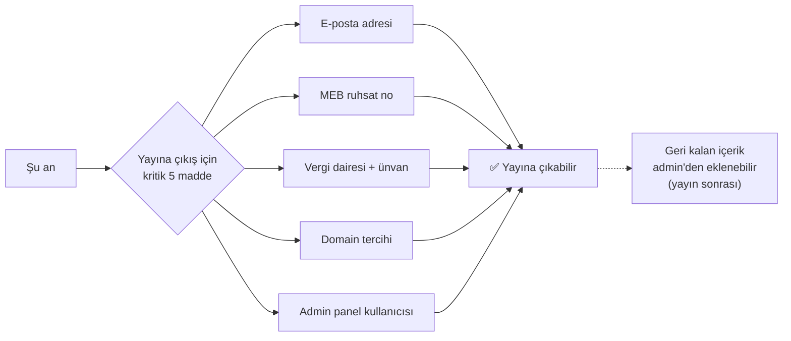
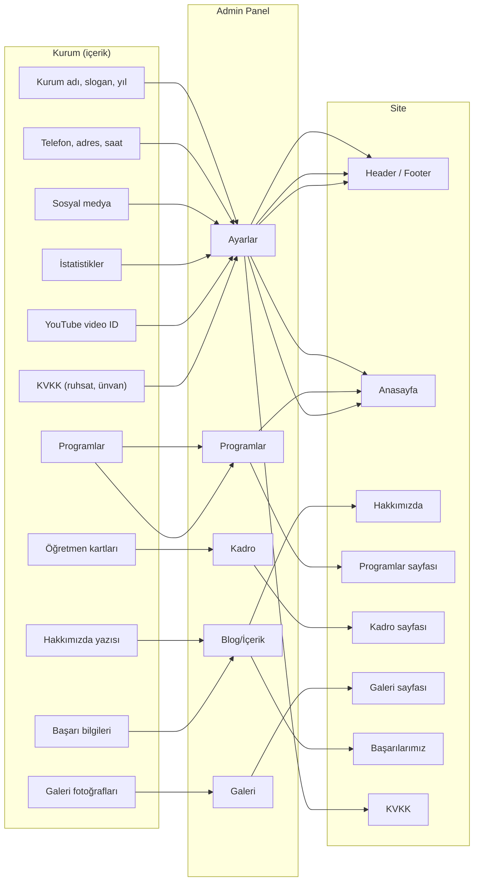

# Kuruma Gönderilecek İçerik Talep Mesajı

> Bu dosya **çalışma günlüğüdür**. Üstte mevcut durum, ortada kuruma gönderebileceğin
> güncel mesaj taslağı, altta referans için orijinal 2 turlu mesajlar duruyor.

---

## 🚀 Yayına Çıkış İçin Minimum Paket



> Minimum paket → yayın. Eğitim programları, kadro, galeri, başarılar
> **admin panelinden** sonradan eklenebilir; yayın için engel değil.

---

## ✅ DURUM ÖZETİ — Şimdiye Kadar Geleni / Bekleneni

### 🟢 Geldi & uygulandı

**Kurumsal kimlik**
- ✅ Resmi kurum adı: *Özel Ferizli İlk Adım Akademi Özel Öğretim Kursu*
- ✅ Kısa marka adı: *İlk Adım Akademi*
- ✅ Slogan: *Geleceğe Atılan İlk Adım*
- ✅ Kuruluş yılı: **2023**
- ✅ Logo (`assets/img/logo/logo.png` + `logo-large.png`)
- ✅ Favicon set'i (16/32/192/512 + apple-touch + og-default)

**İletişim**
- ✅ Telefon: `+90 549 355 61 54`
- ✅ WhatsApp: aynı numara
- ✅ Tam adres: *Kemalpaşa Mahallesi, 112. Sokak No: 1/A, Ferizli / Sakarya*
- ✅ Çalışma saatleri (7 gün için ayrı ayrı)
- ✅ Google Maps embed URL'si

**Sosyal medya**
- ✅ Instagram: `@ferizliilkadmakademi`

**Görsel**
- ✅ Tanıtım videosu (önce yerel `tanitim.mp4` olarak vardı; şimdi admin panelden YouTube ID girilince embed olarak gösteriliyor)

### 🟡 Hâlâ bekleniyor (öncelik sırasıyla)

| Eksik | Etki | Neresinde gösterilir |
|---|---|---|
| **E-posta adresi** (örn. `info@…`) | Footer'da/iletişim sayfasında "e-posta" satırı şu an boş — gizlendi | Footer, İletişim, KVKK |
| **MEB ruhsat numarası** | KVKK metni hâlâ "taslak" olarak duruyor | KVKK Aydınlatma Metni |
| **Vergi dairesi + firma ünvanı** | Aynı şekilde KVKK için zorunlu | KVKK Aydınlatma Metni |
| **Gerçek istatistikler** (kaç mezun, kaç öğretmen, hedef tutturma %) | Admin'den girilecek; girilmezse istatistik bölümü gizli | Anasayfa + Başarılarımız |
| **Eğitim programları detayı** | Admin → Programlar boş; sayfa "henüz program yok" gösteriyor | Anasayfa + Programlar |
| **Eğitim kadrosu (öğretmen kartları)** | Admin → Kadro boş | Kadro sayfası |
| **Galeri fotoğrafları** (dış cephe, sınıflar, etkinlikler) | Admin → Galeri boş | Galeri sayfası |
| **Hakkımızda kuruluş hikâyesi** (1-2 paragraf) | Sayfa şu an generic metinle dolu — placeholder benzeri | Hakkımızda |
| **Kurucu/yönetici mesajı** (1 paragraf) | Aynı sayfada generic metin var | Hakkımızda |
| **Başarı bilgileri** (mezunlar, kazanılan okullar, yıl yıl) | Başarılarımız sayfası "Başarı Hikâyelerimiz Yakında Burada" boş durumu gösteriyor | Başarılarımız |
| **Mezun yorumları** (yazılı izinli) | Aynı sayfada gösterilecek | Başarılarımız |
| **YouTube tanıtım videosu ID'si** | Anasayfa video alanı boş gösteriliyor (gizli) | Anasayfa |
| **Diğer sosyal medya** (FB, YT, TikTok, Twitter) | Boş bırakıldı, ikonlar otomatik gizlendi | Footer + floating ikonlar |
| **Domain tercihi** | Yayına çıkmak için gerekli | DNS |
| **Admin paneli kullanıcı bilgileri** (kim panel kullanacak) | Şu an sadece test admin'i var, gerçek kullanıcılar lazım | Admin login |

---

## 📤 GÜNCEL MESAJ — Eksikleri Toplama (kuruma gönder)

> Bu mesaj kurumun **şu an verebileceği** eksikleri istiyor. Aşağıyı kopyala-yapıştır
> WhatsApp/e-posta için. WhatsApp'ta `*kalın*` çalışır.

```
Merhabalar,

Web sitesinin temeli artık hazır 🎉 — kurumsal bilgiler, iletişim, çalışma
saatleri, logo, sosyal medya bağlantısı eklendi. Yayına almadan önce
elimizde olmayan birkaç içerik kaldı; aşağıdakileri gönderebilirseniz çok
sevinirim.

*1) Yasal & Kurumsal*
• E-posta adresiniz (örn. info@... — yoksa kurmamız uygunsa söyleyin)
• MEB ruhsat numaranız
• Vergi dairesi ve firma ünvanı (KVKK aydınlatma metni için)

*2) Sayılarla Kurumumuz*
Anasayfada gösterilecek 3-4 küçük istatistik kartı için:
• Şu ana kadar kaç öğrenci mezun verdiniz (yaklaşık)?
• Kaç branş öğretmeniyle çalışıyorsunuz?
• Hedefe ulaşma oranınız var mı (örn. "öğrencilerimizin %X'i ilk 3 tercihine
  yerleşti")?
• Eklemek istediğiniz başka rakam var mı?
(Abartısız, gerçek rakamlar kullanmamız önemli — küçük olsa da kurum
güvenilirliği için bu kıymetli.)

*3) Eğitim Programlarınız*
Hangi programları sunuyorsunuz? Her bir program için:
• Adı (örn. "LGS Hazırlık Programı")
• Hedef kitle (örn. "8. Sınıf Öğrencileri")
• Kısa açıklama (2-3 cümle)
• 4-5 madde halinde "ne sunuyor?" (haftalık ders saati, deneme sayısı, etüt
  var mı, vb.)

*4) Eğitim Kadronuz*
Her öğretmen için:
• Ad-Soyad
• Branş (Matematik, Türkçe, vs.)
• 1-2 cümle deneyim/mezuniyet bilgisi
• Vesikalık fotoğraf (mümkünse kurumsal, aynı arka planda)

*5) Galeri Fotoğrafları*
Aşağıdaki kategorilerde, yatay (manzara) çekimde, mümkünse 1600x1200
çözünürlükten yüksek:
• Kurum dış cephesi / tabela (2-3 adet)
• Sınıflar, koridor, etüt salonu (8-10 adet)
• Etkinlik, kutlama, ödül töreni varsa (varsa)

*6) Hakkımızda Yazısı (1-2 paragraf)*
• Kuruluş hikâyeniz (neden, nasıl?)
• Sizi diğer kurslardan ayıran 3-5 özellik
• Misyon / vizyon (varsa)
Sıfırdan yazmak zorsa, birkaç madde halinde gönderin, biz toparlayıp
onayınıza sunalım.

*7) Kurucu / Yönetici Mesajı (1 paragraf)*
Velilere hitaben, sıcak ve samimi bir mesaj. "Sevgili veliler ve
öğrenciler..." gibi başlayan birkaç cümle yeterli. Sonunda imza için
ad-soyad ve görev bilgisi.

*8) Başarılar (varsa)*
• Geçmiş yıllarda öğrencilerinizin sınav başarıları (kazanılan okullar/bölümler)
• 2-3 mezun yorumu (izinli — yazılı izin var mı?)
• Aldığınız ödüller, sertifikalar

*9) Tanıtım Videonuz YouTube'da mı?*
Varsa video adresini gönderin. Yoksa boş bırakacağız (sorun değil).

*10) Yayına Çıkış*
• Domain tercihiniz var mı? (örn. ferizliilkadimakademi.com,
  .com.tr, .net seçeneklerinden hangisi?)
• Siteyi kim yönetecek (admin panel kullanacak kişi/kişiler)? Onların
  ad-soyad bilgisi yeterli; biz hesap açıp şifreleri size güvenli şekilde
  göndereceğiz.

Bu kadarı geldiğinde yayına alabiliriz. Eksik kalan parçalar için sayfayı
güncellemek kolay — sonradan da ekleyebiliriz.

Teşekkürler!
```

---

## 📋 Güncel Checklist

### ✅ Tamam
- [x] Logo dosyası
- [x] Kurum tam resmi adı
- [x] Adres
- [x] Telefon / WhatsApp
- [x] Çalışma saatleri
- [x] Maps konumu
- [x] Instagram bağlantısı

### ⏳ Beklemede — yayına çıkmadan
- [ ] E-posta adresi
- [ ] MEB ruhsat numarası
- [ ] Vergi dairesi + firma ünvanı (KVKK için)
- [ ] Domain tercihi
- [ ] Admin paneli için kullanıcı bilgileri (gerçek kişiler)

### ⏳ Beklemede — admin'den girilecek (sonradan eklenebilir)
- [ ] İstatistik rakamları (mezun sayısı, öğretmen, başarı oranı)
- [ ] Eğitim programları detayı
- [ ] Öğretmen listesi + fotoğrafları
- [ ] Galeri fotoğrafları (dış cephe + sınıflar + etkinlikler)
- [ ] Hakkımızda kuruluş hikâyesi
- [ ] Kurucu/yönetici mesajı
- [ ] Başarı bilgileri + mezun yorumları
- [ ] YouTube tanıtım videosu ID'si
- [ ] Diğer sosyal medya (Facebook, YouTube, TikTok, Twitter)

### 🔄 Sürekli — site yayındayken
- [ ] Yeni etkinlik / duyuru fotoğrafları
- [ ] Veli/öğrenci yorumları (izinli)
- [ ] Yeni blog yazıları (opsiyonel)

---

## 🗺️ İçerik haritası — kurumdan gelen hangi bilgi nereye gider



> Bir içerik geldiğinde **admin panelinde tek bir yere** girilir; ilgili tüm
> site sayfalarında otomatik gözükür. Manuel HTML/JSON düzenlemesi yok.

---

## 💡 Notlar

- **Sıralama önemli:** "Yasal & Kurumsal" + "Hakkımızda yazısı" + "1-2 program ve 2-3 öğretmen"
  yeterli minimum içerik — bunlar gelirse **yayına çıkabiliriz**. Geri kalanlar admin'den eklenir.
- **KVKK** metni şu an kurum ünvanı ve ruhsat numarası eksik olduğu için "taslak"
  kalıyor. Bu üç bilgi gelince hukuki danışmana son hâlini onaylatmanı öneriyorum.
- **Fotoğraf çekimi:** Kurum fotoğrafları amatör çekilmiş olabilir.
  En azından **dış cephe** ve **bir-iki sınıf** için uzun pozda + bol ışıkta yeni
  çekim yapılabilirse hero kapağı çok daha şık olur.
- **"Hakkımızda" yazısı** kurum yazmakta zorlanırsa: sözlü dinleyip
  notepad'e düş, "bunu yayınlasak nasıl olur" diye dön. Hep daha kolay olur.
- **İstatistikler için altın kural:** Abartmayın. *"2 yıllık deneyim"* yazmak,
  *"10+ yıllık tecrübe"* yazmaktan daha güvenilirdir. Veliler küçük yerleşimde
  hatırlayıp tartışır.

---

## 🗂️ Arşiv — Orijinal 2 Mesajlık İlk Gönderim

> Aşağıdaki iki mesaj proje başlangıcında kuruma gönderildi. Referans için
> tutuluyor; yeni iletişim için yukarıdaki "Güncel Mesaj"ı kullan.

<details>
<summary>📤 1. Mesaj — İlk gönderim (kritik içerikler)</summary>

```
Merhabalar,

Web sitesi çalışmamıza başlayabilmek için sizden bazı bilgi ve görseller
toplamamız gerekiyor. Liste biraz uzun görünebilir ancak elinizde olanları
parça parça gönderseniz dahi başlayabiliriz; eksikleri yol aldıkça
tamamlarız.

Aşağıdakileri *öncelikli* olarak bekliyoruz:

*1) Kurumsal Kimlik*
• Kurumun MEB ruhsatındaki tam resmi adı
• Logonuz (varsa orijinal vektör dosyası — .ai / .svg / .eps; yoksa
  yüksek çözünürlüklü PNG)
• Kurumsal renkleriniz (varsa)
• Kuruluş yılı

*2) İletişim Bilgileri*
• Tam açık adres (mahalle, sokak, no)
• Sabit telefon numarası
• WhatsApp için kullanılan numara (sabit ile aynıysa belirtmenize gerek yok)
• E-posta adresi
• Çalışma saatleri (hafta içi / cumartesi / pazar ayrı ayrı)
• Google Maps konum bağlantısı

*3) Sosyal Medya Hesapları*
Instagram hesabınızı biliyoruz, varsa diğerleri:
• Facebook
• YouTube
• TikTok
• Twitter / X

*4) Görseller (en kritik kısım)*
• Kurum dış cephesi / tabela (1-2 adet)
• Sınıf ve iç mekan fotoğrafları (en az 8-10 adet)
• Bekleme/öğretmen odası, koridor, etüt salonu vb.
• Etkinlik, ödül töreni, gezi fotoğrafları (varsa)
• Tanıtım videonuz varsa (opsiyonel)

*5) Kurum Hakkında Kısa Yazı*
• Kurumun kuruluş hikâyesi
• Sizi diğer kurslardan ayıran 3-5 özellik
• Misyon/Vizyon (varsa)

Teşekkür ederiz!
```

</details>

<details>
<summary>📤 2. Mesaj — İkinci gönderim (detay içerikler)</summary>

```
Merhabalar, sitenin omurgası şekilleniyor. Şimdi içerikleri zenginleştirmek
için biraz daha ayrıntılı bilgilere ihtiyacımız var:

*6) Eğitim Programlarınız*
• Sınıf seviyeleri (örn. 5. sınıf, 6-7-8, 9-10, 11-12)
• Hazırlık verilen sınavlar (LGS, TYT, AYT, YDT, KPSS, vb.)
• Her sınıf seviyesi için verilen ders branşları
• Haftalık ders saati, sınıf mevcudu
• Deneme sınavı sıklığı

*7) Eğitim Kadronuz*
Her öğretmen için:
• Ad-Soyad / Branş / Mezuniyet / Deneyim yılı
• Vesikalık fotoğraf

*8) Başarılarınız*
• Geçmiş yıllarda öğrencilerinizin sınav başarıları
• Kazanılan okullar/bölümler
• Veli veya öğrenci yorumları (izinli)
• Aldığınız ödüller, sertifikalar

*9) Yasal Bilgiler (Footer için)*
• MEB ruhsat numarası
• Vergi dairesi ve firma ünvanı

*10) Web Sitesi Operasyonel*
• Domain tercihi
• Admin panel kullanıcısı olarak kim atanacak?
• Kurumsal e-posta açmak ister misiniz?
```

</details>
