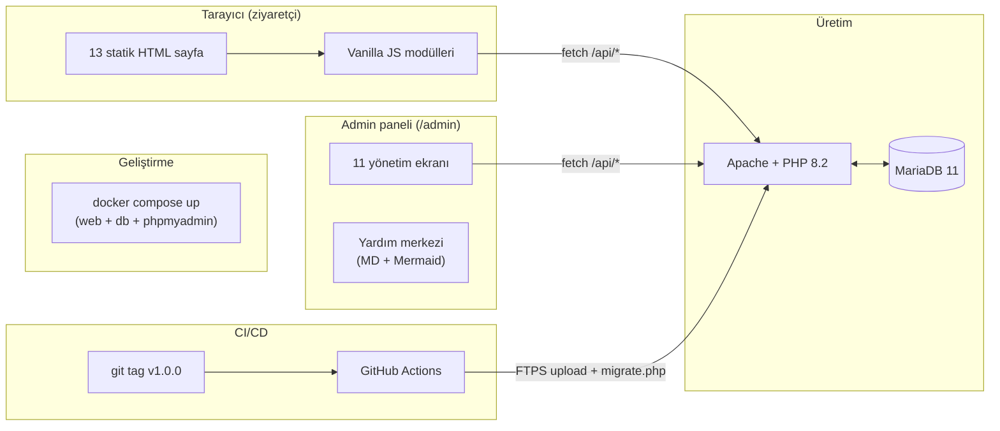
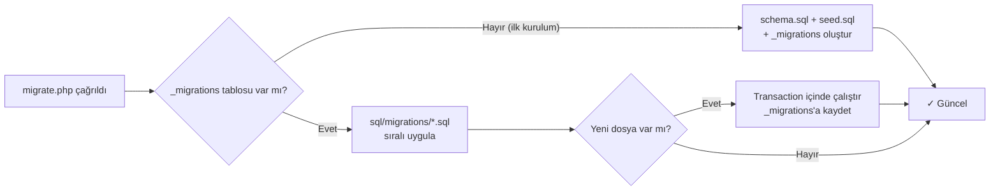

# Özel Ferizli İlk Adım Akademi — Web Sitesi

[](https://www.php.net/)
[](https://mariadb.org/)
[](https://docs.docker.com/compose/)

Sakarya/Ferizli'de yer alan özel öğretim kursunun kurumsal web sitesi.
Vanilla HTML/CSS/JS frontend + PHP + MySQL backend; tüm dinamik içerik
admin panelinden yönetilir, geliştiriciye iş düşmez.

---

## Mimari



| Katman | Stack |
|---|---|
| **Frontend** | Vanilla HTML5 + CSS3 + ES2022 (no build, no framework) |
| **Backend** | PHP 8.2 (PDO, prepared statements) — yalın, framework yok |
| **Database** | MariaDB 11 (utf8mb4, InnoDB) |
| **Web sunucu** | Apache 2.4 + mod_rewrite |
| **Dev env** | Docker Compose (web + db + phpmyadmin) |
| **CI/CD** | GitHub Actions → FTPS / SSH deploy + DB migration |
| **Editör** | Quill.js (blog), DOMPurify (XSS sanitize) |
| **Yardım** | Marked.js + Mermaid.js + DOMPurify, runtime markdown |

---

## Hızlı Başlangıç (yerel geliştirme)

```bash
# 1) .env hazırla (DB şifresi vs. — örnekten kopyala)
cp .env.example .env

# 2) Konteynerleri başlat
docker compose up -d

# 3) Site: http://localhost:8088
# phpMyAdmin (opsiyonel): http://localhost:8081
#   docker compose --profile dev up -d   ile başlatılır
```

İlk açılışta `sql/schema.sql` + `sql/seed.sql` otomatik içeri alınır.
Admin şifresi başlangıçta **kilitli**; gerçek şifre atamak için:

```bash
docker compose exec -T web php api/install/admin-olustur.php
```

Detaylı kurulum: [KURULUM_PHP.md](KURULUM_PHP.md)

---

## Dosya Yapısı

```
/
├── *.html                  # 13 sayfa (index, hakkimizda, programlar, …)
├── partials/               # header / footer / floating-icons
├── assets/
│   ├── css/                # base, components, layout, pages (4 dosya)
│   ├── js/                 # main.js + sayfa-özel modüller
│   ├── img/                # logo, favicon, og-default
│   └── uploads/            # kullanıcı yüklemeleri (gitignored)
├── admin/                  # Yönetim paneli
│   ├── index.html          # Login + dashboard
│   ├── duyurular.html      # Duyuru CRUD
│   ├── programlar.html     # Eğitim programları
│   ├── kadro.html          # Öğretmen kartları
│   ├── galeri.html         # Albüm + görsel yönetimi
│   ├── formlar.html        # Form tasarımcısı (11 alan tipi)
│   ├── cevaplar.html       # Form yanıtları (CSV/PDF/JSON)
│   ├── blog.html           # Quill editör ile yazı oluşturma
│   ├── bildirimler.html    # Sistem bildirimleri
│   ├── kullanicilar.html   # Kullanıcı yönetimi (admin/editör)
│   ├── ayarlar.html        # Site ayarları (telefon, adres, ...)
│   ├── yardim.html         # Yardım merkezi shell
│   ├── yardim/             # 41 markdown sayfa (12 bölüm)
│   ├── css/                # admin.css + yardim.css
│   └── js/                 # admin-core, api-client, yardim
├── api/
│   ├── index.php           # REST router
│   ├── db.php              # PDO singleton
│   ├── helpers.php         # JSON cevap, slug, sanitize
│   ├── auth.php            # Session-based auth (bcrypt)
│   ├── endpoints/          # 11 endpoint (blog, formlar, ayarlar, ...)
│   ├── install/
│   │   ├── admin-olustur.php   # CLI: ilk admin şifresini ayarla
│   │   ├── migrate.php          # CLI + web: DB migration runner
│   │   └── migrate-base64-images.php
│   ├── config.example.php  # ENV-based dev config
│   └── config.template.php # CI/CD'nin doldurduğu prod şablonu
├── sql/
│   ├── schema.sql          # Tüm tablolar (utf8mb4)
│   ├── seed.sql            # Varsayılan kullanıcı + ayarlar
│   └── migrations/         # Artımlı schema güncellemeleri
├── docker/                 # Dockerfile + php.ini + entrypoint
├── docker-compose.yml      # web + db + phpmyadmin
├── .github/
│   ├── workflows/deploy.yml      # CI/CD pipeline
│   └── SECRETS_KURULUM.md        # GitHub secret/vars rehberi
└── *.md                    # Dokümanlar (aşağıda)
```

---

## Tek Bir Yerden Değiştirilebilenler

| Konu | Yer |
|---|---|
| Telefon, adres, sosyal medya, çalışma saatleri | Admin → **Site Ayarları** |
| İstatistik kartları (mezun, deneyim vb.) | Admin → Site Ayarları → İstatistikler |
| Anasayfa tanıtım videosu | Admin → Site Ayarları → YouTube ID |
| Tema renkleri | [assets/css/base.css](assets/css/base.css) `:root` değişkenleri |
| Site genelinde marka adı | Admin → Site Ayarları → Kurum Bilgileri |
| KVKK aydınlatma metni | [kvkk.html](kvkk.html) (üretim öncesi hukuki onay) |

---

## Yönetim Paneli

`/admin/` rotasında. İki rol:

- **Admin**: tüm modüller + kullanıcı yönetimi
- **Editör**: içerik yönetimi (duyuru, kadro, galeri, blog) + Profilim

Paneldeki **🎓 Yardım** sekmesinden 41 sayfalık kullanım rehberine ulaşılır
(Markdown + Mermaid; teknik bilgisi olmayan kullanıcılar için yazılmıştır).

---

## CI/CD

Release tag (`v1.0.0` formatlı) push edildiğinde otomatik tetiklenir:

```
git tag v1.0.0 && git push origin v1.0.0
```

Pipeline akışı:

1. **validate** — PHP syntax + JSON validity
2. **deploy** — `api/config.php` secrets'tan üretilir + FTPS/SSH ile yüklenir
3. **migrate** — `migrate.php` endpoint'i tetiklenir → bootstrap veya artımlı migration
4. **smoke-test** — anasayfa HTTP 200 mü?

Detaylar:
- **GitHub secrets/variables kurulumu** → [.github/SECRETS_KURULUM.md](.github/SECRETS_KURULUM.md)
- **Müşteriden hosting bilgisi alma** → [KURULUM_HOSTING.md](KURULUM_HOSTING.md)
- **CI workflow** → [.github/workflows/deploy.yml](.github/workflows/deploy.yml)

### Migration sistemi



Yeni migration eklemek için: `sql/migrations/<3-haneli>_<açıklama>.sql`
(örn. `001_blog_etiketler.sql`). CI bir sonraki deploy'da otomatik uygular.

---

## Form Motoru

Kendi form motoru (Google Forms yok):

- Admin → **Formlar** menüsünde 11 alan tipi (text, email, tel, textarea,
  select, radio, checkbox, checkbox-tek, date, number, başlık)
- Cevaplar **Cevaplar** sayfasında, CSV/PDF/JSON/JSONL olarak indirilebilir
- KVKK uyarısı: form yanıtları kişisel veridir — bkz. [admin yardım merkezi](admin/yardim/ipuclari/guvenlik.md)
- Bir form **"Varsayılan"** işaretlenirse `/basvuru.html` ona yönlendirir
- Duyurular formlara bağlanabilir → "📝 Formu Doldur" butonu çıkar

---

## Yeni Sayfa Ekleme

1. Kök dizinde `yenisayfa.html` oluştur (mevcut bir sayfayı şablon olarak kopyala).
2. [partials/header.html](partials/header.html) içindeki nav listesine `<li>` ekle:
   ```html
   <li><a href="/yenisayfa.html" class="site-nav__link" data-link="yenisayfa">Yeni Sayfa</a></li>
   ```
3. [assets/js/main.js](assets/js/main.js)'deki `eslesme` nesnesine sayfa ID'sini ekle
   (aktif menü vurgusu için).
4. [partials/footer.html](partials/footer.html) menü listesine de eklemeyi unutma (opsiyonel).

---

## Tema / Renk Değişikliği

Tüm tema [assets/css/base.css](assets/css/base.css) içindeki `:root` CSS değişkenleriyle
yönetilir. Logo renklerinden esinlenilmiş pastel + kurumsal palet:

```css
:root {
  --renk-birincil: #1565c0;   /* Logo mavisi — kurumsal */
  --renk-vurgu:    #d32f2f;   /* Logo kırmızısı — CTA */
  --pastel-mavi:   #eaf3fb;
  --pastel-pembe:  #fdebec;
  --pastel-krem:   #fdf8ee;
  /* ... */
}
```

Değişiklik tüm sayfalarda anında yansır.

---

## Veri Bağlama (Frontend ↔ API)

Her sayfada [assets/js/main.js](assets/js/main.js) çalışır; üç yolu vardır:

1. **`data-veri="path"`** → `/api/ayarlar`'dan ilgili değeri elementin metnine yazar.
   Örn: `<span data-veri="iletisim.telefon">…</span>`.
2. **`data-veri-href="tel:iletisim.telefon"`** → tıklanabilir `tel:` veya `mailto:` href.
3. **`data-veri-gizle-bos="iletisim.eposta"`** → değer boşsa elementi gizler
   (sahte fallback'leri ortadan kaldırır).

Listeleme yapan modüller: [duyurular.js](assets/js/duyurular.js),
[programlar.js](assets/js/programlar.js), [kadro.js](assets/js/kadro.js),
[galeri.js](assets/js/galeri.js), [blog.js](assets/js/blog.js),
[form-render.js](assets/js/form-render.js).

---

## Dokümanlar

| Dosya | Kim için |
|---|---|
| [KURULUM_PHP.md](KURULUM_PHP.md) | Yerel geliştirme ortamı (Docker / MAMP) |
| [KURULUM_HOSTING.md](KURULUM_HOSTING.md) | Müşteriye sorulacak hosting bilgileri |
| [.github/SECRETS_KURULUM.md](.github/SECRETS_KURULUM.md) | GitHub Actions secrets/variables |
| [KURUMA_ICERIK_TALEBI.md](KURUMA_ICERIK_TALEBI.md) | Kuruma içerik talep mesajı + durum |
| [/admin/yardim.html](admin/yardim.html) | Kurum personeli için adım adım kullanım kılavuzu (41 sayfa) |

---

## Önemli Notlar

- **Güvenlik**: `api/config.php` ve `.env` git'e **girmez** (gitignored). CI'da
  secrets'tan üretilir, sadece sunucuya gider.
- **`api/install/`** klasörü web erişimine kapalı (`.htaccess: Require all denied`),
  istisna: `migrate.php` — kendi `X-Migration-Key` doğrulamasını yapar.
- **Çoklu admin önerisi**: Kuruma teslim sırasında en az 2 admin hesabı açın
  (birinin şifresi unutulursa diğeri sıfırlayabilir).
- **Yedekleme**: `assets/uploads/` kullanıcı verisi içerir; hosting otomatik
  yedek almıyorsa düzenli aralıkla manuel indirin.

---

## Lisans

Bu proje **Özel Ferizli İlk Adım Akademi** için özel olarak geliştirilmiştir.
Kaynak kodu eğitim ve referans amaçlı incelenebilir.
