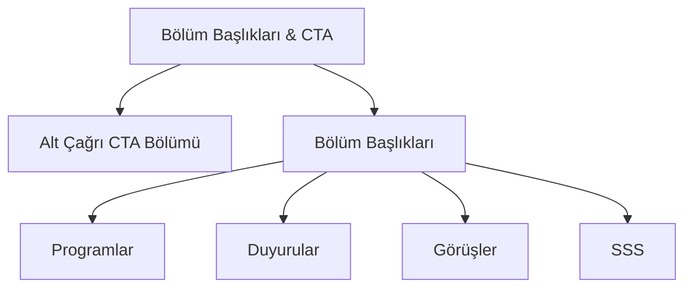
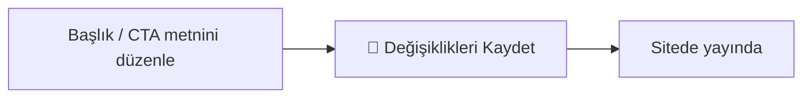

# Bölüm Başlıkları & Çağrı (CTA)

Anasayfadaki bölümlerin **başlık metinlerini** (Programlar, Duyurular, Görüşler, SSS) ve sayfanın **en altındaki kayıt çağrısı kutusunu (CTA)** buradan düzenlersiniz. Bu bölüm yalnızca **başlık/çağrı yazılarını** yönetir — bölümlerin içeriği (programlar, duyurular vb.) başka sayfalardan gelir.

**Yer:** Üst menü → **Ayarlar** → "Ana Sayfa — Bölüm Başlıkları & Çağrı (CTA)" bölümü

> [!UYARI]
> Bu bölüm **katlanır (açılır) bir bölümdür** ve değişiklikler **anında kaydedilmez.** Bir alanı düzenlemek yetmez — sayfanın en altındaki **💾 Değişiklikleri Kaydet** düğmesine basana kadar hiçbir şey siteye yansımaz. (Yalnızca *Modüller* anahtarları anında kaydedilir; bu bölüm değil.)

## İki kısımdan oluşur

## Alt Çağrı (CTA) Bölümü

Anasayfanın **en altındaki** dikkat çekici **kayıt çağrısı kutusu**dur. Ziyaretçiyi başvuruya veya iletişime yönlendiren son davettir. Aşağıdaki alanları içerir:

| Alan | Ne işe yarar |
|---|---|
| **CTA Başlık** | Kutunun büyük yazısı (örn. "Hayalinizdeki başarıya bir adım uzaklıktasınız.") |
| **CTA Metin** | Başlığın altındaki kısa açıklama cümlesi |
| **1. Buton Metni** | Birinci düğmenin üzerindeki yazı (örn. "Ön Kayıt Ol") |
| **1. Buton Linki** | Birinci düğmenin gideceği adres (örn. `/basvuru.html`) |
| **2. Buton Metni** | İkinci düğmenin üzerindeki yazı (örn. "Bize Ulaşın") |
| **2. Buton Linki** | İkinci düğmenin gideceği adres (örn. `/iletisim.html`) |

Link örnekleri:

| Link | Nereye gider |
|---|---|
| `/basvuru.html` | Başvuru / ön kayıt sayfası |
| `/iletisim.html` | İletişim sayfası |
| `/programlar.html` | Programlar sayfası |

> [!İPUCU]
> CTA kutusu sayfanın en sonunda olduğu için ziyaretçi **tüm siteyi gezdikten sonra** burayı görür. Bu yüzden net ve davetkâr bir çağrı yazın — "Ön Kayıt Ol" gibi tek tıkla harekete geçiren bir metin idealdir.

## Bölüm Başlıkları

Anasayfadaki dört bölümün başlık yazılarını buradan düzenleyebilirsiniz: **Programlar, Duyurular, Görüşler ve SSS.** Her bölüm için üç alan vardır:

| Alan | Görünüm | Örnek |
|---|---|---|
| **Üst Etiket** | Başlığın üstündeki **küçük renkli etiket** | "Programlarımız" |
| **Başlık** | **Büyük** ana başlık | "Her Seviyeye Uygun Eğitim" |
| **Açıklama** | Başlığın altındaki **alt satır** | "Ortaokul, lise ve sınav hazırlık programlarımızla..." |

> [!UYARI]
> Bu bölüm yalnızca **başlık metinlerini** düzenler. Programlar ve Duyurular bölümlerinin **içeriği** (kartlar, listeler) **ayrı sayfalardan** gelir:
> - Program kartları için: [Eğitim Programları](#/programlar/program-ekleme)
> - Duyuru kartları için: [Yeni Duyuru Ekleme](#/duyurular/yeni-duyuru)
>
> Görüşler ve SSS içeriği ise yine **Ayarlar** sayfasındaki kendi bölümlerinden yönetilir: [Görüşler](#/anasayfa/gorusler) · [Sıkça Sorulan Sorular](#/anasayfa/sss).

## Boş bırakırsanız ne olur?

Bir başlık alanını **boş bırakmak sorun değildir.** Boş bıraktığınız her alan için sitede **yerleşik bir varsayılan metin** görünür. Yani:

- "Programlar — Başlık" alanını boş bırakırsanız sitede otomatik olarak "**Her Seviyeye Uygun Eğitim**" yazar.
- Bir başlığı değiştirmek istemiyorsanız o alana **dokunmanıza gerek yok.**

Sadece kuruma özel bir metin yazmak istediğinizde ilgili alanı doldurun.

> [!İPUCU]
> Tüm başlıkları sıfırdan yazmak zorunda değilsiniz. Sitenin kendi metinleri zaten anlamlı ve düzgündür. Yalnızca değiştirmek istediğiniz birkaç başlığı doldurmanız yeterlidir — gerisini boş bırakın.

## Kaydetme

Bu bölümdeki **tüm** değişiklikler (CTA yazıları, butonlar, bölüm başlıkları) yalnızca sayfanın en altındaki **💾 Değişiklikleri Kaydet** düğmesine bastığınızda kalıcı olur ve siteye yansır.

## Bilmeniz gerekenler

- Bu bölüm yalnızca **başlık ve çağrı metinlerini** yönetir; bölüm içeriklerini değil.
- Boş bırakılan başlık alanı için sitede **yerleşik varsayılan** metin görünür — boş bırakmak güvenlidir.
- Programlar ve Duyurular **içeriği** ayrı sayfalardan gelir; burada sadece o bölümlerin **başlığını** değiştirirsiniz.
- Değişiklikler **anında kaydedilmez** — alttaki **💾 Değişiklikleri Kaydet** şarttır.
