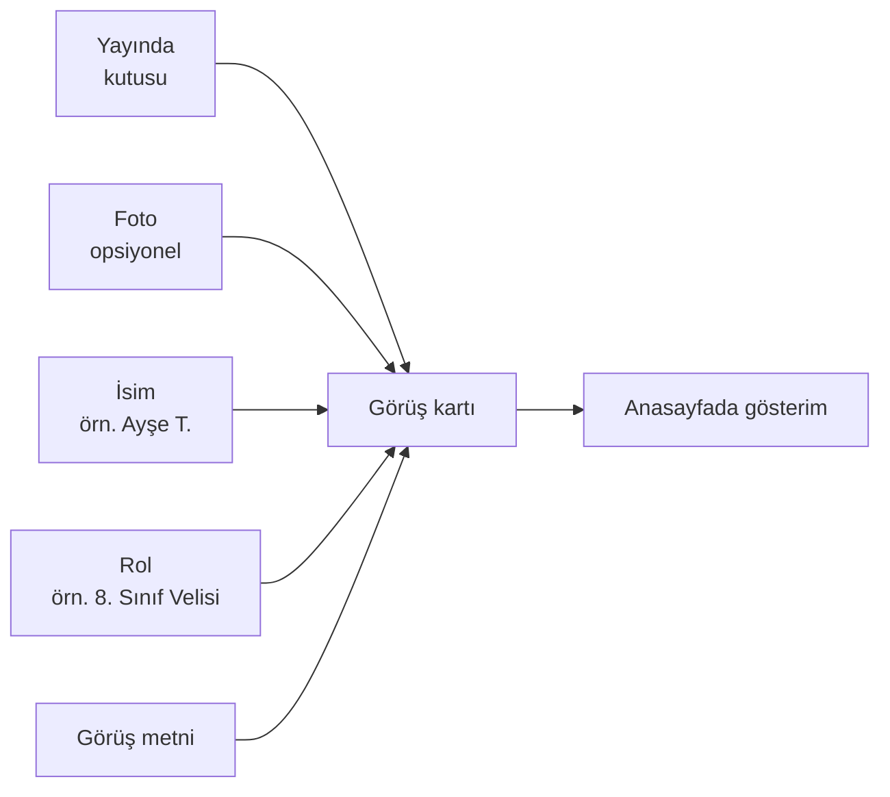
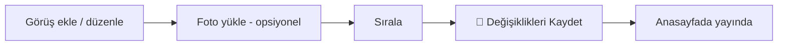

# Görüşler

Anasayfada gösterilen **veli ve öğrenci yorumları** (testimonials) buradan yönetilir. "Kızımın matematiği çok düzeldi", "Öğretmenler çok ilgili" gibi gerçek görüşler, kurumunuza güven duyan yeni velileri ikna eden en güçlü içeriktir.

**Yer:** Üst menü → **Ayarlar** → "Ana Sayfa — Görüşler" bölümü (💬)

> [!UYARI]
> **Gerçek olmayan/uydurma görüş yazmayın.** Kendi yazdığınız sahte yorumlar (var olmayan "Ayşe T."nin ağzından metin) kurumun güvenilirliğini **zedeler**. Bir veli kendi adına yazılmış ama söylemediği bir yorumu görürse, ya da yorumların hepsi aynı kalemden çıkmış gibi durursa, bu sosyal medyada (Instagram, WhatsApp grupları) ciddi tepki çekebilir. **Sadece gerçekten alınmış, izinli görüşleri yayınlayın.** Elinizde hiç görüş yoksa bu bölümü boş bırakın — aşağıda anlatıldığı gibi bölüm otomatik gizlenir.

## Bir görüşte hangi alanlar var?

Her görüş kartı, anasayfada veli/öğrencinin adı, rolü, fotoğrafı (varsa) ve yorumuyla gösterilir. Admin'de her görüş için şu alanlar bulunur:

### Yayında (kutu)

Her görüşün başında bir **"Yayında"** kutusu vardır. İşaretliyse görüş sitede görünür.

- İşareti **kaldırırsanız** o görüş sitede **görünmez** — ama silinmez, listede kalır. İleride tekrar işaretleyip yayına alabilirsiniz.
- Yeni eklenen görüşler varsayılan olarak **işaretli** (yayında) gelir.
- Bir görüşü silmeden geçici gizlemek için silmek yerine bu kutunun işaretini kaldırın.

### Foto (opsiyonel)

Veli/öğrencinin fotoğrafı. **Zorunlu değildir.**

<ol class="adim-listesi">
<li>Fotoğraf eklemek için soldaki yuvarlak alanın altındaki <strong>📁</strong> düğmesine basın ve bir görsel seçin/yükleyin.</li>
<li>Fotoğrafı kaldırmak için yanındaki <strong>×</strong> düğmesine basın.</li>
</ol>

**Foto yoksa**, sitede ismin **baş harfi yuvarlak bir daire içinde** gösterilir (örn. "Ayşe T." için "A"). Bu son derece şık durur — fotoğraf bulamadıysanız hiç dert etmeyin.

> [!İPUCU]
> **Veli fotoğrafı için izin alın.** Bir velinin/öğrencinin yüzünü siteye koyacaksanız mutlaka **açık izni** olmalı. Çoğu durumda fotoğraf gerekmez — baş harfli yuvarlak daire hem zarif hem de mahremiyet açısından güvenlidir. Şüphedeyseniz fotoğrafı boş bırakın.

### İsim

Görüşü veren kişinin adı. Tam soyadı yazmak yerine **baş harf** kullanmak hem daha doğal durur hem de mahremiyeti korur:

- `Ayşe T.`
- `Mehmet K.`
- `Zeynep (8. sınıf öğrencisi)`

### Rol

Kişinin kurumla ilişkisi. Kısa tutun. Örnekler:

- `8. Sınıf Velisi`
- `LGS Mezunu Öğrenci`
- `12. Sınıf Velisi`
- `2024 Mezun Velisi`

### Görüş metni

Asıl yorum. 1-3 cümle idealdir — çok uzun metinler kartta küçük görünür ve okunmaz. Velinin gerçek ifadesini koruyun; sadece imla/yazım düzeltmesi yapın.

## Yeni görüş ekleme

<ol class="adim-listesi">
<li><strong>Ayarlar</strong> sayfasını açın, "Ana Sayfa — Görüşler" başlığına tıklayarak bölümü açın.</li>
<li>En altta yer alan <strong>+ Yeni Görüş Ekle</strong> düğmesine basın.</li>
<li>Açılan boş kartın alanlarını doldurun (en azından <strong>İsim</strong> veya <strong>Görüş metni</strong>).</li>
<li>İsterseniz <strong>📁</strong> ile fotoğraf yükleyin (opsiyonel).</li>
<li>İşiniz bitince sayfanın en altındaki <strong>💾 Değişiklikleri Kaydet</strong> düğmesine basın.</li>
</ol>

## Görüşleri sıralama ve silme

Her görüş kartının sağ üstünde araç düğmeleri vardır:

- **↑** ve **↓** okları: Görüşü **yukarı / aşağı** taşıyarak gösterim sırasını değiştirir. En önemli / en güçlü görüşleri yukarı taşıyın — ziyaretçi ilk onları görür.
- **Sil** düğmesi: Görüşü **tamamen kaldırır.** (Sadece geçici gizlemek istiyorsanız silmek yerine "Yayında" işaretini kaldırın.)

Sıralama ya da silme yaptıktan sonra da **💾 Değişiklikleri Kaydet**'e basmayı unutmayın.

> [!UYARI]
> **Değişiklikler "Kaydet"e basana kadar yayınlanmaz.** Görüşler bölümü, Site Ayarları'ndaki **katlanır bir bölümdür** ve değişiklikler **anında kaydedilmez.** Görüş ekleseniz, silseniz, sıralasanız ya da fotoğraf yükleseniz bile bunlar siteye yansımaz — sayfanın en altındaki **💾 Değişiklikleri Kaydet** düğmesine basana kadar. (Sadece *Modüller* anahtarları anında kaydedilir; bu bölüm değil.) Fotoğraf yüklediğinizde çıkan "Fotoğraf yüklendi — kaydetmeyi unutmayın" uyarısı tam da bunu hatırlatır.

## Bölümü açma / kapatma

Görüşler bölümünün anasayfada görünüp görünmeyeceğini **Modüller** kısmından kontrol edersiniz.

**Yer:** Üst menü → **Ayarlar** → "Modüller — Aç / Kapa" → **💬 Görüşler**

Bu anahtar (toggle) **anında** kaydedilir — ayrıca "Kaydet"e basmanıza gerek yoktur. Kapattığınızda görüşleriniz silinmez; modülü tekrar açtığınızda olduğu gibi geri gelir. Detaylar için: [Modüller (Aç / Kapa)](#/site-ayarlari/moduller).

## Hiç görüş yoksa ne olur?

Görüş bölümü **otomatik gizlenir**. Anasayfada boşluk kalmaz, başka hiçbir bölüm bozulmaz. Yani:

- Henüz hiç gerçek görüş toplamadıysanız — hiçbir şey eklemeyin, bölüm kendiliğinden görünmez olur.
- Tüm görüşlerin "Yayında" kutusunu kaldırırsanız da aynı şekilde bölüm gizlenir.

Bu davranış kasıtlıdır: **uydurma yorumla doldurmaktansa, bölümün hiç görünmemesi daha güvenlidir.**

## Görüş nasıl toplanır? (öneri)

Gerçek görüş toplamak sandığınızdan kolaydır:

- Dönem sonu veli toplantılarında memnun velilerden **1-2 cümlelik yorum** ve yayın izni isteyin.
- WhatsApp veli grubunda gelen teşekkür mesajlarını **izin alarak** kullanın.
- Mezun olan öğrencilerden kısa bir görüş rica edin ("rolü" → "2024 Mezunu").

## Kaydetme

Bu bölümdeki **tüm** değişiklikler (yeni görüş, foto, isim, rol, metin, sıralama, silme...) yalnızca sayfanın en altındaki **💾 Değişiklikleri Kaydet** düğmesine bastığınızda kalıcı olur ve siteye yansır.

## Bilmeniz gerekenler

- Bir görüş kartının kaydedilebilmesi için en azından **İsim** veya **Görüş metni** dolu olmalıdır. Tamamen boş bir kart kaydetseniz bile sitede gösterilmez, bir şey bozulmaz.
- "Yayında" işareti kaldırılmış görüş listede kalır ama sitede çıkmaz — kalıcı silme için **Sil** kullanın.
- **Foto opsiyoneldir;** yoksa ismin baş harfi yuvarlak daire içinde gösterilir.
- Görüşler yalnızca **anasayfada** gösterilir; ayrı bir "Görüşler" sayfası yoktur.
- İçerik değişiklikleri **💾 Değişiklikleri Kaydet** ile yayınlanır; **Modüller → Görüşler** aç/kapa anahtarı ise **anında** çalışır.
