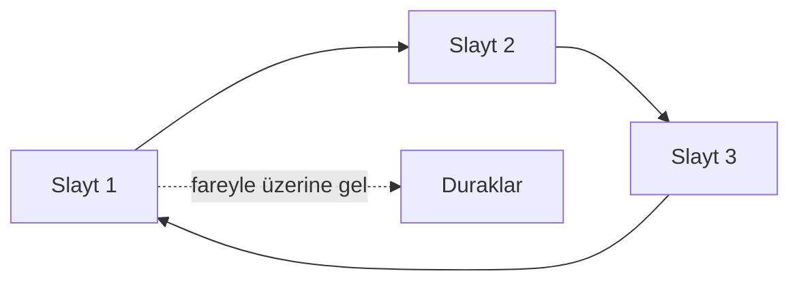
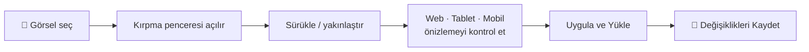
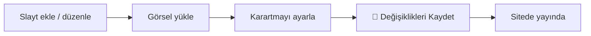

# Hero Slider

Anasayfanın en üstündeki **büyük görsel alan** burasıdır. Ziyaretçi siteye girdiğinde ilk gördüğü yer odur — bu yüzden kurumun "vitrini" gibi düşünebilirsiniz. Buradan birden çok **slayt** (görsel + başlık + buton) hazırlar, sıralar ve istediğiniz an yayından kaldırabilirsiniz.

**Yer:** Üst menü → **Ayarlar** → "Ana Sayfa — Hero Slider" bölümü

> [!UYARI]
> Hero Slider bölümü **katlanır (açılır) bir bölümdür** ve değişiklikler **anında kaydedilmez.** Slayt eklemek, görsel yüklemek veya bir alanı düzenlemek yetmez — sayfanın en altındaki **💾 Değişiklikleri Kaydet** düğmesine basana kadar hiçbir şey siteye yansımaz. (Sadece *Modüller* anahtarları anında kaydedilir; bu bölüm değil.)

## Slider nedir?

Slider, üst üste değil **arka arkaya gösterilen** birden çok görselli karttır. Çalışma şekli:

- Birden fazla **slayt** koyabilirsiniz; site bunları sırayla gösterir.
- Slaytlar **otomatik geçer** (siz açtıysanız).
- Ziyaretçi isterse kenarlardaki **oklarla (‹ ›)** veya alttaki **noktalarla** kendisi gezebilir.
- Ziyaretçi **fareyle slaytın üzerine geldiğinde geçiş durur** — okuması rahat olsun diye. Fareyi çekince devam eder.

## Slider geneli — iki ayar

Slaytların **üstünde**, tüm slider'ı ilgilendiren iki ayar vardır:

| Ayar | Ne işe yarar |
|---|---|
| **Otomatik geçiş** (kutu) | İşaretliyse slaytlar kendiliğinden ilerler. İşaretli değilse ziyaretçi okları/noktaları kullanmadan slayt değişmez. |
| **Geçiş Süresi (saniye)** | Bir slaytın ne kadar süre ekranda kalacağı. Örn. **6** yazarsanız her slayt 6 saniye gösterilir. 2 ile 20 arasında bir değer girin. |

> [!İPUCU]
> Geçiş süresini çok kısa tutmayın. Başlık ve butonun okunabilmesi için **5-7 saniye** idealdir. Tek slaytınız varsa "Otomatik geçiş" zaten fark etmez — geçecek başka slayt yoktur.

## Yeni slayt ekleme

<ol class="adim-listesi">
<li><strong>Ayarlar</strong> sayfasını açın, "Ana Sayfa — Hero Slider" başlığına tıklayarak bölümü açın.</li>
<li>En altta yer alan <strong>+ Yeni Slayt Ekle</strong> düğmesine basın.</li>
<li>Açılan boş slaytın alanlarını (görsel, başlık, buton...) doldurun.</li>
<li>İşiniz bitince sayfanın en altındaki <strong>💾 Değişiklikleri Kaydet</strong> düğmesine basın.</li>
</ol>

## Bir slaytın alanları

Her slaytta aşağıdaki alanlar bulunur.

### Yayında

Slaytın başındaki **"Yayında"** kutusu. İşaretliyse slayt sitede gösterilir.

- İşareti **kaldırırsanız** o slayt sitede **görünmez** — ama silinmez, listede kalır. İleride tekrar işaretleyip yayına alabilirsiniz.
- Hazırlamakta olduğunuz, henüz bitmemiş bir slaytı "Yayında" işaretini kaldırarak gizli tutmak iyi bir yöntemdir.

### Görsel ve kırpma aracı (YENİ)

Slaytın arka plan fotoğrafı. Bir fotoğraf seçtiğinizde dosya **doğrudan yüklenmez** — önce **"Hero Görselini Kırp" penceresi** (kırpma aracı) açılır. Burada fotoğrafı konumlandırır, yakınlaştırır ve **her cihazda nasıl görüneceğini canlı görerek** onaylarsınız. Böylece "sitede böyle görüneceğini bilmiyordum" sürprizinin önüne geçilir.

<ol class="adim-listesi">
<li><strong>📁 Görsel</strong> düğmesine basın ve bilgisayarınızdan bir fotoğraf seçin.</li>
<li><strong>Kırpma penceresi açılır.</strong> Soldaki alanda fotoğrafı <strong>sürükleyerek konumlandırın</strong>; <strong>+ / −</strong> düğmeleri, kaydırıcı ya da fare tekerleğiyle <strong>yakınlaştırın</strong>. Baştan başlamak için <strong>Sıfırla</strong>.</li>
<li>Sağdaki <strong>Web · Tablet · Mobil</strong> önizlemelerine bakın: bunlar fotoğrafın her ekranda nasıl duracağını başlık, rozet ve butonla birlikte gösteren <strong>küçük bir provadır</strong> ve siz kırptıkça <strong>anında güncellenir</strong>.</li>
<li>Beğendiğinizde <strong>Uygula ve Yükle</strong>'ye basın — fotoğraf kırpılıp yüklenir ve önizlemesi slayta gelir. Vazgeçerseniz <strong>İptal</strong>.</li>
<li>Fotoğrafı değiştirmek için tekrar <strong>📁 Görsel</strong>; kaldırmak için yanındaki <strong>×</strong> düğmesine basın.</li>
</ol>

> [!İPUCU]
> **Orta şerit önemlidir.** Kırpma alanında ortadaki açık bölgenin iki yanı hafifçe karartılmıştır; bu **orta şerit, telefonda görünen kısımdır** (telefon ekranı dar olduğu için kenarlar kırpılır). Yüz, logo, önemli detay gibi şeyleri **ortada tutun** ki her cihazda görünsün. Sağdaki **Mobil** önizleme bunu birebir gösterir.

> [!UYARI]
> Fotoğrafı **çok fazla yakınlaştırırsanız** pencerede **"düşük çözünürlük" uyarısı** çıkar. Bu, fotoğrafın o kadar büyütülünce büyük ekranlarda **bulanık** çıkacağı anlamına gelir. Uyarıyı görünce biraz uzaklaşın ya da **daha büyük (en az 1600×900) bir fotoğraf** kullanın.

> [!UYARI]
> Kırpma aracı her zaman **yatay (16:9)** bir görsel üretir; dikey/kare fotoğraflarda kenarlardan bir kısım kırpılır. En iyi sonuç için baştan **yatay ve en az 1600×900 piksel** bir fotoğraf seçin. Ayrıca kırpıp yükledikten **sonra da** mutlaka **💾 Değişiklikleri Kaydet**'e basın — yalnızca yüklemek/kırpmak yeterli değildir.

**Telifsiz fotoğraf** bulmak için **Unsplash** veya **Pexels** sitelerini kullanabilir ya da kurumun **kendi çektiği fotoğrafları** yükleyebilirsiniz. Detaylı anlatım: [Görsel İpuçları](#/ipuclari/gorsel-ipuclari).

### Rozet metni ve rozet ikonu (YENİ)

Görselin üzerinde, başlığın hemen üstünde görünen **küçük etiket**tir. Örneğin "Ferizli, Sakarya" gibi.

- **Rozet metni:** Etikette yazacak kısa metin. **Boş bırakırsanız rozet hiç görünmez.**
- **Rozet ikonu:** Metnin yanındaki **açılır liste**den (combobox) bir ikon seçebilirsiniz. **"— İkon yok —"** seçerseniz sadece metin görünür, ikon eklenmez.

> [!İPUCU]
> Rozet ikonu yepyeni bir özellik. Artık etiketinizin başına küçük bir simge koyarak dikkat çekebilirsiniz — örneğin konum için 📍, kayıt dönemi için 📅, bir başarı/ödül için 🏅.

Açılır listedeki seçenekler:

| Seçenek | Nerede iyi durur |
|---|---|
| **— İkon yok —** | Yalnızca metin; sade görünüm |
| **📍 Konum** | "Ferizli, Sakarya" gibi yer bilgisi |
| **⭐ Yıldız** | Öne çıkan / kaliteli vurgusu |
| **✨ Işıltı** | Yeni / özel bir şey |
| **📅 Takvim** | Kayıt dönemi, tarih |
| **📣 Duyuru** | Önemli haber |
| **🔥 Popüler** | Çok ilgi gören |
| **🏷️ Etiket** | Genel etiket |
| **🏅 Ödül** | Başarı, derece |
| **🕐 Saat** | Son gün / süreli |
| **✅ Onay** | Resmî / güvenilir |
| **ℹ️ Bilgi** | Genel bilgilendirme |

### Başlık ve Alt başlık

- **Başlık:** Slaytın **büyük yazısı**. En dikkat çeken metindir. Kısa ve net tutun (örn. "2025 Hazırlık Dönemi Başladı").
- **Alt başlık:** Başlığın altındaki **daha küçük açıklama**. Bir-iki cümle yeterlidir.

### 1. Buton ve 2. Buton

Slaytın üzerinde, ziyaretçiyi bir sayfaya yönlendiren **tıklanabilir düğmeler**.

- **1. Buton metni:** Düğmenin üstünde yazacak yazı (örn. "Hemen Başvur").
- **1. Buton linki:** Tıklayınca gidilecek adres.
- **2. Buton** alanları **opsiyoneldir** — ikinci bir düğme istemiyorsanız boş bırakın.

Link örnekleri:

| Link | Nereye gider |
|---|---|
| `/basvuru.html` | Başvuru / kayıt sayfası |
| `/iletisim.html` | İletişim sayfası |
| `/programlar.html` | Programlar sayfası |
| `/kadro.html` | Eğitim kadrosu sayfası |
| `whatsapp` | **Özel:** WhatsApp'a yönlendirir |

> [!İPUCU]
> **WhatsApp butonu:** Link alanına sadece `whatsapp` yazarsanız, butona tıklayan ziyaretçi doğrudan kurumun WhatsApp hattına yönlendirilir. Kullanılan numara **Ayarlar → İletişim** bölümünden alınır — yani numarayı orada güncel tutmanız yeterlidir.

### Görsel karartma (okunabilirlik)

Slaytın altındaki **kaydırıcıdır** (0 ile 90% arası). Görselin üzerine **koyu bir katman** ekler. Amacı, üzerine yazılan başlık ve butonların **okunabilir** kalmasıdır.

- **Açık / parlak fotoğraflarda** yazılar zor okunur — karartmayı **artırın**.
- **Zaten koyu fotoğraflarda** fazla karartmaya gerek yoktur — değeri **düşürün**.

> [!UYARI]
> Karartmayı her zaman **yazı okunabilirliğine** göre ayarlayın. Çok az karartmada beyaz başlık parlak gökyüzünde kaybolur; çok fazla karartmada güzel fotoğraf kapkara görünür. Slaytı kaydedip siteyi açarak gözle kontrol edin, gerekirse değeri ayarlayın.

## Slaytları sıralama ve silme

Her slaytın sağ üstünde araç düğmeleri vardır:

- **↑** ve **↓** okları: Slaytı **yukarı / aşağı** taşıyarak gösterim sırasını değiştirir. En üstteki slayt ilk gösterilir.
- **Sil** düğmesi: Slaytı **tamamen kaldırır.** (Sadece geçici gizlemek istiyorsanız silmek yerine "Yayında" işaretini kaldırın.)

Sıralama ya da silme yaptıktan sonra da **💾 Değişiklikleri Kaydet**'e basmayı unutmayın.

## Tüm slider'ı gizlemek

Slider'ı **anasayfadan tamamen kaldırmak** isterseniz tek tek slaytları silmenize gerek yok. **Ayarlar → Modüller — Aç / Kapa** bölümünden **"Hero Slider"** anahtarını kapatın — o zaman anasayfada hiç görünmez. Bu anahtar **anında** kaydedilir. Slaytlarınız silinmez; modülü tekrar açtığınızda olduğu gibi geri gelir. Ayrıntı: [Modüller (Aç / Kapa)](#/site-ayarlari/moduller).

## Kaydetme

Bu bölümdeki **tüm** değişiklikler (yeni slayt, görsel, başlık, buton, karartma, sıralama, silme...) yalnızca sayfanın en altındaki **💾 Değişiklikleri Kaydet** düğmesine bastığınızda kalıcı olur ve siteye yansır.

## Bilmeniz gerekenler

- "Yayında" işareti kaldırılmış slayt sitede **gösterilmez** ama listede durur.
- **Rozet metni boşsa** rozet (ikon dahil) hiç görünmez.
- Hero görseli seçince **kırpma penceresi** açılır; "Uygula ve Yükle" demeden fotoğraf yüklenmez. Bu pencere yalnızca **hero görselleri** içindir (galeri, kadro vb. görsellerde çıkmaz).
- Kırpma alanındaki **orta şerit telefonda görünen kısımdır** — önemli detayları ortada tutun.
- Görsel yüklemek tek başına yeterli değildir — **Kaydet** şarttır.
- 2. Buton istemiyorsanız boş bırakabilirsiniz.
- Slider'ı komple kapatmak için **Modüller → Hero Slider** anahtarını kullanın.
