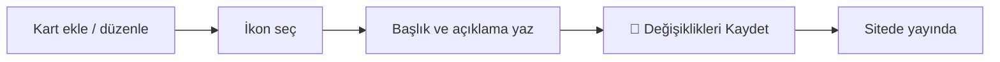

# "Neden Biz" Kartları

Hero Slider'ın hemen **altında** yer alan, kurumun **öne çıkan özelliklerini** anlatan küçük kartlardır. Her kart bir **ikon + başlık + kısa açıklama**dan oluşur (örneğin "Deneyimli Kadro — Alanında uzman branş öğretmenleri"). Ziyaretçi anasayfayı açtığında ilk dikkat ettiği yerlerden biridir; bu yüzden kurumu en iyi anlatan 3-4 maddeyi buraya koymanız idealdir.

**Yer:** Üst menü → **Ayarlar** → "Ana Sayfa — 'Neden Biz' Kartları" bölümü

> [!UYARI]
> Bu bölüm **katlanır (açılır) bir bölümdür** ve değişiklikler **anında kaydedilmez.** Kart eklemek, ikon seçmek veya bir alanı düzenlemek tek başına yetmez — sayfanın en altındaki **💾 Değişiklikleri Kaydet** düğmesine basana kadar hiçbir şey siteye yansımaz. (Sadece *Modüller* anahtarları anında kaydedilir; bu bölüm değil.)

## Bölüm başlığı (Üst Etiket ve Başlık)

Kartların **üstünde**, tüm bölümü ilgilendiren iki alan vardır:

| Alan | Ne işe yarar |
|---|---|
| **Üst Etiket** | Başlığın üstünde görünen küçük renkli yazı. Örn. "Neden İlk Adım?" |
| **Başlık** | Bölümün büyük başlığı. Örn. "Öğrencilerimizi farkla hazırlıyoruz" |

> [!İPUCU]
> Üst Etiket'i kısa bir soru ya da slogan gibi tutun; Başlık'ta ise kurumun bir cümlelik vaadini yazın. İkisi birlikte ziyaretçiyi kartları okumaya davet eder.

## Yeni kart ekleme

<ol class="adim-listesi">
<li><strong>Ayarlar</strong> sayfasını açın, "Ana Sayfa — 'Neden Biz' Kartları" başlığına tıklayarak bölümü açın.</li>
<li>Listenin altındaki <strong>+ Yeni Kart Ekle</strong> düğmesine basın.</li>
<li>Açılan boş kartın <strong>İkon</strong>, <strong>Başlık</strong> ve <strong>Açıklama</strong> alanlarını doldurun.</li>
<li>İşiniz bitince sayfanın en altındaki <strong>💾 Değişiklikleri Kaydet</strong> düğmesine basın.</li>
</ol>

## Bir kartın alanları

Her kartta üç alan bulunur.

### İkon

Kartın başında gösterilecek **simge**. Bir **açılır liste**den (combobox) seçilir — emojiyi elle yazmazsınız, listeden seçersiniz. Listedeki seçenekler:

| Seçenek | Nerede iyi durur |
|---|---|
| **🎓 Mezuniyet kepi** | Mezun başarısı, üniversiteye hazırlık |
| **👥 Öğrenci/Grup** | Kadro, küçük sınıflar, topluluk |
| **📈 Yükseliş** | Gelişim, not artışı, ilerleme |
| **💬 Mesaj/İletişim** | Veli iletişimi, danışmanlık |
| **📖 Açık kitap** | Müfredat, kaynak, ders içeriği |
| **🎯 Hedef** | Hedef odaklı çalışma, planlama |
| **🏅 Ödül** | Başarı, derece, ödül |
| **🕐 Saat** | Etüt saatleri, düzenli program |
| **✅ Onay** | Resmî / güvenilir, kalite |
| **❤️ Kalp** | İlgi, samimiyet, özveri |
| **💡 Fikir** | Yöntem, yenilikçi yaklaşım |
| **✏️ Kalem** | Yazılı çalışma, deneme sınavları |
| **🛡️ Güven** | Güvenli ortam, güvenilirlik |
| **🙂 Memnuniyet** | Veli/öğrenci memnuniyeti |
| **⭐ Yıldız** | Genel öne çıkarma |

> [!İPUCU]
> İkonu kartın **konusuna** göre seçin. Örneğin "Deneyimli Kadro" için 👥, "Birebir Takip" için 🎯, "Düzenli Etüt" için 🕐 doğal durur. İkonlar sitenin ana rengiyle uyumlu çizgi simgeler olarak gösterilir.

### Başlık

Kartın **kalın yazısı** — en dikkat çeken kısımdır. Kısa ve net tutun (örn. "Deneyimli Kadro", "Birebir Takip"). Bu alan boş kalan bir kart kaydedilmez.

### Açıklama

Başlığın altındaki **kısa açıklama**. Bir cümle yeterlidir (örn. "Alanında uzman branş öğretmenleri"). Çok uzun yazarsanız kart dengesi bozulur; kısa tutun.

## Kartları sıralama ve silme

Her kartın sağ tarafında araç düğmeleri vardır:

- **↑** ve **↓** okları: Kartı **yukarı / aşağı** taşıyarak gösterim sırasını değiştirir. En üstteki kart solda/ilk sırada gösterilir.
- **Sil** düğmesi: Kartı **tamamen kaldırır.** (Geri alma yoktur; yanlışlıkla silerseniz Kaydet'e basmadan sayfayı yenileyerek eski haline dönebilirsiniz.)

Sıralama ya da silme yaptıktan sonra da **💾 Değişiklikleri Kaydet**'e basmayı unutmayın.

## Kaç kart koymalı?

Kartlar bir **ızgara** (grid) düzeninde dizilir. En düzgün görünüm için:

- **4 kart** → tek satırda dörtlü dizilim (geniş ekranda en dengeli görünüm).
- **3 kart** → üçlü dizilim, yine ferah durur.
- **2 kart** → ikili dizilim.

> [!İPUCU]
> **3 veya 4 kart en güzel görünür.** Çok fazla kart koymak (örn. 7-8) ziyaretçinin dikkatini dağıtır; kurumu en iyi anlatan birkaç maddeyi seçin.

## Bölümü gizleme

"Neden Biz" bölümünü **anasayfadan tamamen kaldırmak** isterseniz iki yol vardır:

- **Tüm kartları silip kaydederseniz** bölüm sitede otomatik **gizlenir** — hiç kart yoksa başlık da görünmez.
- Ya da bütün kartları tek tek değil, hızlıca gizlemek için kartları silip Kaydet'e basmanız yeterlidir.

> [!UYARI]
> Yeni bir siteye henüz hiç kart eklemediyseniz, bölümde **örnek (varsayılan) kartlar** görünebilir. Kendi kartlarınızdan **en az birini** ekleyip kaydettiğinizde bu örnekler kaybolur ve yalnızca sizin yazdıklarınız gösterilir. Bölümü gerçekten boş bırakmak istiyorsanız tüm kartları silip **💾 Değişiklikleri Kaydet**'e basın.

## Kaydetme

Bu bölümdeki **tüm** değişiklikler (Üst Etiket, Başlık, yeni kart, ikon, sıralama, silme...) yalnızca sayfanın en altındaki **💾 Değişiklikleri Kaydet** düğmesine bastığınızda kalıcı olur ve siteye yansır.

## Bilmeniz gerekenler

- Değişiklikler **anında kaydedilmez** — mutlaka **💾 Değişiklikleri Kaydet**'e basın.
- İkon **açılır listeden** seçilir; elle emoji yazılmaz.
- **Başlığı boş** olan kart kaydedilmez.
- **Hiç kart yoksa** bölüm anasayfada tamamen gizlenir.
- En düzgün görünüm için **3-4 kart** önerilir.
- İlgili bölüm başlıkları ve alt çağrı için: [Bölüm Başlıkları & CTA](#/anasayfa/bolum-basliklari). Üst slider için: [Hero Slider](#/anasayfa/hero-slider).
