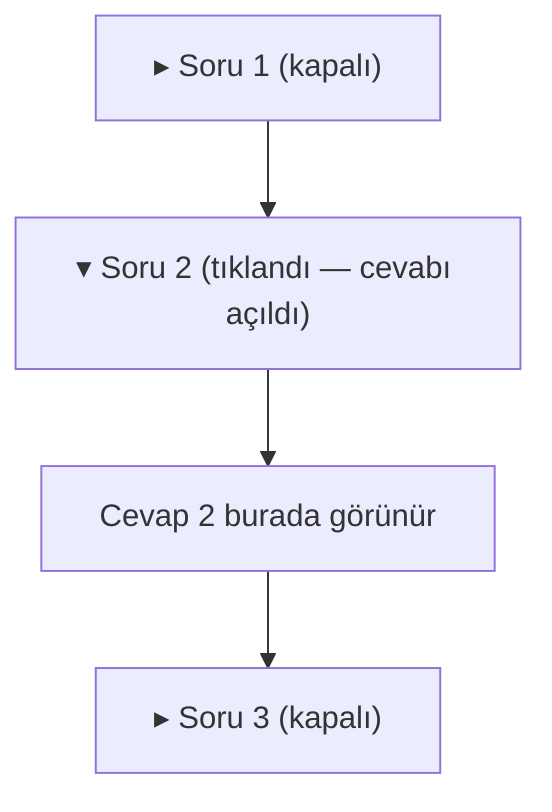
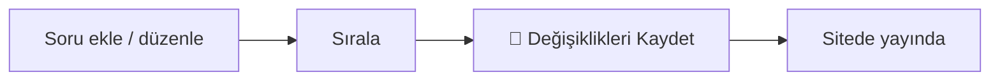

# Sıkça Sorulan Sorular (Ana Sayfa)

Anasayfada velilere gösterilen **soru–cevap** bölümü burasıdır. Velilerin kayıt, ücret, işleyiş gibi en çok merak ettiği soruları ve cevaplarını buradan hazırlarsınız. Sitede bu sorular **tıklanınca açılıp kapanan bir liste** (accordion) olarak görünür.

**Yer:** Üst menü → **Ayarlar** → "Ana Sayfa — Sıkça Sorulan Sorular" bölümü

> [!İPUCU]
> **Burası, sitenizin ANASAYFASINDA velilere gösterilen SSS bölümüdür.** Yardım merkezindeki (bu okuduğunuz panelin içindeki) "Sık Sorulan Sorular" sayfasıyla ([#/ipuclari/sss](#/ipuclari/sss)) **karıştırmayın** — o sayfa, **sizin gibi panel kullananlar** için teknik yardım sorularıdır ve sitede yayınlanmaz. Burada yazdıklarınız ise doğrudan **velilerin gördüğü** anasayfada çıkar.

## Sitede nasıl görünür? — Açılır liste (accordion)

Anasayfada bu bölüm, alt alta dizilmiş sorulardan oluşur. Ziyaretçi bir **soruya tıklayınca** altında cevabı açılır; tekrar tıklayınca kapanır. Böylece sayfa uzayıp kalabalıklaşmaz — veli yalnızca merak ettiği sorunun cevabını açar.

## Bir sorunun alanları

Her satırda üç şey vardır:

| Alan | Ne işe yarar |
|---|---|
| **Yayında** (kutu) | İşaretliyse soru sitede gösterilir. İşareti **kaldırırsanız** soru sitede görünmez ama silinmez — listede kalır, sonra tekrar açabilirsiniz. |
| **Soru** | Velinin tıklayacağı **soru metni** (örn. "Kayıt için hangi belgeler gerekir?"). Bu alan **boşsa o satır sitede gösterilmez.** |
| **Cevap** | Soruya tıklayınca açılan **cevap metni**. Kısa ve net tutun. |

> [!İPUCU]
> "Yayında" işaretini kaldırmak, bir soruyu **silmeden geçici gizlemenin** en pratik yoludur. Henüz cevabını netleştirmediğiniz bir soruyu yayından kaldırıp, hazır olunca tekrar işaretleyebilirsiniz.

## Yeni soru ekleme

<ol class="adim-listesi">
<li><strong>Ayarlar</strong> sayfasını açın, "Ana Sayfa — Sıkça Sorulan Sorular" başlığına tıklayarak bölümü açın.</li>
<li>En altta yer alan <strong>+ Yeni Soru Ekle</strong> düğmesine basın.</li>
<li>Açılan boş satırda <strong>Soru</strong> ve <strong>Cevap</strong> alanlarını doldurun, <strong>Yayında</strong> kutusunu işaretli bırakın.</li>
<li>İşiniz bitince sayfanın en altındaki <strong>💾 Değişiklikleri Kaydet</strong> düğmesine basın.</li>
</ol>

## Soruları sıralama ve silme

Her sorunun sağ üstünde araç düğmeleri vardır:

- **↑** ve **↓** okları: Soruyu **yukarı / aşağı** taşıyarak gösterim sırasını değiştirir. En çok merak edilen soruları **üste** koymanız iyi olur.
- **Sil** düğmesi: Soruyu **tamamen kaldırır.** (Sadece geçici gizlemek istiyorsanız silmek yerine "Yayında" işaretini kaldırın.)

Sıralama ya da silme yaptıktan sonra da **💾 Değişiklikleri Kaydet**'e basmayı unutmayın.

## Kaydetme

> [!UYARI]
> Bu bölüm "Site Ayarları" sayfasındaki **katlanır (açılır) bir bölümdür** ve değişiklikler **anında kaydedilmez.** Soru eklemek, düzenlemek veya sıralamak yetmez — sayfanın en altındaki **💾 Değişiklikleri Kaydet** düğmesine basana kadar hiçbir şey siteye yansımaz. (Yalnızca *Modüller* bölümündeki aç/kapa anahtarları anında kaydedilir; bu içerik bölümü değil.)

## Bölümün başlığını değiştirmek

Bu listenin **üstündeki başlık ve açıklama** (örn. "Merak Edilenler", "Sıkça Sorulan Sorular") ayrı bir yerden düzenlenir: **Ayarlar → "Ana Sayfa — Bölüm Başlıkları & Çağrı (CTA)"** bölümünde **SSS — Üst Etiket / Başlık / Açıklama** alanları bulunur. Ayrıntı: [Bölüm Başlıkları & CTA](#/anasayfa/bolum-basliklari).

## Tüm bölümü gizlemek (Aç / Kapa)

SSS bölümünü **anasayfadan tamamen kaldırmak** isterseniz her soruyu tek tek silmenize gerek yok. **Ayarlar → Modüller — Aç / Kapa** bölümünden **"Sıkça Sorulan Sorular"** anahtarını kapatın — o zaman anasayfada hiç görünmez. Bu anahtar **anında** kaydedilir. Sorularınız silinmez; modülü tekrar açtığınızda olduğu gibi geri gelir. Ayrıntı: [Modüller (Aç / Kapa)](#/site-ayarlari/moduller).

> [!İPUCU]
> **Hiç yayında soru yoksa bölüm zaten otomatik gizlenir.** Liste boşsa (ya da tüm soruların "Yayında" işareti kaldırılmışsa) anasayfada SSS başlığı bile çıkmaz, boş bir alan kalmaz. Yani hazır değilseniz hiç soru eklememeniz yeterlidir.

## İyi SSS nasıl yazılır?

Amaç, velinin **telefon etmeden** cevabını bulabilmesidir. Birkaç pratik kural:

- **Soruyu velinin diliyle yazın.** "Kayıt ücretleri ne kadar?" gibi, gerçekte sorulan biçimde. Resmî/teknik ifadelerden kaçının.
- **Cevap kısa ve net olsun.** 1–3 cümle idealdir. Uzun paragraf yerine en önemli bilgiyi öne alın.
- **En çok sorulanı üste koyun.** Sıralama oklarıyla kayıt, ücret gibi temel soruları başa taşıyın.
- **Kesin söz vermekten kaçının.** Sürekli değişen bilgiler (fiyat, kontenjan) için "güncel bilgi için bizi arayın" demek, sonradan yanlış kalmaktan iyidir.
- **Soruları az ve öz tutun.** 5–8 iyi soru, 20 zayıf sorudan daha etkilidir.

Örnek soru başlıkları (kendi kurumunuza göre uyarlayın):

| Konu | Örnek soru |
|---|---|
| **Kayıt** | "Kayıt için hangi belgeler gerekiyor ve süreç nasıl işliyor?" |
| **Ücret** | "Eğitim ücretleri ve ödeme seçenekleri nelerdir?" |
| **İşleyiş** | "Dersler hangi gün ve saatlerde yapılıyor?" |
| **Sınıf mevcudu** | "Bir sınıfta kaç öğrenci oluyor?" |
| **Deneme/Takip** | "Öğrencilerin gelişimi nasıl takip ediliyor, deneme sınavı var mı?" |

> [!İPUCU]
> Cevabında bir sayfaya yönlendirme yapmak isterseniz, cevabı **kısa tutup** "Detaylar için **Programlar** sayfamıza bakabilirsiniz" gibi yazın. SSS cevapları düz metindir; buton/bağlantı eklenmez, bu yüzden yönlendirmeyi kelimeyle belirtin.

## Bilmeniz gerekenler

- "Yayında" işareti kaldırılmış ya da **Soru** alanı boş olan satır sitede **gösterilmez** (ama listede kalır).
- Sitede sorular **accordion** olarak açılır/kapanır — veli yalnızca tıkladığı sorunun cevabını görür.
- İçerik değişiklikleri **💾 Değişiklikleri Kaydet** ile kaydedilir; aç/kapa anahtarı (**Modüller → Sıkça Sorulan Sorular**) ise **anında** geçerli olur.
- Hiç yayında soru yoksa veya modül kapalıysa bölüm **tamamen gizlenir** — anasayfada boşluk kalmaz.
- Buradaki SSS, yardım merkezindeki ([#/ipuclari/sss](#/ipuclari/sss)) panel kullanıcılarına yönelik SSS'den **farklıdır**.
