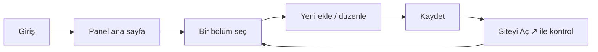

# Panele Genel Bakış

Yönetim paneline giriş yaptığınızda **Panel** sayfası açılır. Burada tüm bölümlere kart şeklinde ulaşabilirsiniz.

## Üst menü (admin bar)

Sayfanın en üstünde, koyu zeminli bir menü vardır. Bu menü panelin **her sayfasında** sabit kalır.

| Bölüm | Ne yapar? |
|---|---|
| **Panel** | Ana ekrana döner |
| **Duyurular** | Etkinlik / sınav / kayıt duyuruları |
| **Programlar** | Eğitim programları (LGS, YKS, takviye) |
| **Kadro** | Öğretmen tanıtımları |
| **Galeri** | Fotoğraf yükleme ve albümler |
| **Formlar** | Başvuru / kayıt formları |
| **Cevaplar** | Forma gelen yanıtlar |
| **Blog** | Yazılar (modülün açık olması gerekir) |
| **Kullanıcılar / Profilim** | Yetkili kişiler (admin) ya da kendi profiliniz (editör) |
| **Ayarlar** | Telefon, adres, sosyal medya |

Üst menünün **sağ tarafında** üç önemli öğe vardır:

- 🔔 **Bildirim zili** — okunmamış bildirim sayısını gösterir
- ↗ **Siteyi Aç** — siteyi yeni sekmede açar (yaptığınız değişikliği canlı görmek için)
- 🚪 **Çıkış** — oturumu güvenli şekilde kapatır

> [!İPUCU]
> **Modülleri aç/kapa:** Hakkımızda, Programlar, Kadro, Duyurular, Galeri bölümlerinden
> herhangi birini sitenizde gizlemek istiyorsanız: **Ayarlar → Modüller (Aç / Kapa)**
> bölümünden tek tıkla yapabilirsiniz. Aynı bölümün altından anasayfadaki
> **Hero Slider, Sayaç, Görüşler ve SSS** bölümlerini de tek tek gösterip gizleyebilirsiniz.
> Tüm anasayfa düzeni (slider, görüşler, SSS vb.) Ayarlar sayfasından yönetilir; detaylı yardım
> için Ana Sayfa Düzeni bölümüne bakın: [Hero Slider](#/anasayfa/hero-slider).
> Veriler silinmez. Detay: [Modüller (Aç / Kapa)](#/site-ayarlari/moduller).

## Genel akış

Genel mantık şudur: **Bir bölüme git → ekle/düzenle → kaydet → siteyi açıp kontrol et.**

## Roller: Admin ve Editör

Panel iki tip kullanıcıyı destekler:

- **Admin** — her şeyi yapabilir. Yeni kullanıcı ekleyebilir, başkalarının şifresini sıfırlayabilir.
- **Editör** — içerik yönetir (duyuru, kadro, galeri vb.) ama kullanıcı yönetemez. Kendi profilini ve şifresini değiştirebilir.

Hangi rolde olduğunuza göre menüdeki bazı bağlantılar gizli olabilir. Örneğin **Editör** rolünde "Kullanıcılar" yerine "**Profilim**" görünür.

> [!İPUCU]
> Roller hakkında detay için: [Roller: Admin ve Editör](#/kullanicilar/roller)

## Mobil cihazda

Yönetim paneli mobilde de çalışır. Üst menüdeki bağlantılar sığmazsa sağa-sola **kaydırabilirsiniz**. Bazı düzenleme ekranları (özellikle Form Tasarlayıcı) daha rahat kullanım için bilgisayardan kullanılmasını öneririz.
