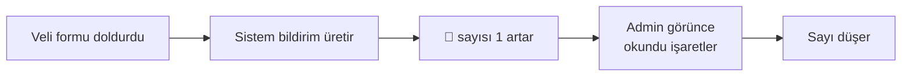

# Bildirimleri Yönetme

Sistem **otomatik bildirimler** üretir. Bunlar şunlardır:

- Yeni bir form cevabı geldiğinde
- (Gelecekte) Yeni yorum, yeni kullanıcı kaydı vb.

**Yer:** Üst menü → 🔔 (bildirim zili) veya **Bildirimler**

## Bildirim sayısı

Üst menünün sağ tarafındaki 🔔 ikonu üzerinde **rakam** belirebilir. Bu, **okunmamış** bildirim sayısıdır.

## Bildirim listesi

Bildirimler sayfasında her bildirim için şunlar görünür:

- **Tarih ve saat**
- **Bildirim tipi** (örn. "Yeni form cevabı")
- **Detay** — hangi form, kim doldurdu kısa özet
- **İşaretsiz nokta** — okunmamış bildirimler vurgu ile gösterilir

## Okundu işaretleme

Bir bildirime tıkladığınızda:
- Bildirimin detayı açılır
- Otomatik olarak **okundu** olarak işaretlenir
- 🔔 ikonundaki sayı 1 azalır

> [!İPUCU]
> Bildirim **silinmez** — sadece okundu olarak işaretlenir. Geçmişe bakabilmek için tutulur.

## Tümünü okundu yap

Listenin üstünde **"Tümünü Okundu Yap"** düğmesi vardır. Tek tıkla tüm bildirimleri okunmuş hale getirir.

Bunu ne zaman kullanacaksınız?
- Çok sayıda eski bildirim birikmişse
- "Sıfırlamak" istediğinizde

## Bildirim silme

Şu anda bildirim silme arayüzü yoktur — okundu olarak işaretlemek yeterlidir. Otomatik temizleme planlı olabilir; çok eski bildirimler arka planda silinir.

## Bildirim akışı

## Bildirimleri kaçırmamak için

- Admin paneline **günde en az bir kez** girip bildirim sayısına bakın.
- Yoğun dönemde (kayıt sezonu) **birkaç saatte bir** kontrol edin.
- Mobil cihaz desteği: tarayıcınız push bildirimlerini destekliyorsa, gelecek bir güncellemede etkinleştirilebilir.

## Sık karşılaşılan durumlar

**Sayı azalmıyor**
Sayfayı yenileyin (**Ctrl+R** veya **Cmd+R**). Tarayıcı bazen sayıyı cache'ler.

**Hiç bildirim gelmiyor**
- Form yayında mı? "Yayında" işaretli olmadan velinin doldurması mümkün değil.
- Test formu kendiniz dolduruyor musunuz? **Cevaplar** sayfasında bunu görmelisiniz.
- Yine olmuyorsa: teknik sorumlunuza ulaşın.

**Çift bildirim**
Aynı cevap için iki bildirim — sistemde geçici bir hata olabilir. Birini okundu yapın, geçer.
