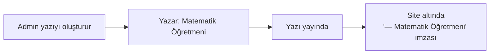

# Etiketler ve Yazar

## Etiketler

Etiketler, blog yazılarınızı **konuya göre sınıflandırmaya** yarar. Veliler blog listesinde etikete tıklayarak ilgili tüm yazıları görebilir.

### Etiket nasıl eklenir?

Yazı oluşturma/düzenleme ekranında **Etiketler** alanı vardır. Yazı için 1-5 etiket önerilir.

Etiketleri **virgül ile** ayırın veya tek tek girin:

```
LGS, Sınav, Veli Tavsiyeleri
```

### Mevcut etiketleri kullanma

Sistem size daha önce kullandığınız etiketleri **otomatik önerir**. Yazmaya başlayın, öneriler açılır — istediğinize tıklayın.

> [!İPUCU]
> Aynı kavram için **tek bir etiket** kullanın. *"LGS"* ile *"lgs"* veya *"Lgs"* sistemin gözünde aynı değil. Tutarlı yazın.

### Önerilen etiket listesi

| Etiket | Kullanım |
|---|---|
| `LGS` | LGS ile ilgili yazılar |
| `YKS` | YKS ile ilgili yazılar |
| `Veli Tavsiyeleri` | Velilere yönelik ipuçları |
| `Çalışma Yöntemleri` | Verimli ders çalışma |
| `Motivasyon` | Cesaretlendirici yazılar |
| `Sınav Stratejileri` | Sınav anında yapılacaklar |
| `Etkinlikler` | Kurumdan etkinlik haberleri |
| `Mezunlarımız` | Başarı hikayeleri |

### Sitede görünümü

Yazı listesinde her yazının kartında etiketler görünür. Etikete tıklanırsa, sayfa filtrelenir:

```
/blog.html?etiket=LGS
```

Bu URL'i sosyal medyada paylaşabilirsiniz — sadece o etiketin yazılarını gösterir.

## Yazar

Yazının altında "**— Ahmet Bey**" gibi bir imza görünür. Bu **yazar bilgisi**dir.

### Otomatik atama

Yeni bir yazı oluşturduğunuzda, sistem **giriş yapan kullanıcıyı** otomatik yazar olarak atar.

Profilinizdeki "Ad Soyad" alanı doluysa o gösterilir. Boşsa kullanıcı adınız gösterilir.

> [!İPUCU]
> Profilim sayfasından **"Ad Soyad"** alanınızı doldurun. Yazılarda "Ahmet Yılmaz" görünmesi, "ahmet" görünmesinden daha profesyonel.

### Yazarı değiştirme (admin yetkisi)

Admin rolündeyseniz, yazıyı başka birinin yazmış gibi gösterebilirsiniz:

<ol class="adim-listesi">
<li>Yazıyı açın.</li>
<li><strong>Yazar</strong> açılır menüsünden kullanıcı seçin (sistemde kayıtlı tüm kullanıcılar listelenir).</li>
<li><strong>Kaydet</strong>'e basın.</li>
</ol>

Bu özellik özellikle bir öğretmen adına yazı yayınlamak için kullanışlıdır:



### Editör rolü

Editör rolündeki kullanıcılar **kendi yazılarını** oluşturur ve yazar **otomatik kendileri** olur. Başka birini yazar yapamazlar.

## Yazar fotoğrafı

Yazar imzasının yanında yuvarlak bir profil fotoğrafı gözükür (varsa). Bu fotoğraf kullanıcının **Profilim** sayfasından yüklediği fotoğraftan gelir.

Yazar profilinde fotoğraf yoksa, baş harfli yuvarlak rozet gösterilir.

## Sık karşılaşılan durumlar

**"Site Yöneticisi" olarak gözüküyor**
Demek admin kullanıcısının "Ad Soyad" alanı "Site Yöneticisi" yazıyor. Profilim sayfasından gerçek adınızla değiştirin.

**Yazıyı başkası yazmış olarak göstermek istiyorum**
- Admin iseniz "Yazar" alanından seçin.
- O kullanıcı sistemde **kayıtlı olmalı** (önce kullanıcı oluşturun).

**Bir etiketi silmek istiyorum**
Yazıyı açın, etiket alanından kelimeyi silin, kaydedin. Sistem etiket başka yazıda yoksa otomatik temizler.
