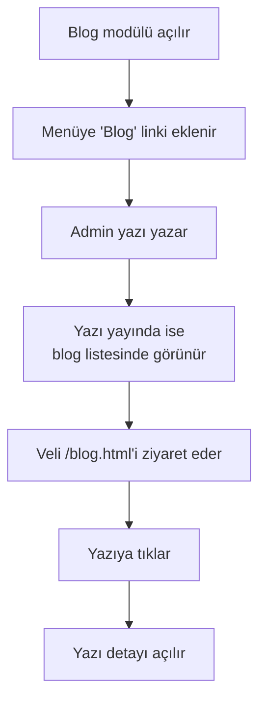

# Blog Modülünü Açma

> [!İPUCU]
> Blog modülünü **iki farklı yerden** yönetebilirsiniz:
>
> 1. **Üst menü → Blog** sayfasında — başlığın altındaki yeşil/kırmızı kutudaki anahtar
> 2. **Üst menü → Ayarlar → Modüller** bölümünde — toplu görünümde diğer modüllerle birlikte
>
> İki yer de aynı yere yazar — birinde değiştirdiğinizde diğeri otomatik güncellenir.
> Detay: [Modüller (Aç / Kapa)](#/site-ayarlari/moduller).

Blog modülü **opsiyoneldir**. Açık değilse menüde "Blog" görünmez. Açık olunca:

- Üst menüye **Blog** linki eklenir
- Footer'a Blog linki eklenir
- `/blog.html` adresinden tüm yazılar listelenir
- Her yazının kendi detay sayfası olur

## Modülü açma / kapatma

### Yol A — Blog sayfasının üstünden (en hızlı)

<ol class="adim-listesi">
<li>Üst menüden <strong>Blog</strong> sayfasına gidin.</li>
<li>Sayfa başlığının altındaki yeşil/kırmızı durum kutusunu bulun.</li>
<li>Sağdaki <strong>anahtarı</strong> tıklayın → modül anında açılır/kapanır.</li>
<li>Kutu rengi değişir, sağ üstte yeşil toast bildirimi çıkar.</li>
</ol>

### Yol B — Ayarlar → Modüller (toplu görünüm)

<ol class="adim-listesi">
<li>Üst menüden <strong>Ayarlar</strong> sayfasına gidin.</li>
<li>"Modüller — Aç / Kapa" bölümünü bulun (varsayılan olarak açık gelir).</li>
<li>"<strong>✍️ Blog</strong>" kartındaki kutuyu işaretleyin/kaldırın.</li>
<li><strong>Anında kaydedilir</strong> — Kaydet butonu beklemenize gerek yok.</li>
</ol>

> [!İPUCU]
> İki yol da aynı veriyi yazıyor. Birini açtığınızda diğer açık sekmede de
> (sekmeye geri döndüğünüzde) güncel durum gözükür.

### Kapatınca veriler ne olur?
- Sitede menü linkleri kaybolur.
- `/blog.html` adresine doğrudan girenler **404** sayfasına yönlendirilir.
- **Yazılarınız silinmez** — admin panelinde aynen durur. Tekrar açtığınızda hepsi geri gelir.

## Ne zaman blog açılmalı?

| Durum | Blog açmak |
|---|---|
| Düzenli olarak (haftalık / aylık) içerik üretebilecekseniz | ✅ Açın |
| Sadece duyuru paylaşıyorsanız | ❌ Duyurular yeterli; blog'a gerek yok |
| Eğitim ipuçları, makaleler, sınav stratejileri paylaşmak istiyorsanız | ✅ İdeal |
| Üretim için zamanınız yoksa | ❌ Kapalı tutun |

> [!İPUCU]
> Blog **boşsa kötü görünür**. "Henüz yazı yok" mesajı veliye soğuk gelir. En az 2-3 yazı yazana kadar modülü kapalı tutun, sonra açın.

## Genel akış

## Sonraki adımlar

- İlk yazınızı oluşturun: [Yazı Yazma](#/blog/yazi-yazma)
- Editör kullanımını öğrenin: [Editörü Kullanma](#/blog/editor)
