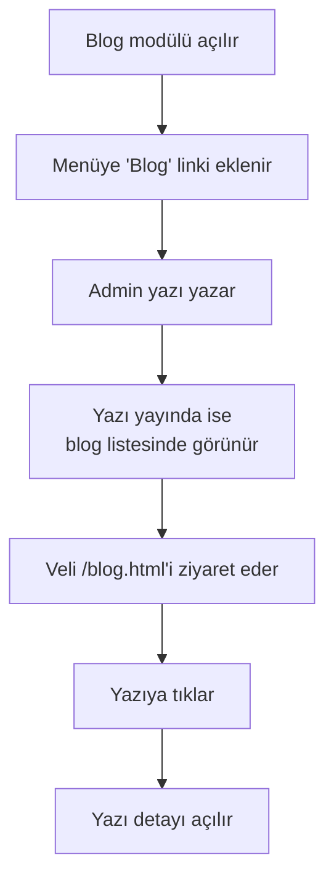

# Blog Modülünü Açma

Blog modülü **opsiyoneldir**. Açık değilse menüde "Blog" görünmez. Açık olunca:

- Üst menüye **Blog** linki eklenir
- Footer'a Blog linki eklenir
- `/blog.html` adresinden tüm yazılar listelenir
- Her yazının kendi detay sayfası olur

## Modülü açma

<ol class="adim-listesi">
<li>Üst menüden <strong>Blog</strong> sayfasına gidin (admin'de zaten görünür).</li>
<li>Sayfa üstünde <strong>"Blog modülü"</strong> toggle / switch olur.</li>
<li>Bunu <strong>Açık</strong>'a çekin.</li>
<li>Kaydedildiğinde sitede menülere "Blog" eklenmesi anında etkili olur.</li>
</ol>

## Modülü kapatma

Aynı yerde toggle'ı **Kapalı**'ya çekin.

- Sitede menü linkleri kaybolur.
- `/blog.html` adresine doğrudan girenler **404** sayfasına yönlendirilir.
- Yazılarınız silinmez — sadece görünmez. Tekrar açtığınızda hepsi geri gelir.

## Ne zaman blog açılmalı?

| Durum | Blog açmak |
|---|---|
| Düzenli olarak (haftalık / aylık) içerik üretebilecekseniz | ✅ Açın |
| Sadece duyuru paylaşıyorsanız | ❌ Duyurular yeterli; blog'a gerek yok |
| Eğitim ipuçları, makaleler, sınav stratejileri paylaşmak istiyorsanız | ✅ İdeal |
| Üretim için zamanınız yoksa | ❌ Kapalı tutun |

> [!İPUCU]
> Blog **boşsa kötü görünür**. "Henüz yazı yok" mesajı veliye soğuk gelir. En az 2-3 yazı yazana kadar modülü kapalı tutun, sonra açın.

## Genel akış

## Sonraki adımlar

- İlk yazınızı oluşturun: [Yazı Yazma](#/blog/yazi-yazma)
- Editör kullanımını öğrenin: [Editörü Kullanma](#/blog/editor)
