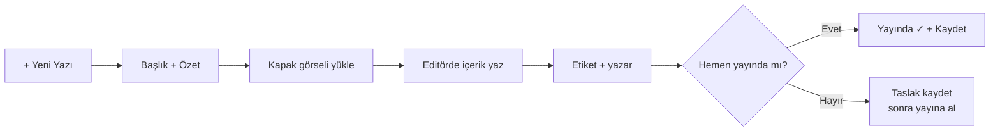

# Yazı Yazma

Yeni bir blog yazısı oluşturmak için:

**Yer:** Üst menü → **Blog** → **+ Yeni Yazı**

## Adım adım

<ol class="adim-listesi">
<li><strong>+ Yeni Yazı</strong> düğmesine basın.</li>
<li>Form alanlarını doldurun (aşağıda).</li>
<li>Editörde içeriğinizi yazın.</li>
<li>Önce <strong>taslak</strong> olarak kaydedin.</li>
<li>Hazır olduğunuzda <strong>Yayında</strong>'yı işaretleyip tekrar <strong>Kaydet</strong>'e basın.</li>
</ol>

## Alanlar

### Başlık (zorunlu)
Yazının başlığı. Hem listede hem detay sayfasında görünür. Akılda kalıcı ve **bilgi veren** bir başlık seçin.

İyi başlık örnekleri:
- ✅ *"LGS 2025 Soru Dağılımına Genel Bakış"*
- ✅ *"Sınava Hazırlanırken 5 Yaygın Hata"*
- ✅ *"Velilerin Sıkça Sorduğu Sorular"*

Zayıf başlıklar:
- ❌ *"Bir yazı"*
- ❌ *"Önemli açıklama"*

### URL Adresi (slug)
Yazının web adresi son ekidir. Otomatik üretilir ama düzenleyebilirsiniz.

Başlık *"LGS 2025 Soru Dağılımı"* ise slug: `lgs-2025-soru-dagilimi`

URL: `siteniz.com/blog/yazi.html?id=lgs-2025-soru-dagilimi`

> [!İPUCU]
> Slug **kısa, anlamlı ve değişmez** olsun. Bir kez yayınlandıktan sonra slug değiştirmek SEO'yu bozar (eski linkler kırılır).

### Özet
Yazının **kısa açıklaması** (1-3 cümle). Blog liste sayfasında başlığın altında görünür. WhatsApp / sosyal medyada paylaşıldığında da önizleme metni olur.

### Kapak Görseli
Yazının üstünde büyük bir görsel. Liste sayfasında da kart görseli olur.

Tavsiyeler: 1200×630 piksel, JPG. Bkz. [Görsel İpuçları](#/ipuclari/gorsel-ipuclari).

### İçerik
Yazının asıl gövdesi. Burası **zengin metin editörü** ile yazılır (başlık, kalın, italik, link, görsel, alıntı). Bkz. [Editörü Kullanma](#/blog/editor).

### Etiketler
Yazıyı sınıflandırmak için. Liste sayfasında veliler etikete göre filtreleyebilir.

Örnek etiketler: *LGS*, *YKS*, *Veli Tavsiyeleri*, *Çalışma İpuçları*.

Bkz. [Etiketler ve Yazar](#/blog/etiketler-yazar).

### Yazar
Yazının altında **kim yazdı** olarak görünen kişi. Genellikle siz (giriş yapan kullanıcı). Admin iseniz farklı bir yazar (örneğin "Matematik öğretmeni Ahmet Bey") atayabilirsiniz.

### Yayın Tarihi
Genelde **bugün**. İleri tarih girerseniz: yazı o tarihe kadar listede görünmez (zamanlı yayın).

### Yayında
İşaretliyse blog listesinde görünür. **Taslak** ise sadece admin görür.

## Genel akış

## Yazı uzunluğu

- **Kısa yazı:** 300-500 kelime (haber, duyuru benzeri)
- **Orta yazı:** 800-1200 kelime (eğitici makale, rehber)
- **Uzun yazı:** 1500+ kelime (derinlemesine konu)

> [!İPUCU]
> Veliler yazıları cep telefonundan okur. **Kısa paragraflar** (2-3 cümle), **ara başlıklar**, **madde işaretleri** ve **görseller** okumayı kolaylaştırır.

## Yayımladıktan sonra

1. **Kaydet** → **Siteyi Aç ↗** → `/blog.html` → yazınızı görün.
2. Yazıya tıklayın → detay sayfası açılmalı.
3. URL'i not edin → WhatsApp ve sosyal medyada paylaşın.
