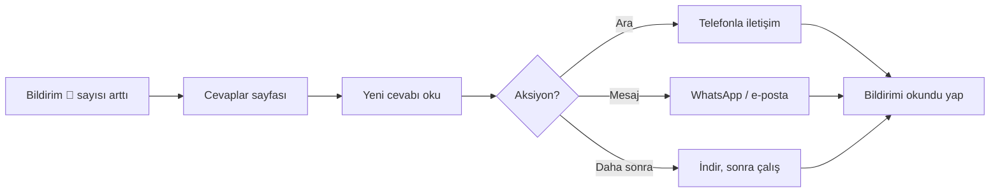

# Cevapları Görüntüleme

Yayındaki formlara gelen tüm yanıtları burada görür ve yönetirsiniz.

**Yer:** Üst menü → **Cevaplar**

## Genel görünüm

Sayfa iki bölümden oluşur:

- **Sol:** Yanıt listesi (tarih + kim gönderdi özet)
- **Sağ:** Seçili yanıtın tam içeriği

## Form bazında filtreleme

Üst kısımda **Form Seç** açılır menüsü vardır. Birden fazla form yayındaysa, hangi formun cevaplarını görmek istediğinizi seçin.

> [!İPUCU]
> "Tümü" seçeneğiyle tüm formların cevapları tek listede görünür. Tarih sırasına göre dizilir. Hangi formdan geldiği yanıt başlığında belirtilir.

## Bir yanıtı açma

Sol listede istediğiniz cevaba tıklayın. Sağ tarafta:

- **Gönderim tarihi** ve **saati**
- Velinin **tüm yanıtları** (tüm alanlar)
- **IP / Tarayıcı bilgisi** (opsiyonel — sistemde varsa)

## Bildirim sistemi

Yeni cevap geldiğinde:

- Üst menüdeki **🔔 bildirim ikonunda** rakam belirir
- Sayı, okunmamış yeni cevap sayısını gösterir
- İkona tıklayınca Bildirimler sayfası açılır

> [!UYARI]
> Bildirim sayısı **otomatik temizlenmez**. Bildirimler sayfasından okuduğunuzu işaretlemeniz gerekir. Bkz. [Bildirimleri Yönetme](#/bildirimler/bildirimler).

## Cevap silme

Bir cevabı silmek için:

1. Cevabı açın.
2. Sayfa altındaki kırmızı **Sil** düğmesine basın.
3. Onaylayın.

> [!TEHLIKE]
> Silinen cevap **geri alınamaz**. Test sırasında oluşturduğunuz cevaplar haricinde, gerçek başvuruları silmek çoğu zaman istenmez. Önce indirip yedekleyin (bkz. [İndirme](#/cevaplar/indirme)).

## Sık karşılaşılan durumlar

**Cevap geldi ama bildirimde sayı yok**
Sayfayı yenileyin. Tarayıcı bazen geç günceller. Hâlâ olmuyorsa çıkıp yeniden giriş yapın.

**Velinin yazdığı bilgi okunmuyor**
- Yazı tipi mi (font)? Hayır — sistemde tek font kullanılır.
- Yanıt çok uzun mu? Sağ panelde scroll edebilirsiniz.

**Aynı veli iki kez doldurmuş**
Sistem **çift gönderim'i otomatik engellemez** (birinin tekrar dolduması mümkün). İkisini de görürsünüz. Hangisinin daha güncel olduğuna karar verip diğerini silebilirsiniz.

**Veliye yanıt vermek istiyorum**
Form verisinde telefonu / e-postası varsa direkt arayabilir veya WhatsApp yazabilirsiniz. Sistem otomatik yanıt göndermez.

## Pratik akış

