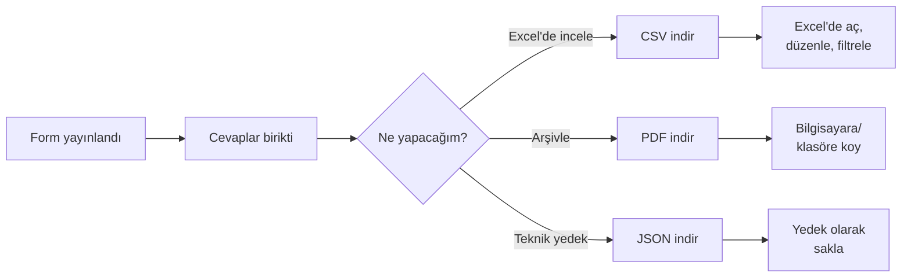

# İndirme (CSV / PDF / JSON)

Form cevaplarını **dosya olarak indirip** Excel, ofis arşivi veya öğrenci kayıt sistemine alabilirsiniz.

## Format seçimi

**Cevaplar** sayfasında, üst kısımda **4 indirme düğmesi** vardır:

| Format | Ne için kullanılır |
|---|---|
| **📊 CSV İndir** | Excel veya Google Sheets'te açılır. **En çok önerilen format.** |
| **📄 PDF İndir** | Yazdırılabilir, arşivlenir. Resmi dosyalama için. |
| **{} JSON İndir** | Teknik yedek; başka bir sisteme aktarmak için. |
| **{} JSONL İndir** | Satır satır JSON; veri analizi için. |

## CSV ile çalışma (en yaygın)

CSV dosyası **Excel'de** açılır. Dosyayı çift tıklayarak veya Excel'den "Aç" yaparak.

### Türkçe karakter sorunu

> [!UYARI]
> Bazı Excel sürümlerinde Türkçe karakterler bozuk gözükebilir (ş → Å, ğ → Ä gibi). Çözüm:
> 1. Excel'de boş bir sayfa açın
> 2. **Veri → Metinden** seçin
> 3. CSV dosyanızı seçin
> 4. **Kaynak Dosya** olarak "**UTF-8**" seçin
> 5. Devam edip yükleyin

LibreOffice Calc ve Google Sheets'te bu sorun olmaz; UTF-8 otomatik tanınır.

## PDF ile yazdırma

PDF formatı **basılı arşiv** için ideal. Dosyayı açtığınızda her cevap bir veya iki sayfada görünür.

Yazdırmak için: PDF görüntüleyicide **Ctrl+P** (Mac'te Cmd+P) → yazıcı seçin.

## Form bazında veya tek cevap

İki seviyede indirme yapabilirsiniz:

### Tüm cevaplar (form bazında)
Üst kısımdaki **Form Seç** menüsünden bir form seçin → indirme düğmelerine basın. Sadece o forma ait cevaplar iner.

### Tek cevap
Bir cevabı açtığınızda, sağ panelin üst kısmında **"Bu cevabı PDF olarak indir"** seçeneği olabilir. Tek cevap içeren bir dosya iner.

## Tipik akış

## Veri yedekleme önerisi

Dönem sonu önerilen rutin:

<ol class="adim-listesi">
<li>Dönem kapanış tarihi geldiğinde tüm formların <strong>CSV</strong>'ini indirin.</li>
<li>Dosyaları yıl klasörüne koyun (örn. "<em>2024-2025</em>").</li>
<li>Yedek için <strong>PDF</strong> de indirin.</li>
<li>Eski formları yayından kaldırın (silmeyin).</li>
</ol>

## KVKK uyarısı

> [!UYARI]
> İndirdiğiniz dosyalar **kişisel veri içerir** (isim, telefon, e-posta). Bilgisayarda ya da bulutta saklarken:
> - Cihazınızı **şifre korumalı** tutun.
> - Dosyaları paylaşırken sadece **yetkili kişilere** iletin.
> - Bulut hizmetlerine (Google Drive, OneDrive) yüklemeden önce iki kez düşünün — kurumun KVKK politikası neye izin veriyor?
> - Saklama süresi sonunda dosyaları **güvenli şekilde silin** (kalıcı olarak, geri dönüşüm kutusundan da boşaltarak).

## Sık sorulan sorular

**Dosya açılmıyor**
Dosya indirilirken bozulmuş olabilir. Tekrar indirmeyi deneyin.

**Excel "bu dosya hasarlı görünüyor" diyor**
"Devam"a basın. CSV dosyaları bazen bu mesajı verir ama normal açılır.

**Cevap sayısı çoksa indirme yavaş**
Birkaç saniye bekleyin. 500'den fazla cevap için sayfa hafif yavaşlayabilir.

**İndirilen dosyada bir alan yok**
Form daha sonra düzenlenmiş olabilir; eski cevaplarda eski form yapısı vardır. Sistem bunu uyumlu göstermeye çalışır ama bazen alan farkı görünür.
