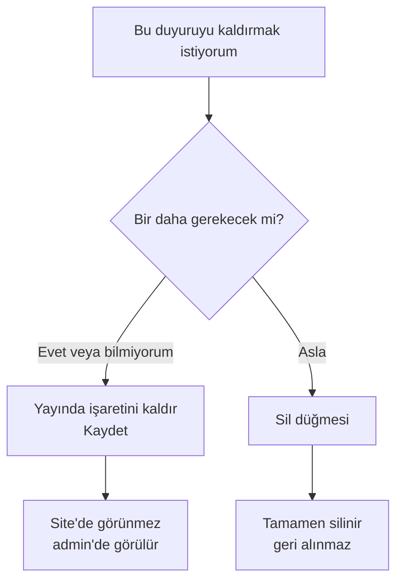

# Düzenleme ve Silme

## Mevcut duyuruyu düzenleme

**Yer:** Üst menü → **Duyurular**

<ol class="adim-listesi">
<li>Listeden düzenlemek istediğiniz duyurunun kartına tıklayın.</li>
<li>Sağ panelde tüm alanlar açılır.</li>
<li>İstediğiniz alanı değiştirin.</li>
<li>Sayfa altındaki <strong>Kaydet</strong> düğmesine basın.</li>
</ol>

> [!İPUCU]
> Kaydet'e basmadan başka duyuruya geçerseniz **değişiklikleriniz kaybolur**. Sistem otomatik kaydetmez.

## Yayından kaldırma (silmeden)

Bir duyuruyu sitenizden kaldırmak istiyor ama silmek istemiyorsanız:

1. Duyuruyu açın.
2. **Yayında** kutusunu **işaretsiz** hale getirin.
3. **Kaydet**'e basın.

Duyuru sitede görünmez ama admin panelinde kalır. İleride tekrar yayına almak isterseniz tekrar işaretleyip kaydedersiniz.

> [!İPUCU]
> Geçici olarak kaldırılan duyuruları "Taslak" olarak düşünün. Geri almak çok kolaydır.

## Silme

Bir duyuruyu **tamamen silmek**:

<ol class="adim-listesi">
<li>Duyuruyu açın.</li>
<li>Sayfa altındaki kırmızı <strong>Sil</strong> düğmesine basın.</li>
<li>Onay penceresi çıkar — emin misiniz? <strong>Tamam</strong>.</li>
<li>Duyuru anında silinir; geri alınamaz.</li>
</ol>

> [!TEHLIKE]
> Silinen duyuru **geri alınamaz**. Yanlışlıkla silerseniz baştan yazmanız gerekir. Şüpheliyseniz silmek yerine **yayından kaldırın** (yukarı bkz.).

## Hangisini seçmeliyim?

## Toplu silme yok

Şu anda birden fazla duyuruyu aynı anda silme özelliği yoktur. Tek tek silmeniz gerekir. Çok eski duyuruları temizlemek istiyorsanız küçük gruplar halinde silin.

## Sıralama

Duyurular **otomatik olarak tarih sırasına** göre listelenir (en yeni başta). Manuel sıralama yoktur.

Bir duyuruyu "öne çıkarmak" istiyorsanız iki yol:

1. **Tarih güncelle** — duyuruyu açın, tarihi bugüne çekin, kaydedin. Liste başına gelir.
2. **"Önemli" işaretle** — kart kırmızı "Önemli" etiketiyle dikkat çeker.

## Geçmiş duyurular

Çok eski duyurular sitede gösterilmeye devam eder. Eğer arşivlemek isterseniz:

- **Yayında**'yı işaretsiz yapın (silmeden).
- Belirli bir tarihte tek seferde temizleyin (örneğin yıl sonunda).

## Sık karşılaşılan durumlar

**Bir alan düzenlenemiyor (gri görünüyor)**
Hesabınızın yetkisi yeterli olmayabilir. Admin'e danışın.

**Düzenleme sonrası sitede değişiklik göremiyorum**
- Kaydet'e bastınız mı? Toast bildirimi gördünüz mü?
- Tarayıcı cache: **Ctrl+Shift+R** ile yenileyin.
- Yine olmazsa: oturum süresi dolmuş olabilir, çıkıp yeniden giriş yapın.

**Sil düğmesini bulamıyorum**
Sayfanın en altında, kırmızı renkli. Mobilde ekranı tamamen aşağı kaydırın.
