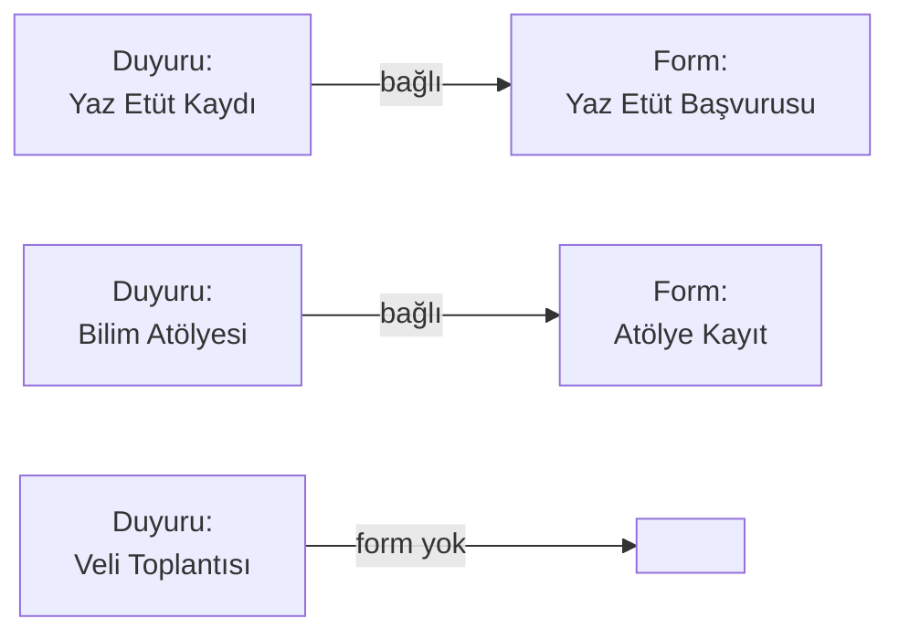

# Duyuruyu Bir Forma Bağlama

Bazı duyurular bir **başvuru** veya **kayıt formuyla** ilişkilidir. Örneğin "Yaz dönemi etüt kaydı başladı" duyurusu, "Yaz Etüt Başvuru Formu" ile bağlanabilir.

**Sonuç:** Velinin duyuru detayını açtığında "**📝 Formu Doldur**" butonu görünür ve bir tıklamayla başvuru formuna gider.

## Önce form oluşturun

Bağlanacak form **zaten oluşturulmuş** olmalıdır. Henüz yoksa:

- [Yeni Form Oluşturma](#/formlar/yeni-form) sayfasından oluşturun.
- Formu **Yayında** olarak işaretleyin.
- Form ID'sini not edin (Formlar listesinde her formun yanında ID görünür).

## Bağlantıyı kurma

<ol class="adim-listesi">
<li>Duyurular sayfasında ilgili duyuruyu açın (veya yeni ekleyin).</li>
<li>Sağ panelde <strong>Bağlı Form</strong> alanını bulun.</li>
<li>Açılır menüden bağlamak istediğiniz formu seçin.</li>
<li><strong>Kaydet</strong>'e basın.</li>
</ol>

## Sitede nasıl görünür?

Bağlantı kurulan duyurunun kartında:

- Kategori etiketinin yanında küçük bir **"📝 Form var"** rozeti çıkar.
- Velinin "Devamını oku"ya tıklayıp detay sayfasına ulaştığında, içeriğin altında belirgin bir **"📝 Formu Doldur"** butonu görünür.

## Bağlantıyı kaldırma

Forma bağı koparmak için:

1. Duyuruyu açın.
2. **Bağlı Form** alanını **boş** (veya "Yok") yapın.
3. **Kaydet**.

Duyurudaki form butonu kaybolur. Form silinmemiş olur — başka duyurulara bağlamaya devam edebilirsiniz.

## Pratik örnekler

- Bir form **birden fazla duyuruya** bağlanabilir.
- Bir duyuru **yalnızca tek bir forma** bağlanabilir.
- Form silinirse, bağlı duyurularda form butonu otomatik kaybolur (kırık link olmaz).

## Sık sorulan sorular

**Bağlanabilir form listesinde formum yok**
- Form **Yayında** olmayabilir; Formlar sayfasında kontrol edin.
- Sayfayı yenileyin; bazen yeni eklenen formlar listede gecikmeli görünür.

**Form'a tıklayan veliler nereye gider?**
Başvuru sayfasına yönlendirilirler: `/basvuru.html?form=<form-id>`. Sayfa otomatik o formu yükler.

**Veli formu doldurdu — ben nasıl haberdar olurum?**
Yeni form cevabı geldiğinde admin panelinin üst sağındaki **🔔 bildirim zili** sayıyı artırır. **Cevaplar** menüsünden tüm cevapları görüntüleyebilirsiniz. Bkz. [Cevapları Görüntüleme](#/cevaplar/goruntuleme).
