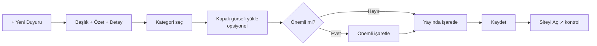

# Yeni Duyuru Ekleme

Yeni bir duyuru — etkinlik, sınav takvimi, kayıt çağrısı, başarı haberi vb. — eklemek için:

**Yer:** Üst menü → **Duyurular**

## Adım adım

<ol class="adim-listesi">
<li>Duyurular sayfasında sağ üstteki <strong>+ Yeni Duyuru</strong> düğmesine basın.</li>
<li>Açılan formda gerekli alanları doldurun (aşağıda her alan ayrıntılı anlatılıyor).</li>
<li>Sayfa altındaki <strong>Kaydet</strong> düğmesine basın.</li>
<li>Yayında olmasını istiyorsanız <strong>Yayında</strong> kutusunu işaretleyin.</li>
</ol>

## Form alanları

### Başlık (zorunlu)
Duyurunun **kısa ve dikkat çekici** başlığı. Mobilde 2-3 satır taşmaz.

İyi örnekler:
- ✅ "2025-2026 LGS Sınıfları Ön Kayıt Başladı"
- ✅ "Ücretsiz Deneme Sınavı — 18 Mayıs"

Kötü örnekler:
- ❌ "Duyuru" (çok kısa)
- ❌ "Sayın velilerimiz, bu sezon başlayacak olan yepyeni LGS sınıflarımızın..." (çok uzun, bu içerikte olmalı)

### Özet
Listede başlığın altında görünen **kısa açıklama** (1-3 cümle). Velinin "okumalı mıyım" diye karar verdiği yer burası.

### Detay
Tıklanan duyurunun **tam içeriği**. Burada uzun yazabilirsiniz. Satır araları otomatik korunur.

### Kategori
Duyurunun **konusu**. Hazır kategoriler: *Genel*, *Sınav Takvimi*, *Etkinlik*, *Başarı*, *Kayıt*. Filtreleme bunu kullanır.

### Tarih (zorunlu)
Duyurunun **gösterilen tarihi**. Genellikle bugünün tarihi seçilir. Kayıt tarihi otomatik o güne ayarlanır.

> [!İPUCU]
> Geçmiş tarihli bir duyuru girmek (örneğin 1 hafta önce yaşanan bir başarı için) sorun değil. Yeni duyurular her zaman tarih sırasına göre listenin başına gelir.

### Önemli mi?
Bu kutuyu işaretlerseniz duyuru:
- Kartında kırmızı **"Önemli"** etiketi taşır
- Sıralamada öne çıkar
- Daha dikkat çekici stille gösterilir

Tüm duyuruları "Önemli" yapmayın — anlamını yitirir.

### Kapak Görseli
İsteğe bağlı. Kartın üstünde bir görsel. Yatay (manzara) format öneriyoruz.

Detaylı: [Görsel Yüklerken](#/ipuclari/gorsel-ipuclari)

### Yayında
İşaretliyse sitede görünür. Boş bırakırsanız **taslak** olur, sadece admin'de görünür.

### Forma Bağlantı (opsiyonel)
Duyuruyu bir başvuru formuna bağlayabilirsiniz. Detay: [Forma Bağlama](#/duyurular/form-baglama)

## Tipik akış

## Görünümü kontrol etme

Kaydettikten sonra:

1. Üst menüden **Siteyi Aç ↗** linkine basın.
2. Anasayfada **son 3 duyurudan biri** olarak görünmeli (yeni tarih ilk sırada gelir).
3. **Duyurular** menüsüne girip tam listede de doğrulayın.
4. Karta tıklayın — detay görünmeli.

## Sık karşılaşılan durumlar

**"Yayında" işaretli ama sitede görünmüyor**
- Tarihi gelecek bir tarihe ayarlamış olabilirsiniz. Sayfayı yenileyin.
- Tarayıcı eski versiyonu cache'lemiş olabilir: **Ctrl+Shift+R** ile zorla yenileyin.

**Detayda satır araları kayboluyor**
Detay alanına enter ile yeni satır eklediğinizde otomatik korunur. Sorun yaşıyorsanız bir teknik sorumluya bildirin.

**Kapak görseli çok büyük çıktı**
Bkz. [Görsel İpuçları](#/ipuclari/gorsel-ipuclari) — sistem otomatik küçültür ama yine de 1600px genişlik öneririz.

**Aynı duyuru iki kere görünüyor**
Sayfayı yenileyin. Tekrarlanma sürüyorsa kayıt sırasında çift tıklama yapmış olabilirsiniz; **Duzenleme ve Silme** sayfasına gidip birini silin.
