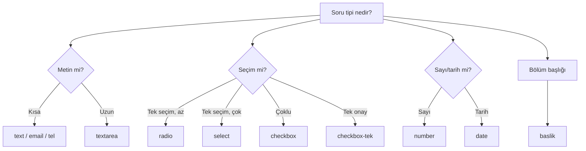

# Alan Tipleri

Bir forma ekleyebileceğiniz **11 alan tipi** vardır. Hangisini ne zaman kullanacağınız bu sayfada:

## Metin alanları

### Tek satır metin (`text`)
**Kısa metin** içindir. Ad, soyad, şehir gibi.

> ☐ *Ad Soyad*

### Çok satırlı metin (`textarea`)
**Uzun yazılar** içindir. Notlar, mesaj, açıklama.

> ☐ *Sorularınız veya notlarınız*

### E-posta (`email`)
Sistem `@` ve domain kontrolü yapar. Geçersiz format girilemez.

> ☐ *E-posta adresiniz*

### Telefon (`tel`)
Mobilde sayısal klavye açılır. Telefon formatı doğrulanır.

> ☐ *Cep telefonu* (`0549 355 61 54`)

### Sayı (`number`)
Sadece rakam girilebilir. Yaş, sınıf seviyesi, kardeş sayısı.

> ☐ *Kaç kardeşi var?*

### URL (`url`)
İnternet adresi formatı. Sosyal medya profili istenirken kullanılır.

## Seçim alanları

### Açılır liste (`select`)
**Çok seçenek varsa** (5+) ya da yer kazanmak istiyorsanız.

> Sınıf seviyesi: [⌄ 7. Sınıf ▼]
> Seçenekler: 5. Sınıf, 6. Sınıf, 7. Sınıf, 8. Sınıf

### Tek seçim (radyo) (`radio`)
**Az seçenek varsa** (2-5) ve görsel olarak göstermek istiyorsanız.

> Cinsiyet:
> ⚪ Erkek  ⚪ Kız

### Çoklu seçim (checkbox) (`checkbox`)
**Birden fazla seçenek** işaretlemek için.

> İlgi alanları:
> ☐ Matematik  ☐ Fen  ☐ Sosyal  ☐ Türkçe

### Tek onay (`checkbox-tek`)
Tek bir kutu — **KVKK gibi onay** için ideal.

> ☐ Kişisel verilerimin işlenmesini kabul ediyorum.

### Tarih (`date`)
Doğum tarihi, etkinlik günü seçimi.

> ☐ Doğum tarihi: [📅 2010-05-12]

### Başlık (`baslik`)
**Soru değildir** — bir bölüm başlığı eklemek için. Veliyi formda yönlendirir.

> *— Öğrenci Bilgileri —*

## Hangi alanı ne zaman?



## Zorunlu işareti

Her alan için **"Zorunlu mu?"** kutusu vardır. İşaretlerseniz:

- Veli o alanı boş bırakırsa form gönderemez
- Etikette **kırmızı yıldız (\*)** görünür

Genelde temel iletişim bilgileri (Ad, Telefon) zorunlu, "Ek not" tipi alanlar opsiyoneldir.

## Yardım metni

Her alanın altında küçük gri metinle bir **yardım açıklaması** yazabilirsiniz:

> **Telefon \*** [_____________]
> *Cep telefonu olmasını öneririz, sabit hat da çalışır.*

Bu özellikle teknik alanlarda velinin doğru veri girmesini sağlar.

## Seçenek metinleri

`select`, `radio`, `checkbox` için seçenekleri **alt alta** yazarsınız:

```
5. Sınıf
6. Sınıf
7. Sınıf
8. Sınıf
```

Her satır bir seçenektir.

## İpuçları

- **Az soru, çok cevap.** Veliler uzun formdan korkar. En kritik 5-7 soru yeterli olabilir.
- **Sıralı mantık.** Önce kişisel bilgi, sonra öğrenci bilgisi, sonra tercih, en sonda mesaj/notlar.
- **KVKK onayı her zaman.** Kişisel veri toplayan tüm formlarda en altta zorunlu bir `checkbox-tek` ekleyin.
- **Test edin.** Formu yayına aldıktan sonra mutlaka kendiniz açıp doldurun. Sonra Cevaplar'dan kendi cevabınızı silin.
