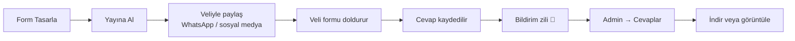

# Form Mantığı

Bu bölüm, formların **nasıl çalıştığını** açıklar. Yeni form oluşturmaya geçmeden önce bir bakın — neyi neden yaptığınızı bilmek hata yapmayı engeller.

## Form nedir?

**Form**, velilerin/öğrencilerin size bilgi göndermesi için bir kutudur. Örnekler:

- *"LGS 2025 Ön Kayıt Formu"* — kayıt almak için
- *"Bilim Atölyesi Başvuru"* — etkinliğe katılım için
- *"Memnuniyet Anketi"* — geri bildirim için

Sistem **Google Forms gibi** çalışır ama kendi sitenizdedir — Google'a veri göndermezsiniz, tüm veriler sizin yönetiminizdedir.

## Akış

## Form ile cevap arasındaki ilişki

- Her formun **kendi cevap koleksiyonu** vardır.
- Bir form **silinirse**, sistem o formun cevaplarını siler mi? **Hayır** — cevaplar arşivde kalır. Ama panel'den göstermesi karmaşıklaşır.
- En iyisi: bir formu silmek yerine **Yayında**'yı kapatın. Cevaplar erişilebilir kalır.

## Forma bağlantı verme

Hazır bir formu paylaşmanın üç yolu:

1. **Doğrudan link** — `https://siteniz.com/basvuru.html?form=<form-id>`
2. **Duyuruyla bağlamak** — [Forma Bağlama](#/duyurular/form-baglama)
3. **Başvuru sayfasında "varsayılan" yapmak** — [Varsayılan Form](#/formlar/varsayilan-form)

> [!İPUCU]
> En basit: **bir tane formunuz varsa**, "Varsayılan" işaretleyin. `/basvuru.html` adresine giren herkes otomatik o formu görür. Birden fazla form varsa duyurularla bağlayın.

## Yayında / Taslak

- **Yayında ✓** — site üzerinden veliler bu formu doldurabilir.
- **Yayında olmayan** (taslak) form — sadece admin panelinden görünür, siteye yansımaz.

Çoğu zaman bir form yayında kalır. Sezonsal formlar (örneğin "Yaz Etüt Başvuru") için: dönem sonunda taslağa çekebilirsiniz.

## Form yapısı

Her form şu parçalardan oluşur:

| Parça | Ne | Örnek |
|---|---|---|
| **Form Adı** | Velinin gördüğü başlık | "LGS 2025 Ön Kayıt" |
| **Açıklama** | Kısa giriş metni | "Lütfen tüm alanları doldurun." |
| **Alanlar** | Soru kutuları | "Ad Soyad", "Telefon", "Sınıf" |
| **Teşekkür Mesajı** | Gönderme sonrası gösterilen mesaj | "Başvurunuz alındı. 2 gün içinde aranacaksınız." |

## Sonraki adım

Form oluşturma adımları için: [Yeni Form Oluşturma](#/formlar/yeni-form)
