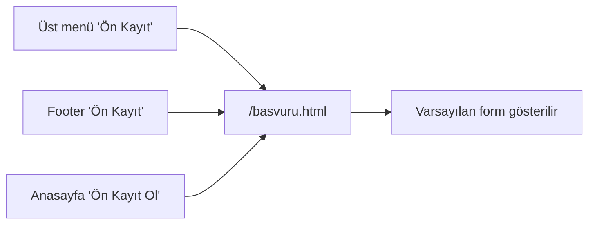
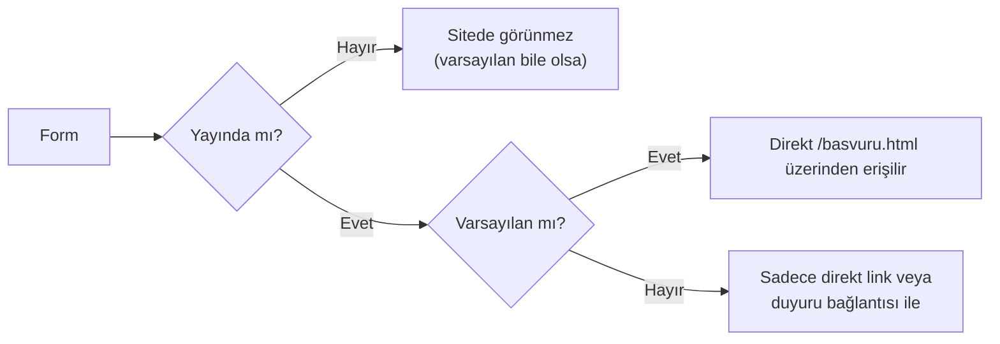

# Varsayılan Form

Tek bir form "varsayılan" olarak işaretlenebilir. **`/basvuru.html` adresine giren herkes** otomatik o formu görür.

## Ne işe yarar?

Site footer'ında, anasayfada ve menüde **"Ön Kayıt"** linkleri vardır. Bu linkler `/basvuru.html` adresine gider. Bu sayfaya giren biri **varsayılan formu** görmelidir.

Varsayılan ayarlanmamışsa: `/basvuru.html` adresi *"Şu anda yayında form bulunmuyor"* mesajı gösterir.

## Nasıl ayarlanır?

<ol class="adim-listesi">
<li><strong>Formlar</strong> sayfasında varsayılan yapmak istediğiniz formu açın.</li>
<li>Form ayarlarında <strong>"Varsayılan form"</strong> kutusunu işaretleyin.</li>
<li><strong>Kaydet</strong>'e basın.</li>
</ol>

**Önemli:** Aynı anda sadece **bir** form varsayılan olabilir. Yeni bir formu varsayılan yaparsanız, eski varsayılan kendiliğinden bu işaretini kaybeder.

## Hangi formu varsayılan yapmalıyım?

Pratikte:

| Durum | Varsayılan ne olmalı |
|---|---|
| Tek bir genel "Ön Kayıt" formunuz var | O form |
| Sezonlu olarak farklı formlar açılır (LGS, YKS, vs.) | O sezonun **ana** formu |
| Birden fazla form var ama biri genel iletişim için | Genel iletişim formu |

> [!İPUCU]
> Yıl içinde varsayılanı **dönemsel olarak güncelleyebilirsiniz**: Eylül-Ocak ana kayıt formu, Şubat-Mayıs yaz kursu formu vb.

## Varsayılan + Yayında

Varsayılan form aynı zamanda **Yayında** olmalıdır. Yayında olmayan bir form varsayılan olsa bile sitede görünmez.

## Bilmeniz gerekenler

- Her duyuru kendi formuna bağlanabilir — varsayılanla çakışmaz.
- Varsayılan değişirse, eski form silinmez — sadece "Varsayılan" işareti diğerine geçer.
- Form silinirse, bağlı duyurulardaki form bağlantısı temizlenir; varsayılan değildi ise hiç sorun olmaz.
