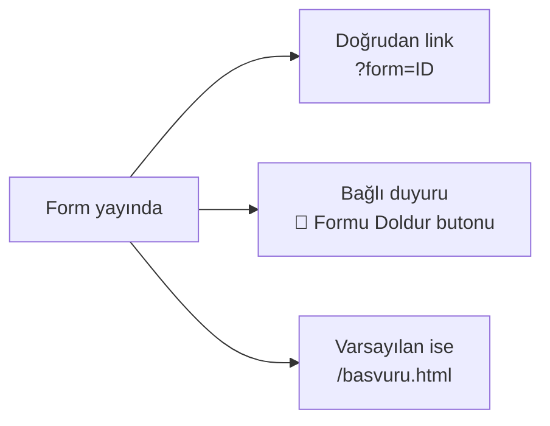

# Yayına Alma

Bir form **iki durumda** olabilir:

- **Taslak** — sadece admin görür, siteye yansımaz
- **Yayında** — site üzerinden veliler doldurabilir

## Yayına alma

<ol class="adim-listesi">
<li><strong>Formlar</strong> sayfasında ilgili formu açın.</li>
<li>Sağ panelin üst kısmında <strong>"Yayında"</strong> kutusunu işaretleyin.</li>
<li><strong>Kaydet</strong>'e basın.</li>
</ol>

> [!İPUCU]
> Yeni bir form oluşturduğunuzda **otomatik taslak**'tır. Bilerek "Yayında" işaretlemeniz gerekir — yanlışlıkla yarım form yayına çıkmaz.

## Yayından kaldırma (gizleme)

Bir formu geçici olarak kapatmak için:

1. Formu açın.
2. **Yayında** işaretini kaldırın.
3. **Kaydet**.

Sitede form yerine "Şu anda yayında form bulunmuyor" mesajı görünür (eğer varsayılan formsa).

Cevaplar **kayıp olmaz** — eski cevaplar Cevaplar sayfasında görüntülenmeye devam eder.

## Test önerisi

Yayına almadan önce mutlaka test edin:

<ol class="adim-listesi">
<li>Formu "Yayında" yapıp <strong>Kaydet</strong>'e basın.</li>
<li><strong>Siteyi Aç ↗</strong> ile siteyi yeni sekmede açın.</li>
<li>Formu doldurun (gerçek veya örnek bilgilerle).</li>
<li><strong>Gönder</strong>'e basın.</li>
<li>Admin paneline geri dönüp <strong>Cevaplar</strong> sayfasını kontrol edin.</li>
<li>Cevap geldiyse her şey çalışıyordur. Test cevabınızı silin (Cevaplar sayfasından).</li>
</ol>

## Form'a erişim yöntemleri

Yayında olan bir forma erişimin **3 yolu** vardır:



### 1. Doğrudan link
```
https://siteniz.com/basvuru.html?form=lgs-2025-on-kayit
```
WhatsApp ve sosyal medyada paylaşmak için.

### 2. Duyuru üzerinden
Form'u bir duyuruyla bağlayın → duyurunun altında **"📝 Formu Doldur"** butonu çıkar. Bkz. [Forma Bağlama](#/duyurular/form-baglama).

### 3. Varsayılan form
**Tek bir form** "Varsayılan" işaretlenir → `/basvuru.html` adresine giren herkes otomatik o formu görür. Bkz. [Varsayılan Form](#/formlar/varsayilan-form).

## Süreli formlar

Bir formu **belirli bir süre boyunca** açık tutmak istiyorsanız (örneğin "Erken kayıt 31 Mayıs'a kadar"):

- Süre dolunca **Yayında**'yı işaretsiz yapın.
- Cevaplar admin panelinde kalır, ama yeni veli form göremez.

> [!İPUCU]
> Süreli formların adına tarih ekleyin: *"LGS 2025-2026 Ön Kayıt (1 Mayıs – 30 Haziran)"* — kim ne zaman dolduruğunu sonradan ayırt etmek kolay olur.
