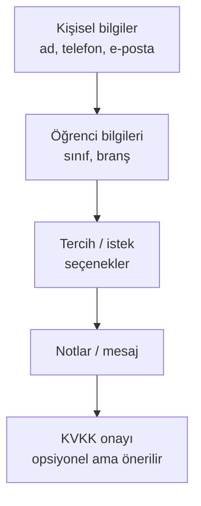

# Yeni Form Oluşturma

**Yer:** Üst menü → **Formlar** → **+ Yeni Form**

## Adım adım

<ol class="adim-listesi">
<li><strong>+ Yeni Form</strong> düğmesine basın.</li>
<li>Sağ panelde formun temel bilgilerini girin (aşağıda).</li>
<li><strong>Alan Ekle</strong> düğmesiyle sorularınızı tasarlayın.</li>
<li>Sıralamayı oklarla düzeltin.</li>
<li>Önce <strong>taslak</strong> olarak kaydedin, sonra "Yayında" işaretleyin.</li>
</ol>

## Temel bilgiler

### Form Adı (zorunlu)
Velinin gördüğü başlık. Örnek: *"LGS 2025-2026 Ön Kayıt Formu"*

### Açıklama
Form üstünde gösterilen kısa açıklayıcı metin. 1-3 cümle.

> *Lütfen aşağıdaki alanları eksiksiz doldurun. Sizinle 1-2 iş günü içinde iletişime geçeceğiz.*

### Teşekkür Mesajı
Veli formu gönderdiğinde **gördüğü mesaj**. Sıcak ve bilgilendirici olsun:

> *Başvurunuz alındı, teşekkür ederiz. En kısa sürede sizinle iletişime geçeceğiz.*

Boş bırakırsanız varsayılan bir mesaj gösterilir.

## Alan ekleme

Her alan bir sorudur. **+ Alan Ekle** düğmesi açılır menü gösterir; alan tipini seçin.

Detaylı alan tipi listesi: [Alan Tipleri](#/formlar/alan-tipleri)

Her alan için:

- **Etiket** — sorunun metni (örn. *"Ad Soyad"*)
- **Yardım metni** (opsiyonel) — etiketin altında küçük açıklama (örn. *"Velinin tam adı"*)
- **Zorunlu mu?** — işaretliyse veli bunu boş bırakamaz
- **Placeholder** (bazı alanlar için) — gri örnek metin (örn. *"Örn: 0549 355 61 54"*)

## Sıralama

Her alan kartında **↑** / **↓** okları vardır. Soruları istediğiniz sıraya getirin.

Genellikle:



## KVKK onayı

Form veli kişisel verilerini topluyorsa, **"Kişisel verilerimin işlenmesini kabul ediyorum"** gibi bir **checkbox-tek** alanı (zorunlu işaretle) eklemenizi öneririz. KVKK aydınlatma metnine link verebilirsiniz: *"[KVKK metni](/kvkk.html)'ni okudum"*.

## Tamamladıktan sonra

1. Formu **Kaydet**.
2. Hâlâ **taslak** ise sitede görünmez — Form listesinde **Yayında** kutusunu işaretleyip kaydedin.
3. Test edin: **Siteyi Aç ↗** → `/basvuru.html?form=<id>` veya varsayılan ise direkt `/basvuru.html`.

## Forma erişim linki

Form kaydedildikten sonra her formun **kendine özel ID'si** vardır. Form listesinde göreceksiniz.

Link şu şekildedir:
```
https://siteniz.com/basvuru.html?form=<form-id>
```

Bu linki WhatsApp grubu / sosyal medyada paylaşabilirsiniz.

> [!İPUCU]
> Tek bir formunuz varsa, daha temiz görünmesi için linki ID'siz şekilde kullanın: `https://siteniz.com/basvuru.html` ve formu "Varsayılan" işaretleyin. Bkz. [Varsayılan Form](#/formlar/varsayilan-form).
