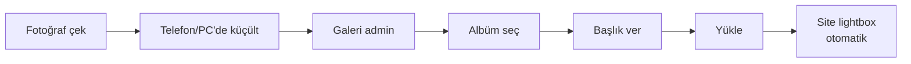

# Galeri: Düzenleme ve Silme

## Görsel başlığını değiştirme

1. Galeri sayfasında ilgili görselin kartına tıklayın.
2. Sağ panelde **başlık** alanını düzenleyin.
3. **Kaydet**.

## Albümü değiştirme

1. Görsele tıklayın.
2. **Albüm** açılır menüsünden yeni albümü seçin.
3. **Kaydet**.

## Görseli değiştirme (aynı kartı tutup)

Mevcut bir görseli farklı bir fotoğrafla değiştirmek için:

1. Görsele tıklayın.
2. **Görseli Değiştir** düğmesine basın.
3. Yeni fotoğrafı seçin.
4. **Kaydet**.

Başlık ve albüm bilgileri korunur, yalnızca görsel değişir.

## Görseli silme

<ol class="adim-listesi">
<li>Galeri sayfasında ilgili görsele tıklayın.</li>
<li>Sağ panelde <strong>Sil</strong> düğmesine basın.</li>
<li>Onay penceresinde <strong>Tamam</strong>.</li>
<li>Görsel hem listeden hem sunucudan silinir.</li>
</ol>

> [!TEHLIKE]
> Silinen görsel **geri alınamaz**. Şüpheli durumda önce yerel bir yedek tutun (bilgisayarınıza indirin).

## Şüpheli durumda — toplu silme

Yıl sonu temizliği yapmak isterseniz: Şu an toplu silme özelliği yok. Her görseli tek tek silmeniz gerekir. Çok eski görselleri (örneğin geçen yılki etkinlik) **albümden çıkarmak yerine silmek** daha temiz olabilir.

## Görsel açıklama metni / SEO

Görsel başlığı **alt metin** olarak da kullanılır:

- Ekran okuyucu için erişilebilirlik
- Google'da görsel araması için

Bu nedenle her görsel için en azından kısa, anlamlı bir başlık girmenizi öneririz.

## Pratik öneri

Etkinlik sonrası tek seferde:
1. Tüm fotoğrafları telefonda **albüm**'e koyun.
2. Çoklu Yükleme ile hepsini sürükleyin.
3. Toplu olarak aynı albüme atayın.
4. İsterseniz başlıkları daha sonra düzeltin.
