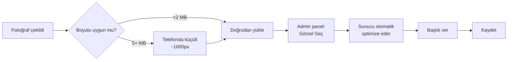

# Görsel Yüklerken

Site genelinde fotoğraf, logo, duyuru kapağı, blog görseli vb. çok yerde görsel yüklersiniz. Bu sayfa **görselleri doğru hazırlamanız** için ipuçlarıdır.

## Format

| Format | Ne için | Notlar |
|---|---|---|
| **JPG** | Fotoğraflar | En yaygın, dosya küçük |
| **PNG** | Logolar, şeffaf arka plan | Dosya biraz daha büyük |
| **WebP** | Modern fotoğraf formatı | En küçük dosya boyutu |
| **GIF** | Animasyonlu görüntüler | Genelde önerilmez |

JPG çoğu durumda yeterli.

## Çözünürlük (piksel)

| Kullanım | Tavsiye |
|---|---|
| **Logo** | 400×400 piksel, PNG |
| **Profil fotoğrafı** | 400×400 piksel, JPG |
| **Duyuru kapağı** | 1200×630 piksel, JPG (yatay) |
| **Blog kapağı** | 1200×630 piksel, JPG |
| **Hero slider görseli** | 1600×900 piksel (yatay 16:9), JPG |
| **Galeri fotoğrafı** | 1600×1200 piksel, JPG |
| **Program/Kadro görseli** | 800×600 piksel, JPG |

> [!İPUCU]
> Sistem yüklediğiniz görseli **otomatik küçültür ve optimize eder**. Yine de gerekenden çok büyük yüklemek (örneğin 5000×3000) yükleme süresini uzatır.

> [!İPUCU]
> **Hero (anasayfa üst görseli) için kırpma aracı.** Hero slaytına görsel seçtiğinizde, fotoğraf doğrudan yüklenmez; önce bir **kırpma penceresi** açılır. Orada fotoğrafı sürükleyip yakınlaştırır ve **Web · Tablet · Mobil** önizlemelerinden her cihazda nasıl görüneceğini görerek onaylarsınız. Çok yakınlaştırınca **düşük çözünürlük uyarısı** çıkar. Bu araç yalnızca **hero görselleri** içindir. Ayrıntı: [Hero Slider](#/anasayfa/hero-slider).

## Dosya boyutu

- **500 KB – 2 MB** ideal aralık.
- 5 MB'tan büyük dosyalar bazen reddedilebilir.
- Telefondan çekilmiş ham fotoğraflar genelde 4-8 MB olur — **küçültmeniz** önerilir.

## Telefonda görsel küçültme

iPhone: Fotoğrafı paylaşırken "**Boyut**" seçeneğinden **Orta**'yı seçin.
Android: Galerideki Düzenle → "**Yeniden boyutlandır**" → 1600 piksel seçin.

PC'de:
- Windows: Görseli sağ tıklayın → "**Düzenle**" → çözünürlüğü değiştirin.
- Mac: Önizleme'de Araçlar → "**Boyutu Ayarla**".

## Yön (oryantasyon)

**Yatay** (manzara) görseller genelde daha güzel görünür çünkü kart düzeni yatay.

İstisnalar:
- **Kadro fotoğrafı** → kare ya da dikey (portre) tercih edilir
- **Blog yazısı içi** → her ikisi de OK

## Görsel kalitesi

- Net olsun (bulanık ya da pikselli olmamalı).
- Çok karanlık veya çok parlak olmasın.
- Kurumsal sayfalar için: **profesyonel hava verecek** seçimler. Selfie veya gece çekimi yerine, gün ışığında çekilmiş net fotoğraflar.

## Telif hakkı

> [!UYARI]
> İnternette bulduğunuz **rastgele görselleri kullanmayın**. Telif hakkı sorununa yol açabilir. Güvenli kaynaklar:
> - Kurumun **kendi çektiği fotoğraflar** (en garanti)
> - **Ücretsiz stok siteleri**: unsplash.com, pexels.com, pixabay.com
> - Ünlü temalar için **Wikimedia Commons**

Aynı kural **hero slider görselleri** için de geçerlidir: kurumun kendi fotoğrafı yoksa unsplash.com veya pexels.com gibi ücretsiz stok sitelerinden indirdiğiniz görselleri rahatlıkla kullanabilirsiniz.

İnsan fotoğrafları için **modelin izni** alınmalı (özellikle çocuklar için **velinin imzalı izni**).

## Görsel başlığı (alt text)

Her görsel için **kısa bir açıklama** girmek önemli:

- Görme engelliler için ekran okuyucu bunu okur
- Google'da görsel araması için
- Görsel yüklenmediğinde yerine yazı görünür

İyi açıklama: *"2024 LGS mezunlarımız sertifika törende"*
Kötü açıklama: *"image001.jpg"* veya boş

## Görsel optimizasyon araçları (opsiyonel)

Daha küçük dosya boyutu için:

- [TinyPNG](https://tinypng.com) — JPG / PNG ücretsiz sıkıştırma
- [Squoosh](https://squoosh.app) — Google'ın açık kaynak aracı

Bu sitelere görseli sürükleyin → optimize edilmiş halini indirin → admin panele yükleyin.

## Genel akış

