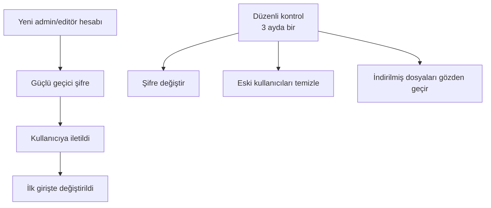

# Güvenlik Tavsiyeleri

Yönetim panelinde sakladığınız bilgiler **kurumun varlığıdır**: veli telefonları, başvuru cevapları, içerikler. Bu bilgilerin güvenliği için aşağıdaki tavsiyelere uyun.

## Hesap güvenliği

### Güçlü şifre kullanın
- En az **12 karakter** (8 yeterli ama 12+ daha iyi).
- Büyük harf + küçük harf + rakam + sembol karışımı.
- Doğum tarihi, çocuk adı, "1234", "sifre" gibi tahmin edilebilir şeyleri **kullanmayın**.

Bkz. [Şifre Değiştirme — İyi şifre nasıl olur?](#/baslarken/sifre-degistirme)

### Şifreyi paylaşmayın
- Bir başkasıyla **aynı hesabı** kullanmayın. Onun için ayrı bir hesap açın.
- Şifrenizi WhatsApp, e-posta gibi yerlerde **yazmayın**. Sözlü iletin veya geçici bir yöntemle paylaşın.
- Şifreyi **kâğıda yazıp masada bırakmayın**. Şifre yöneticisi (1Password, Bitwarden, Apple Keychain) kullanmak en iyisidir.

### Düzenli olarak değiştirin
- **3-6 ayda bir** kendi şifrenizi değiştirin.
- Bir kullanıcı işten ayrıldığında hesabını **derhal silin** veya pasif yapın.

## Oturum güvenliği

### Çıkış yapma
- Ortak bilgisayar kullanıyorsanız, işiniz bittiğinde **mutlaka çıkış** yapın.
- Tarayıcıyı kapatmak yetmez — **Çıkış** düğmesini kullanın.

### Otomatik çıkış
- Sistem belirli süre işlem yapılmayınca güvenlik için otomatik çıkış yaptırabilir.
- Bu normal — yeniden giriş yapın.

### Şüpheli giriş
- Hesabınıza izinsiz girildiğinden şüpheleniyorsanız, hemen **şifrenizi değiştirin**.
- Daha ciddi olduğunu düşünüyorsanız, **kurumun sistem sorumlusu**na haber verin.

## Cihaz güvenliği

### Bilgisayarınızı koruyun
- Bilgisayarınızda **ekran kilit şifresi** olsun (5 dakika sonra otomatik kilitlensin).
- Antivirüs / Windows Defender açık olsun.
- İşletim sistemi güncellemelerini erteleme. Güvenlik açıklarını kapatırlar.

### Mobil
- Telefonunuz **PIN / parmak izi / yüz kilidi** ile korunsun.
- Yöneticilik için kullandığınız tarayıcıya **otomatik giriş şifresi kaydet**erseniz, telefon kaybolduğunda risk artar.

### Wi-Fi
- Halka açık Wi-Fi (kafe, otel) üzerinden yönetici işlemi yapmayın. Saldırgan trafiği dinleyebilir.
- Mobil veri veya kurumun güvenli ağı kullanın.

## Veri güvenliği (KVKK)

Sistem **kişisel veri** içerir: veli ve öğrencilerin ad, telefon, e-postaları.

### İndirilen dosyalar
- CSV / PDF olarak indirdiğiniz cevapları **şifreli klasörde** veya **şifreli buluta** koyun.
- Dosyaları **rastgele paylaşmayın**.
- İhtiyacınız bittiğinde **kalıcı silin** (geri dönüşüm kutusunu da boşaltın).

### Üçüncü partilere veri verme
- Veli bilgilerini **dış kişilere** vermeyin.
- Yetkili olmayan bir öğretmene başvuru listesini WhatsApp'tan göndermek **KVKK ihlali** olabilir.

### Hatırlatıcı
Bir KVKK Aydınlatma Metni **mutlaka** sitenizde olmalıdır (zaten KVKK sayfası var). Bunu güncel tutun. Kuşkulu durumda **hukuki danışman**dan destek alın.

## Güvenlik checklist

| ☐ | Tüm aktif kullanıcıların şifresi son 6 ay içinde değişti |
| ☐ | İşten ayrılan kişilerin hesabı silindi/pasiflendi |
| ☐ | En az 2 admin hesabı var |
| ☐ | KVKK metni güncel ve sitede yayında |
| ☐ | İndirilen dosyalar güvenli yerde saklanıyor |
| ☐ | Bilgisayarınız ekran kilidiyle korumalı |

## Bir şey ters giderse

1. Hemen **etkilenen hesabın şifresini sıfırlayın**.
2. Diğer kullanıcılara durumu **bildirin** (onlar da değiştirsin).
3. **Kurumun teknik sorumlusu**na ulaşın.
4. Olayı **not edin** (ne zaman, ne oldu, ne yapıldı) — sonraki incelemeler için yararlı.
