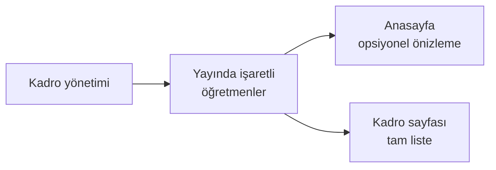

# Öğretmen Kartı Ekleme

**Eğitim Kadrosu** sayfasında öğretmenlerinizin tanıtım kartlarını yönetirsiniz.

**Yer:** Üst menü → **Kadro**

## Adım adım

<ol class="adim-listesi">
<li>Sağ üstteki <strong>+ Yeni Öğretmen</strong> düğmesine basın.</li>
<li>Sağ panelde formu doldurun.</li>
<li><strong>Kaydet</strong>'e basın.</li>
</ol>

## Form alanları

### Ad Soyad (zorunlu)
Öğretmenin tam adı. Örnek: *"Ayşe Yılmaz"*

### Unvan / Branş
Branşı veya görevi. Örnek: *"Matematik Öğretmeni"*, *"Türkçe Öğretmeni"*, *"Müdür Yardımcısı"*.

### Kısa Tanıtım
Öğretmenin **deneyimi, mezuniyeti veya kısa biyografisi**. 1-3 cümle yeterlidir.

İyi örnek:
> *Marmara Üniversitesi Matematik Öğretmenliği mezunu. LGS hazırlık alanında 8 yıllık deneyim. 2022'den beri kurumumuzda görev yapmaktadır.*

### Fotoğraf
Vesikalık veya profesyonel portre. **Kare format** öneriyoruz (kart yuvarlağa çekiyor). Bkz. [Görsel İpuçları](#/ipuclari/gorsel-ipuclari).

> [!İPUCU]
> Fotoğraf yoksa kart yine de gösterilir — sadece bir **isim baş harfi** rozeti olur. Yine de profesyonel görünüm için fotoğraf önerilir.

### Sosyal medya / E-posta (opsiyonel)
Öğretmenin profesyonel iletişim bilgisi. Boş bırakılabilir.

### Yayında
İşaretliyse Kadro sayfasında görünür.

## Sıralama

Öğretmenleri sıralamak için:
- Kart yanındaki **↑** / **↓** okları
- Genellikle **rütbe / kıdem** sırasına göre dizilir (müdür, müdür yardımcısı, sonra öğretmenler)

## Sitede gözükmesi

## Çoklu rol

Bir kişi birden fazla görevi varsa (örn. "Müdür Yardımcısı / Matematik Öğretmeni"), bunu **Unvan / Branş** alanına yazabilirsiniz. Tek bir kart açın.
