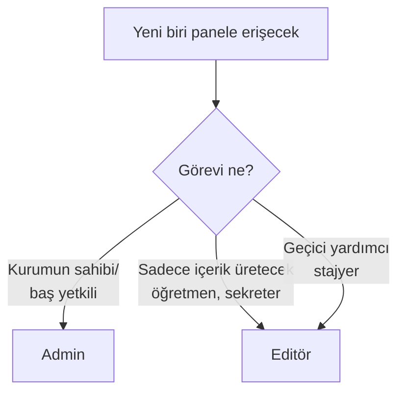

# Roller: Admin ve Editör

Sistemde iki rol vardır: **Admin** ve **Editör**. Her ikisi de admin paneline giriş yapar ama yetkileri farklıdır.

## Karşılaştırma

| Yetki | Admin | Editör |
|---|---|---|
| Duyuru ekle/düzenle/sil | ✅ | ✅ |
| Program / Kadro / Galeri yönet | ✅ | ✅ |
| Form oluştur, cevapları gör | ✅ | ✅ |
| Blog yazısı oluştur | ✅ | ✅ |
| Site ayarlarını değiştir | ✅ | ✅ |
| Yeni kullanıcı ekle | ✅ | ❌ |
| Kullanıcının şifresini sıfırla | ✅ | ❌ |
| Kullanıcı sil | ✅ | ❌ |
| Başka birinin yazılarını düzenle | ✅ | ❌ (sadece kendisi) |
| **Profilim** (kendi şifre/bilgi) | ✅ | ✅ |

## Hangi rolü kime vermeli?

### Admin rolü
Sadece **kurumun en yetkili kişisi** (veya 1-2 kişi) admin olmalıdır:
- Müdür / Kurum sahibi
- Sistem sorumlusu

### Editör rolü
Diğer tüm günlük işler için. Örnekler:
- İçerik editörü (duyuru, blog, galeri ekleyen kişi)
- Öğretmenler (kendi blog yazılarını yazar)
- Sekretarya (form cevaplarını takip eden)

> [!UYARI]
> **Admin yetkisini gereksiz vermeyin.** Admin başkasının şifresini sıfırlayabilir ve hesabını silebilir — bu güvenlik riski yaratır. Şüpheliyseniz **Editör** rolü yeterlidir.

## Rolü değiştirme

Admin rolündeyseniz başkasının rolünü değiştirebilirsiniz:

<ol class="adim-listesi">
<li><strong>Kullanıcılar</strong> sayfasına gidin.</li>
<li>İlgili kullanıcıyı seçin.</li>
<li><strong>Rol</strong> alanında "Admin" veya "Editör" seçin.</li>
<li><strong>Kaydet</strong>'e basın.</li>
</ol>

> [!TEHLIKE]
> **Kendinizin rolünü Editör'e düşürmeyin.** Yapsanız bile sistem buna izin verir, ama o anda admin yetkilerinizi kaybedersiniz. Geri vermek için **başka bir admin** gerekir. Tek admin sizseniz **bu işlemi yapmayın**.

## En az kaç admin olmalı?

**En az 2 admin** bulundurmanızı öneririz:

- Biri unutursa, diğeri şifreyi sıfırlar
- Biri kurumdan ayrılırsa, diğeri devreye girer

Tek admin riskli — şifreyi unutursanız teknik müdahale gerekir.

## Sonraki sayfalar

- [Yeni Kullanıcı Ekleme](#/kullanicilar/yeni-kullanici)
- [Şifre Sıfırlama](#/kullanicilar/sifre-sifirlama)
- [Profilim](#/kullanicilar/profil)
