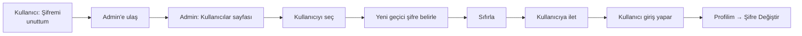

# Şifre Sıfırlama

> [!UYARI]
> **Sadece Admin** başkasının şifresini sıfırlayabilir. Kendi şifrenizi değiştirmek için: [Şifre Değiştirme](#/baslarken/sifre-degistirme).

## Bir kullanıcının şifresini sıfırlama

**Senaryo:** Bir öğretmen şifresini unuttu. Size soruyor. Yapacaklarınız:

<ol class="adim-listesi">
<li>Üst menüden <strong>Kullanıcılar</strong>'a gidin.</li>
<li>İlgili kullanıcıyı listeden bulun ve tıklayın.</li>
<li>Sağ panelde <strong>"Şifreyi Sıfırla"</strong> bölümünü bulun.</li>
<li><strong>Yeni geçici şifre</strong> alanına bir şifre yazın (en az 8 karakter).</li>
<li><strong>Sıfırla</strong> düğmesine basın.</li>
<li>Bildirim sonrası kullanıcının yeni şifresi aktif olur. Eski şifresi artık çalışmaz.</li>
</ol>

## Geçici şifre seçimi

Geçici şifre **kullanıcının hatırlayabileceği** ama **basit olmayan** bir şey olmalı. Örnekler:

- `Sifre-2026!`
- `Yeniden-1234`
- `Bahar-Mart-26`

> [!İPUCU]
> Her kullanıcı için **farklı bir** geçici şifre seçin. Tüm kullanıcılar için aynı şifre güvenlik riski yaratır.

## Kullanıcıya bildirme

Şifreyi sıfırladıktan sonra **kullanıcıya yeni şifreyi iletmeniz** gerekir. Telefon veya WhatsApp uygundur — e-postaya yazmayın (e-postalar güvensiz olabilir).

Örnek mesaj:

```
Merhaba Ahmet Bey,

Şifreniz sıfırlandı. Geçici şifreniz:
Sifre-2026!

Lütfen ilk girişten sonra Profilim sayfasından
kendi belirleyeceğiniz bir şifreyle değiştirin.
```

## Süreç



## Yetkisiz erişim şüphesi

> [!TEHLIKE]
> Birinin hesabına izinsiz girildiğinden şüpheleniyorsanız:
> 1. Hemen o kullanıcının şifresini **sıfırlayın**.
> 2. Yeni geçici şifreyi **sadece sahibine** iletin.
> 3. Diğer kullanıcılara durumu açıklayın; kendi şifrelerini de değiştirmelerini isteyin.
> 4. Sistemde son aktivite kayıtlarına bakılabilir (teknik destek gerekir).

## Sık karşılaşılan durumlar

**Yeni şifreyi kabul etmiyor**
- En az 8 karakter olmalı.
- Sadece rakam ya da hep aynı karakter olmamalı.

**Kullanıcı yine giriş yapamıyor**
- Kullanıcı adı doğru mu? (Bazen e-posta yerine kullanıcı adı yazıyorlar.)
- Şifrenin **başında veya sonunda** boşluk yok mu?
- Caps Lock kapalı mı?

**Kendi şifremi unuttum (admin'im)**
Eğer başka bir admin varsa: ona ulaşıp size sıfırlatın.
Tek admin sizseniz: **kurumun teknik sorumlusu** veritabanından sıfırlama yapabilir.

## Önleyici tedbir

- Her admin için **e-posta adresi** dolu olsun — ileride otomatik sıfırlama açıldığında çalışır.
- **En az 2 admin** bulundurun.
- Şifrelerinizi düzenli (3-6 ayda bir) değiştirin.
