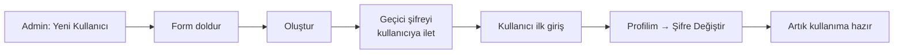

# Yeni Kullanıcı Ekleme

> [!UYARI]
> Bu işlemi sadece **Admin** rolündeki kullanıcılar yapabilir. Editör'seniz "Kullanıcılar" yerine "Profilim" görürsünüz.

**Yer:** Üst menü → **Kullanıcılar** → **+ Yeni Kullanıcı**

## Adım adım

<ol class="adim-listesi">
<li><strong>+ Yeni Kullanıcı</strong> düğmesine basın.</li>
<li>Açılan formu doldurun (alan açıklamaları aşağıda).</li>
<li><strong>Oluştur</strong>'a basın.</li>
<li>Yeni kullanıcı listede görünür. Ona giriş bilgilerini iletin.</li>
</ol>

## Form alanları

### Kullanıcı Adı (zorunlu)
**Sistemde benzersiz** olmalıdır. Sadece harf, rakam ve tire/alt çizgi kullanın.

İyi örnekler:
- `ayse.yilmaz`
- `ahmet_b`
- `matematik_ogr`

Kötü örnekler:
- `ayşe yılmaz` (boşluk olmaz)
- `123` (sadece rakam — anlamsız)
- `admin` (admin kelimesi başka kullanıcılarla çakışabilir)

### E-posta
Kullanıcıya **bildirim ve şifre sıfırlama** için kullanılır. Boş bırakılabilir ama önerilir.

### Ad Soyad
Kullanıcının **gerçek adı**. Blog yazılarında, "merhaba [Ad]" tipi mesajlarda gösterilir.

### Şifre (zorunlu)
**Geçici bir şifre** girin. Kullanıcı ilk girişten sonra **mutlaka kendi şifresine değiştirmelidir**.

Geçici şifre örneği: `Hosgeldin-2026!`

> [!İPUCU]
> Şifreyi siz kendiniz hatırlamayın — kullanıcıya iletip "Lütfen ilk girişten sonra değiştirin" deyin.

### Rol
**Admin** veya **Editör**. Detay için: [Roller](#/kullanicilar/roller).

## Yeni kullanıcıya ne anlatmalısınız?

Yeni kullanıcı oluşturduktan sonra ona şunları iletin (örneğin WhatsApp ile):

```
Merhaba Ahmet Bey,

İlk Adım Akademi yönetim paneline erişiminiz oluşturuldu.

Giriş adresi: https://siteniz.com/admin/
Kullanıcı adı: ahmet.b
Geçici şifre: Hosgeldin-2026!

Lütfen ilk girişten sonra Profilim sayfasından
şifrenizi kendi belirleyeceğiniz bir şifreyle değiştirin.

Yardım için: https://siteniz.com/admin/yardim.html
```

## Tipik akış



## Sınırlamalar

- Aynı **kullanıcı adı** veya **e-posta** ile iki hesap olamaz.
- Şifre en az 8 karakter olmalıdır.
- Yeni eklenen kullanıcı **hemen** giriş yapabilir.

## Sık karşılaşılan durumlar

**"Bu kullanıcı adı kullanılıyor" hatası**
Önceki bir kullanıcı (silinmiş bile olsa) aynı adı taşıyor olabilir. Farklı bir kullanıcı adı seçin (örn. `ayse.y2` veya `ayse_yilmaz`).

**Yeni kullanıcı giriş yapamıyor**
- Kullanıcı adını ve şifreyi **doğru ilettiniz mi**? Caps Lock?
- Hesap "pasif" olarak işaretlenmiş mi?
- Şifreyi sıfırlayıp yeniden iletmeyi deneyin.

**Yanlışlıkla admin yetkisi verdim**
Endişelenmeyin: Kullanıcıyı açıp **Rol**'u "Editör" yapın, kaydedin. Yetkileri anında değişir.
