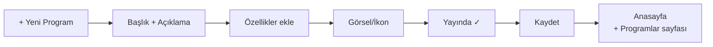

# Yeni Program Ekleme

**Eğitim Programları** sayfasında LGS, YKS, takviye gibi sunduğunuz tüm programları yönetirsiniz.

**Yer:** Üst menü → **Programlar**

## Adım adım

<ol class="adim-listesi">
<li>Sayfanın sağ üstündeki <strong>+ Yeni Program</strong> düğmesine basın.</li>
<li>Sağ panelde açılan formu doldurun.</li>
<li><strong>Kaydet</strong>'e basın.</li>
</ol>

## Form alanları

### Başlık (zorunlu)
Programın adı. Örnek: *"LGS Hazırlık Programı"*, *"YKS Lise 4 Programı"*, *"Hafta Sonu Takviye"*.

### Hedef Kitle
Bu programın **kime hitap ettiği**. Örnek: *"7-8. Sınıf Öğrencileri"*, *"12. Sınıf — Sayısal Bölüm"*.

### Açıklama
Programın içeriği, kapsamı, süresi. 2-4 cümle yeterlidir.

### Özellikler (madde madde)
Her satıra bir özellik yazın:

```
Haftalık 3 saat ana ders
Online + yüz yüze karma
Her ay deneme sınavı
Birebir veli görüşmesi
```

Bunlar program kartında **✓** işaretli liste olarak görünür.

### Görsel (opsiyonel)
Program kartının üstüne büyük bir görsel ekleyebilirsiniz. Boş bırakırsanız ikon ile gösterilir.

Detaylı: [Görsel İpuçları](#/ipuclari/gorsel-ipuclari)

### İkon (emoji)
Görsel kullanmadıysanız ikon görünür. Örnek emojiler: 📚 🎓 📖 ✏️ 🔬

### Yayında
İşaretliyse anasayfa + Programlar sayfasında görünür.

## Sıralama

Programlar **liste sırası** ile sitede görünür. Sırayı değiştirmek için: bkz. [Program Düzenleme](#/programlar/duzenleme).

## Sitede gözükmesi



İki yerde otomatik gösterilir:
1. **Anasayfa** → "Her Seviyeye Uygun Eğitim" bölümünde (ilk 3 program)
2. **Programlar** sayfası → tüm programlar tam listesi
