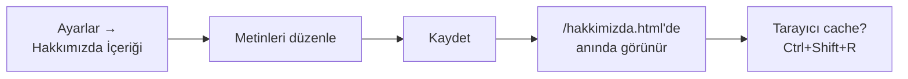

# Hakkımızda Sayfası İçeriği

`/hakkimizda.html` sayfasındaki tüm metinler buradan yönetilir. Sabit HTML
düzenlemeden, admin panelinden değiştirin.

**Yer:** Üst menü → **Ayarlar** → "Hakkımızda Sayfası İçeriği" bölümü

## Düzenlenebilen alanlar

| Alan | Sayfada nereye gelir |
|---|---|
| **Kuruluş Hikâyesi — 1. Paragraf** | "Kuruluş Hikâyemiz" başlığının altındaki ilk büyük metin |
| **Kuruluş Hikâyesi — 2. Paragraf** | Aynı bölümün ikinci paragrafı |
| **🎯 Misyonumuz** | Üç kartlı bölümün sol kartı |
| **🌟 Vizyonumuz** | Orta kart |
| **💎 Değerlerimiz** | Sağ kart |
| **Kurucu / Yönetici Fotoğrafı** | Kurucu Mesajı bölümünün solundaki görsel çerçevesi |
| **Kurucu Mesajı — Vurgu Cümlesi** | "Kurucu Mesajı" bölümünde tırnak içindeki büyük başlık |
| **Kurucu Mesajı — Metin** | Vurgu cümlesinin altındaki paragraf |
| **İmza (Ad / Görev)** | Mesajın sonundaki "— Ahmet Yılmaz / Kurum Müdürü" satırı |

## Kurucu / Yönetici Fotoğrafı

Hakkımızda sayfasında "Kurucu Mesajı" bölümünün solunda büyük bir fotoğraf alanı vardır.

### Fotoğraf eklemek
<ol class="adim-listesi">
<li><strong>Ayarlar → Hakkımızda Sayfası İçeriği</strong> bölümünü açın.</li>
<li>"Kurucu / Yönetici Fotoğrafı" alanını bulun.</li>
<li><strong>📁 Fotoğraf Seç</strong> düğmesine basın.</li>
<li>Bilgisayarınızdan kare veya 4:3 (örn. 800×600) bir fotoğraf seçin.</li>
<li>Önizleme küçük resmi anlık olarak güncellenir.</li>
<li>Sayfa altındaki <strong>💾 Değişiklikleri Kaydet</strong> düğmesine basın.</li>
</ol>

### Fotoğraf yoksa ne olur?
**Tüm fotoğraf çerçevesi sayfadan kaldırılır** — kurucu mesajı metni
otomatik olarak **tek sütuna yayılır**. Yani boş bir kare gözükmez, tasarım
düzgün kalır.

> [!İPUCU]
> Bu davranış kasıtlıdır. Fotoğrafınız hazır değilse modülü kapatmak yerine
> sadece fotoğraf alanını boş bırakabilirsiniz — sayfa metin-ağırlıklı ama
> dengeli görünür.

### Fotoğrafı kaldırmak / değiştirmek
- **Kaldırmak:** "🗑️ Kaldır" düğmesine basın → Kaydet.
- **Değiştirmek:** Yeni bir fotoğraf seçin (önceki otomatik üzerine yazılır) → Kaydet.

### Önerilen format
- **Boyut:** kare (1:1) veya yatay 4:3
- **Çözünürlük:** en az 600×450 piksel, üst sınır 1600×1200
- **Format:** JPG (önerilen) veya PNG
- **İçerik:** kurucu/yönetici net portresi; profesyonel arka plan

## Adım adım

<ol class="adim-listesi">
<li>Üst menüden <strong>Ayarlar</strong> sayfasına gidin.</li>
<li>"Hakkımızda Sayfası İçeriği" bölümünü bulun.</li>
<li>İlgili alana metninizi yazın.</li>
<li>Sayfa altındaki <strong>Değişiklikleri Kaydet</strong> düğmesine basın.</li>
<li><strong>Siteyi Aç ↗</strong> ile yeni sekmede /hakkimizda.html'e gidip kontrol edin.</li>
</ol>

## Paragraf araları

Metin alanlarında **iki kere Enter'a basarak** paragraf araları oluşturabilirsiniz.
Sitede satır araları korunur (sayfa düzeni bozulmaz).

```
Birinci paragraf burada bitiyor.

İkinci paragraf burada başlıyor.
Aynı paragrafta yeni satır da yapılabilir.
```

## Vurgu için kalın ya da italik

Kuruluş hikâyesi paragraflarında **HTML etiketi** kullanılabilir:

| Etiket | Etkisi | Örnek |
|---|---|---|
| `<strong>…</strong>` | **Kalın** | `<strong>Özel Ferizli İlk Adım</strong>` |
| `<em>…</em>` | *İtalik* | `<em>çok özel</em>` |
| `<br>` | Satır atlama | `1. satır<br>2. satır` |

> [!UYARI]
> HTML etiketleri **sadece "Kuruluş Hikâyesi" alanlarında** çalışır. Diğer alanlar
> (Misyon, Vizyon, Değerler, Kurucu mesajı) güvenlik için **düz metin** olarak işlenir;
> etiketleri yazsanız bile yazı olarak gözükür.

## Genel akış



## Modül durumunu da kontrol edin

Bu sayfanın görünebilmesi için **Hakkımızda modülünün açık** olması gerekir.

- Eğer Hakkımızda modülü **kapalıysa**, içeriği güncelleseniz bile sitede görünmez.
- Modülü açmak için: Ayarlar → "Modüller (Aç / Kapa)" → "Hakkımızda" kutusu işaretli.
- Detay: [Modüller (Aç / Kapa)](#/site-ayarlari/moduller).

## Pratik öneriler

- **Kuruluş hikâyesi** 2 paragrafla sınırlı tutulmuş — uzun yazıları okumak yerine
  net, samimi bir özet daha iyi karşılanır.
- **Misyon/vizyon/değerler** kartları 2-3 cümle ile sınırlı tutulsun. Her kart
  300 karakter altında kalsın — uzun olursa kartlar dengesiz görünür.
- **Kurucu mesajı vurgu cümlesi** kısa olsun (5-10 kelime). Cümle, tırnak içinde
  bir başlık gibi gösterilir; bir slogan/mantra olarak çalışır.
- **İmza** olarak "Kurum Müdürü Ahmet Yılmaz" veya benzeri net bir kişi/görev
  yazın. "Kurum Yönetimi" gibi belirsiz ifadeler az samimi durur.

## Test etme

Metinleri kaydettikten sonra mutlaka kontrol edin:

<ol class="adim-listesi">
<li><strong>Siteyi Aç ↗</strong> → /hakkimizda.html</li>
<li>Tüm bölümleri okuyun: hikâye, kartlar, kurucu mesajı.</li>
<li>Yazım hatası var mı?</li>
<li>Mobilde de açıp kontrol edin (özellikle uzun paragraflar).</li>
</ol>

## Sık karşılaşılan durumlar

**Yazdığım metin sitede yarım görünüyor**
- Çok uzun bir paragrafsa kart yüksekliği sınırı taşıyor olabilir.
- Misyon/Vizyon/Değerler kartlarında metni kısaltın.

**HTML etiketi (kalın, italik) çalışmadı**
- Yalnızca "Kuruluş Hikâyesi 1./2. Paragraf" alanlarında geçerlidir.
- Diğer alanlarda etiket yazı olarak gözükür (güvenlik için).

**Tüm metni temizlemek istiyorum**
- İlgili alanı boş bırakın ve **Kaydet**'e basın.
- Sayfada o paragraf boş bir alan olarak kalır (yer kaplar).
- Estetik için: ya başka bir metin yazın ya da **Hakkımızda modülünü kapatın**.
