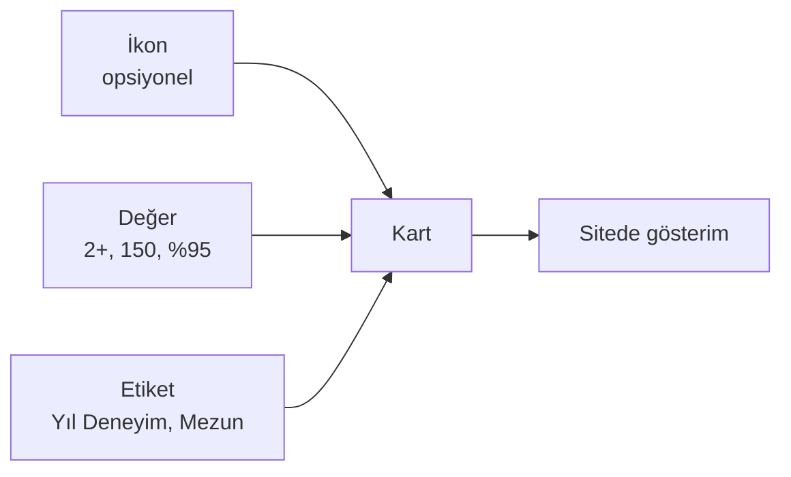

# İstatistik Kartları

Anasayfa ve Başarılarımız sayfasında gösterilen **rakam kartları** (örn. "**2+** Yıl Deneyim", "**150** Mezun Öğrenci") buradan yönetilir.

**Yer:** Üst menü → **Ayarlar** → "İstatistikler" bölümü

> [!UYARI]
> **Gerçek olmayan rakam kullanmayın.** Sahte/abartılı sayılar (örneğin kuruluşu 2023 olan kurum için "10 yıl deneyim") kurumun güvenilirliğini zedeler. Velilerin sosyal medyada tartışmasına neden olabilir. Şüphedeyseniz **kartı boş bırakın veya silin.**

## Her kart için üç alan

### İkon (emoji)
İsteğe bağlı. Kartın üstünde küçük bir emoji görünür. Örnekler:

- 🎓 Mezun öğrenci için
- 📅 Yıl / deneyim için
- 👨‍🏫 Öğretmen sayısı için
- 🎯 Hedef tutturma oranı için

Boş bırakırsanız kart sadece rakam ve etiketle gösterilir — eşit derecede güzel.

### Değer (zorunlu)
Gösterilecek **rakam veya kısa ifade**. Örnekler:

- `2+` (en az 2 yıl deneyim için)
- `150` (mezun öğrenci sayısı)
- `%95` (hedef tutturma oranı)
- `7/24` (destek)

Çok uzun olmasın — 5-6 karakter idealdir.

### Etiket (zorunlu)
Rakamın **ne olduğunu** anlatan kısa metin. Örnekler:

- `Yıl Deneyim`
- `Mezun Öğrenci`
- `Branş Öğretmeni`
- `Hedef Üniversiteye Yerleştirme`

## Kart ekleme / silme / sıralama

**Yeni kart eklemek:**
1. `+ Yeni İstatistik Ekle` düğmesine basın.
2. Ortaya çıkan kartın üç alanını doldurun.
3. Sayfa altındaki **Değişiklikleri Kaydet** ile kaydedin.

**Kart silmek:**
1. Silmek istediğiniz kartın sağındaki kırmızı **Sil** düğmesine basın.
2. Kart anında listeden kaybolur (ama kaydetmediyseniz "**Kaydet**" basana kadar gerçekten silinmez).

**Sıralama değiştirmek:**
1. Her kartın sağında **↑** (yukarı) ve **↓** (aşağı) okları vardır.
2. İstediğiniz sıraya göre okları kullanın.
3. **Kaydet** ile sırayı kalıcı yapın.

## Hiç kart yoksa ne olur?

İstatistik bölümü **tamamen gizlenir**. Anasayfa'da o boşluk olmaz, başka bir bölüm de bozulmaz. Bu özellik kasıtlıdır — şüphede kalırsanız hiç kart eklemeyin.

## Önerilen kart sayısı

| Sayfa | Kart sayısı |
|---|---|
| Anasayfa | **4 kart** (görsel olarak 4'lü grid'e oturur) |
| Başarılarımız | **4 kart** (aynı şekilde) |

3 veya 5 kart da çalışır ama 4 en estetiktir. Aynı kartlar her iki sayfada gösterilir; ayrı liste tutmaz.

## Önerilen başlangıç kartları

Eğer ne yazacağınızı bilmiyorsanız, başlangıç için aşağıdaki gibi gerçek değerlerle başlayabilirsiniz:

| İkon | Değer | Etiket |
|---|---|---|
| 📅 | `2+` | Yıl Deneyim |
| 👨‍🏫 | `5` | Branş Öğretmeni |
| 🎓 | `40` | Aktif Öğrenci |
| 📊 | `Haftalık` | Deneme Sınavı |

Yıllar geçtikçe rakamları güncelleyebilirsiniz. Ya da `2+` yerine `3` yapmak gibi küçük ama dürüst güncellemeler kurumsal gelişimi gösterir.

## Bilmeniz gerekenler

- İstatistikler **her iki ilgili sayfada da** (anasayfa + başarılarımız) aynı kartları kullanır.
- Değişiklikler **anında** siteye yansır.
- "Değer" alanı boş bırakılan bir kart sitede **gösterilmez** (yeni karda doldurmadan kaydetseniz bile bir şey bozulmaz).
