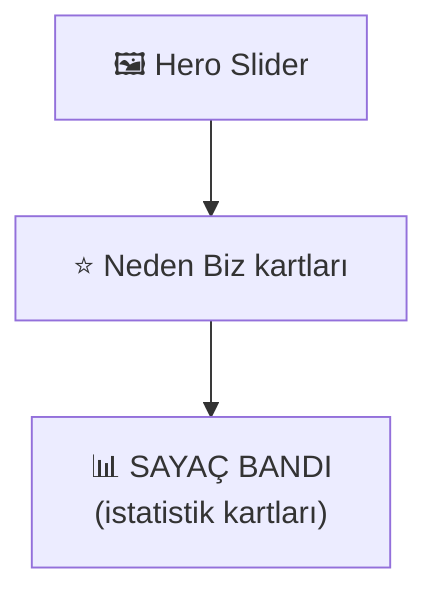
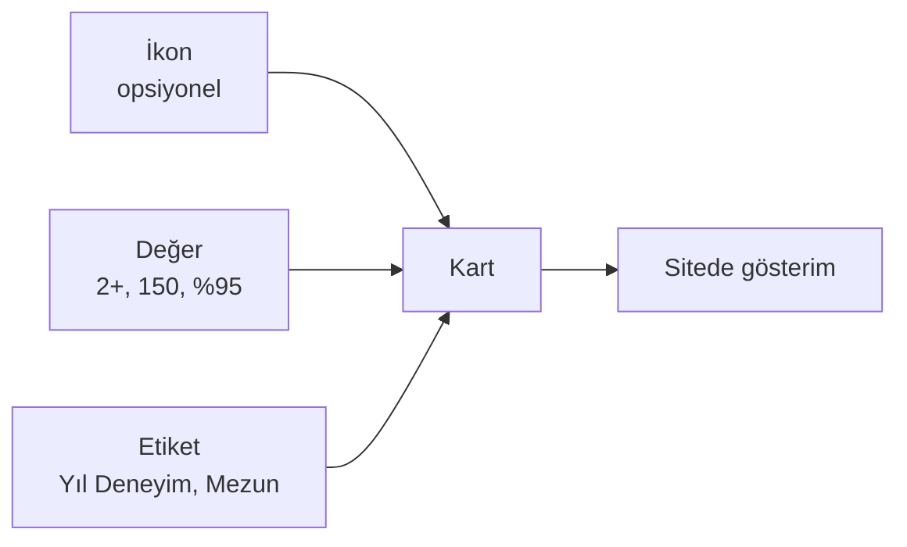

# İstatistik Kartları

Anasayfa ve Başarılarımız sayfasında gösterilen **rakam kartları** (örn. "**2+** Yıl Deneyim", "**150** Mezun Öğrenci") buradan yönetilir.

**Yer:** Üst menü → **Ayarlar** → "İstatistik Kartları" bölümü

> [!UYARI]
> **Gerçek olmayan rakam kullanmayın.** Sahte/abartılı sayılar (örneğin kuruluşu 2023 olan kurum için "10 yıl deneyim") kurumun güvenilirliğini zedeler. Velilerin sosyal medyada tartışmasına neden olabilir. Şüphedeyseniz **kartı boş bırakın veya silin.**

## Sitede nasıl görünür? — Sayaç Bandı

Anasayfada istatistikler artık ayrı bir **sayaç bandı** olarak gösterilir. Bu bant, **hero görselinin (büyük slider) ve "Neden Biz" kartlarının altında**, yan yana dizilen rakam kartları şeklinde durur. Sayfayı kaydırıp bu banda gelindiğinde dikkat çeker.

### Yukarı doğru sayma (count-up animasyonu)

Sayaç bandı ekrana girdiği anda rakamlar **0'dan başlayıp yukarı doğru sayar** ve gerçek değerinde durur — örneğin `2023` değeri 0'dan başlayıp hızla 2023'e çıkar. Bu küçük canlandırma, ziyaretçinin gözünü rakamlara çeker.

İki önemli ayrıntı:

- **Sadece içinde rakam olan değerler sayar.** `150`, `%95`, `2+` gibi rakam içeren değerler 0'dan yukarı doğru sayılır.
- **Tamamen yazı olan değerler olduğu gibi gösterilir.** Örneğin değeri `Haftalık` olan bir kart hiç saymaz; ekrana girer girmez aynen "Haftalık" yazar. Bu doğru ve istenen davranıştır — yazıyı saymaya çalışmaz.

> [!İPUCU]
> Bu sayede `7/24`, `%95`, `2+` gibi karışık değerler de düzgün çalışır: içindeki rakam yukarı doğru sayılır, yanındaki işaret (`%`, `+`, `/24`) korunur.

## Her kart için üç alan

### İkon (emoji)
İsteğe bağlı. Kartın üstünde küçük bir emoji görünür. Örnekler:

- 🎓 Mezun öğrenci için
- 📅 Yıl / deneyim için
- 👨‍🏫 Öğretmen sayısı için
- 🎯 Hedef tutturma oranı için

Boş bırakırsanız kart sadece rakam ve etiketle gösterilir — eşit derecede güzel.

### Değer (zorunlu)
Gösterilecek **rakam veya kısa ifade**. Örnekler:

- `2+` (en az 2 yıl deneyim için)
- `150` (mezun öğrenci sayısı)
- `%95` (hedef tutturma oranı)
- `7/24` (destek)

Çok uzun olmasın — 5-6 karakter idealdir.

### Etiket (zorunlu)
Rakamın **ne olduğunu** anlatan kısa metin. Örnekler:

- `Yıl Deneyim`
- `Mezun Öğrenci`
- `Branş Öğretmeni`
- `Hedef Üniversiteye Yerleştirme`

## Kart ekleme / silme / sıralama

**Yeni kart eklemek:**
1. `+ Yeni İstatistik Ekle` düğmesine basın.
2. Ortaya çıkan kartın üç alanını doldurun.
3. Sayfa altındaki **💾 Değişiklikleri Kaydet** ile kaydedin.

**Kart silmek:**
1. Silmek istediğiniz kartın sağındaki kırmızı **Sil** düğmesine basın.
2. Kart anında listeden kaybolur (ama kaydetmediyseniz "**Kaydet**" basana kadar gerçekten silinmez).

**Sıralama değiştirmek:**
1. Her kartın sağında **↑** (yukarı) ve **↓** (aşağı) okları vardır.
2. İstediğiniz sıraya göre okları kullanın.
3. **Kaydet** ile sırayı kalıcı yapın.

> [!UYARI]
> İstatistik Kartları, "Site Ayarları" sayfasındaki **katlanır bir bölümdür** — değişiklikler **anında kaydedilmez.** Kart eklediğinizde, sildiğinizde veya sıraladığınızda mutlaka sayfanın altındaki **💾 Değişiklikleri Kaydet** düğmesine basın, yoksa kapanınca değişiklikler kaybolur.

## Aç / Kapa — "Sayaç / İstatistik" anahtarı

Sayaç bandını artık **Modüller** bölümündeki **"Sayaç / İstatistik"** anahtarıyla da açıp kapatabilirsiniz.

**Yer:** Üst menü → **Ayarlar** → "Modüller — Aç / Kapa" bölümü → **📊 Sayaç / İstatistik**

İki durum vardır:

- **Veri yoksa otomatik gizlenir.** Hiç kart eklemediyseniz (ya da hepsi boşsa) bant zaten görünmez; ekstra bir şey yapmanıza gerek yok.
- **Veri olsa bile gizleyebilirsiniz.** Kartlarınız dolu olsa bile, bu anahtarı kapatarak sayaç bandını siteden gizleyebilirsiniz. Kartlar **silinmez** — anahtarı tekrar açtığınızda olduğu gibi geri gelir.

> [!İPUCU]
> Modüller bölümündeki bu anahtar **anında kaydedilir** (kutuyu işaretler işaretlemez geçerli olur, "Kaydet"e gerek yok). Bu, "İstatistik Kartları" bölümünün aksine çalışır — orada içerik değişiklikleri için Kaydet'e basmak gerekir. Modül anahtarlarının nasıl çalıştığını [Modüller (Aç / Kapa)](#/site-ayarlari/moduller) makalesinde okuyabilirsiniz.

## Hiç kart yoksa ne olur?

Sayaç bandı **tamamen gizlenir**. Anasayfa'da o boşluk olmaz, başka bir bölüm de bozulmaz. Bu özellik kasıtlıdır — şüphede kalırsanız hiç kart eklemeyin.

## Önerilen kart sayısı

| Sayfa | Kart sayısı |
|---|---|
| Anasayfa | **4 kart** (görsel olarak 4'lü grid'e oturur) |
| Başarılarımız | **4 kart** (aynı şekilde) |

3 veya 5 kart da çalışır ama 4 en estetiktir. Aynı kartlar her iki sayfada gösterilir; ayrı liste tutmaz.

## Önerilen başlangıç kartları

Eğer ne yazacağınızı bilmiyorsanız, başlangıç için aşağıdaki gibi gerçek değerlerle başlayabilirsiniz:

| İkon | Değer | Etiket |
|---|---|---|
| 📅 | `2+` | Yıl Deneyim |
| 👨‍🏫 | `5` | Branş Öğretmeni |
| 🎓 | `40` | Aktif Öğrenci |
| 📊 | `Haftalık` | Deneme Sınavı |

Yıllar geçtikçe rakamları güncelleyebilirsiniz. Ya da `2+` yerine `3` yapmak gibi küçük ama dürüst güncellemeler kurumsal gelişimi gösterir.

> [!İPUCU]
> Yukarıdaki örnekte ilk üç kart (`2+`, `5`, `40`) ekrana gelince 0'dan yukarı doğru sayılır; dördüncü kart "Haftalık" yazı olduğu için olduğu gibi gösterilir. Bu, sayaç bandının normal davranışıdır.

## Bilmeniz gerekenler

- İstatistikler **her iki ilgili sayfada da** (anasayfa + başarılarımız) aynı kartları kullanır.
- Kart içeriği değişiklikleri **💾 Değişiklikleri Kaydet** ile kaydedilir; "Sayaç / İstatistik" aç/kapa anahtarı ise **anında** geçerli olur.
- Anasayfada sayaç bandı; **hero ve "Neden Biz" kartlarının altında** ayrı bir şerit olarak görünür ve ekrana girince **yukarı doğru sayar.**
- "Değer" alanı boş bırakılan bir kart sitede **gösterilmez** (yeni karda doldurmadan kaydetseniz bile bir şey bozulmaz).
