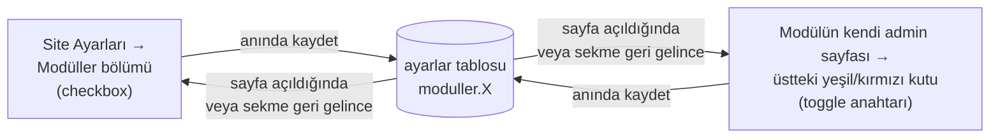
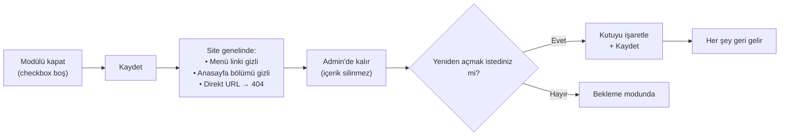

# Modüller (Aç / Kapa)

Sitede hangi bölümlerin görüneceğini buradan kontrol edersiniz. Bir modülü
kapattığınızda **veriler silinmez** — sadece sitede görünmez olur. Tekrar
açtığınızda olduğu gibi geri gelir.

## İki yerden de yönetilebilir

Hangi yolu seçerseniz seçin **aynı yere yazılır** — bir yerde değiştirdiğinizde
diğer yer de güncel gözükür. Sekme arkada açıkken başka sekmede değişiklik
yaparsanız, sekmeye geri döndüğünüzde durum otomatik tazelenir.

**İki yer:**
- **Toplu görünüm:** Üst menü → **Ayarlar** → "Modüller — Aç / Kapa" bölümü (6 modül tek listede)
- **Modüle özel:** Üst menü → **Duyurular** / **Programlar** / **Kadro** / **Galeri** / **Blog** sayfalarının üstünde yeşil/kırmızı durum kutusu + anahtar

## Yönetilebilen modüller

| Modül | Kapatınca ne olur |
|---|---|
| **🏛️ Hakkımızda** | Üst menüden ve footer'dan link kaybolur; anasayfadaki "kurum tanıtımı" bölümü gizlenir; `/hakkimizda.html` adresine girenler 404'e gider |
| **📚 Programlar** | Menüden kaybolur; anasayfadaki "Programlarımız" bölümü gizli; `/programlar.html` 404 |
| **👨‍🏫 Eğitim Kadrosu** | Menüden kaybolur; `/kadro.html` 404 |
| **📢 Duyurular** | Menüden kaybolur; anasayfadaki "Son Duyurular" gizlenir; `/duyurular.html` 404 |
| **🖼️ Galeri** | Menüden kaybolur; `/galeri.html` 404 |
| **✍️ Blog** | Menüden kaybolur; `/blog.html` 404. Yazıların kendisi silinmez — modül açılınca olduğu gibi geri gelir. |

> [!İPUCU]
> 6 modül de tek bir yerden (Ayarlar → Modüller) yönetilir. Eski sürümde Blog
> için ayrı bir toggle vardı; artık diğer modüllerle birlikte aynı yerden açıp
> kapatabilirsiniz.

## Nasıl kullanılır?

### Yol A — Toplu görünüm (Site Ayarları)

<ol class="adim-listesi">
<li><strong>Ayarlar</strong> sayfasına gidin.</li>
<li>"Modüller — Aç / Kapa" bölümünü bulun (varsayılan olarak açık gelir).</li>
<li>Açık tutmak istediğiniz modüller için kutuyu <strong>işaretli</strong> bırakın.</li>
<li>Kapatmak istediğinizin kutusunu <strong>boş</strong> yapın.</li>
<li><strong>Anında kaydedilir.</strong> "Kaydet"e basmanıza gerek yok — kutuyu işaretler işaretlemez sağ üstte yeşil bir bildirim çıkar.</li>
</ol>

### Yol B — Modülün kendi admin sayfası

<ol class="adim-listesi">
<li>Üst menüden ilgili modül sayfasına gidin (örn. <strong>Duyurular</strong>).</li>
<li>Sayfa başlığının altında <strong>yeşil veya kırmızı bir kutu</strong> görürsünüz.</li>
<li>Sağ tarafındaki <strong>anahtarı</strong> tıklayın → modül anında açılır/kapanır.</li>
<li>Renk değişir (🟢 yeşil = açık, 🔴 kırmızı = kapalı) ve bilgi metni güncellenir.</li>
</ol>

> [!İPUCU]
> Hangi yolu seçerseniz seçin, değişiklik **anında** geçerli olur ve diğer açık
> admin sekmelerine **otomatik yansır** (sekmeye geri dönünce durum tazelenir).

## Akış: bir modülü kapattığınızda

## Ne zaman bir modülü kapatırım?

- **Hakkımızda** kurum bilgileri henüz hazır değilse — boş "yapım aşamasında" sayfası göstermek yerine modülü kapatın.
- **Programlar** dönem dışında, program yapısı netleşmeden — kapalı tutup hazır olunca açın.
- **Eğitim Kadrosu** öğretmen fotoğrafları gelmeden — "Site Yöneticisi" gibi placeholder kart yerine modülü kapatın.
- **Duyurular** henüz hiç duyuru yoksa veya geçici sezonsal — kapalıyken anasayfa daha derli toplu görünür.
- **Galeri** fotoğraf yokken — boş bir albüm sayfası iyi gözükmez.

## Önemli uyarılar

> [!UYARI]
> **Paylaşılmış eski linkler 404'e gider.** Sosyal medyada (Instagram, WhatsApp,
> Facebook) ya da Google arama sonuçlarında eski bir link paylaştıysanız —
> örneğin `siteniz.com/programlar.html` — modülü kapattığınızda tıklayan
> veliler **"Sayfa Bulunamadı"** mesajı görür. Modülü yeniden açtığınızda
> eski linkler otomatik çalışmaya devam eder.

> [!UYARI]
> **Anasayfayla bağlantı.** Hakkımızda, Programlar ve Duyurular modülleri
> **anasayfada da** birer bölüm gösterir (kurum tanıtımı, program kartları,
> son 3 duyuru). Bu modülleri kapatınca anasayfadaki ilgili bölüm de gizlenir —
> anasayfa daha sade kalır. Kadro ve Galeri sadece kendi sayfalarında bulunur,
> anasayfayı etkilemez.

> [!İPUCU]
> **"Form var" duyuruları:** Bir duyuru bir forma bağlıysa (📝 Formu Doldur
> butonu olan duyurular) ve **Duyurular modülünü kapatırsanız**, o duyuru
> erişilemez olur. Ama form yine de çalışır — direkt link
> (`/basvuru.html?form=...`) açıktır. Form linkini sosyal medyada paylaşmış
> olabilirsiniz, oradan başvurular gelmeye devam eder.

## Senkronizasyon — iki yer hep aynı mı?

**Evet.** Çünkü iki UI da **aynı veritabanı kaydını** okuyup yazar:

- Site Ayarları'nda checkbox değiştirir → DB güncellenir → toast bildirimi
- Modül sayfasındaki toggle değiştirilir → aynı DB kaydı güncellenir → toast
- Açık olan diğer sekmeler → kullanıcı geri döndüğünde durum **otomatik tazelenir**

İki sekmede aynı anda çelişen değişiklik yapma ihtimali pratikte yok denecek
kadar düşüktür. Olursa **son yazan kazanır**, kaybeden tarafta sayfayı
yenileyince güncel değer gözükür.

## SSS

**Modülü kapattım ama menüde hâlâ görünüyor**
- Tarayıcı cache'i: **Ctrl+Shift+R** ile zorla yenileyin.
- Aynı pencerede admin paneli açıksa, sitenin sekmesini de yenileyin.

**Toggle'a bastım hiçbir şey olmadı**
- İnternet bağlantınızı kontrol edin.
- Toggle gri/devre dışı görünüyorsa: kaydetme işlemi sürüyordur, 1-2 saniye bekleyin.
- Kırmızı bir hata bildirimi çıktıysa sayfayı yenileyin ve tekrar deneyin.

**Bir kişi modülü kapattı, sayfayı görmüyorum bile**
- Yöneticinize danışın — istemeden kapatılmış olabilir.

**Modülün altındaki içeriği de tamamen silmek istiyorum**
- Modülü kapatın (içerik kalır, sadece görünmez).
- Sonra ilgili admin sayfasına (Programlar, Kadro, vb.) gidip kayıtları tek tek silebilirsiniz.

**Tüm modülleri kapatırsam ne olur?**
- Anasayfa hâlâ açılır ama içeriği sade kalır (sadece hero + iletişim CTA).
- Menüde sadece *Ana Sayfa* + *İletişim* görünür.
- Site "bakım modu" gibi gözükür.
