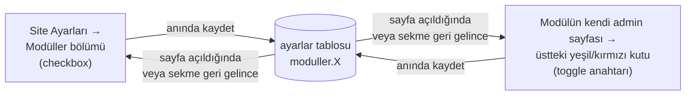
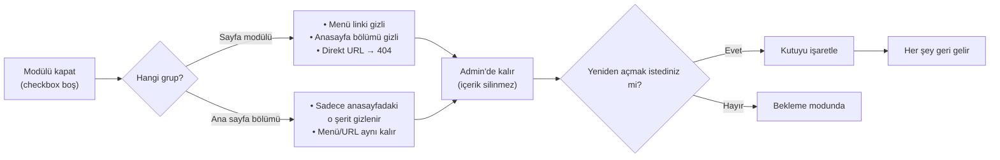

# Modüller (Aç / Kapa)

Sitede hangi bölümlerin görüneceğini buradan kontrol edersiniz. Bir modülü
kapattığınızda **veriler silinmez** — sadece sitede görünmez olur. Tekrar
açtığınızda olduğu gibi geri gelir.

**Yer:** Üst menü → **Ayarlar** → "Modüller — Aç / Kapa" bölümü

## İki grup modül var

Modüller bölümü iki gruptan oluşur ve hepsi **tek listede** yönetilir:

1. **Sayfa modülleri** — Hakkımızda, Programlar, Eğitim Kadrosu, Duyurular,
   Galeri, Blog. Bunlar sitede **birer sayfadır** (menüde link, kendi adresi var).
   Kapatınca menüden kaybolur ve adres 404'e gider.
2. **Ana sayfa bölümleri** — Hero Slider, Sayaç / İstatistik, Görüşler, Sıkça
   Sorulan Sorular. Bunlar ayrı sayfa **değildir**; sadece **anasayfanın içindeki
   bölümlerdir**. Kapatınca yalnızca o bölüm anasayfada gizlenir — menü ve
   adresler etkilenmez (404 olmaz).

Adminde her iki grup da aynı bölümün altında, üst üste iki ızgara olarak görünür.
İkinci ızgaranın başında "**Ana sayfa bölümleri**" başlığı vardır.

## İki yerden de yönetilebilir

Hangi yolu seçerseniz seçin **aynı yere yazılır** — bir yerde değiştirdiğinizde
diğer yer de güncel gözükür. Sekme arkada açıkken başka sekmede değişiklik
yaparsanız, sekmeye geri döndüğünüzde durum otomatik tazelenir.

> [!İPUCU]
> **Ana sayfa bölümlerinin** ayrı bir admin sayfası yoktur. Onları sadece
> Ayarlar → Modüller'den açıp kapatabilirsiniz. İçeriklerini ise yine
> **Ayarlar** sayfasındaki ilgili katlanır bölümlerden düzenlersiniz (aşağıdaki
> tabloda her birinin linki var).

**İki yer (sayfa modülleri için):**
- **Toplu görünüm:** Üst menü → **Ayarlar** → "Modüller — Aç / Kapa" bölümü (tüm modüller tek listede)
- **Modüle özel:** Üst menü → **Duyurular** / **Programlar** / **Kadro** / **Galeri** / **Blog** sayfalarının üstünde yeşil/kırmızı durum kutusu + anahtar

## Yönetilebilen modüller

### Sayfa modülleri

Bunlar sitede birer **sayfadır**. Kapatınca menü linki kaybolur ve adres 404 olur.

| Modül | Kapatınca ne olur |
|---|---|
| **🏛️ Hakkımızda** | Üst menüden ve footer'dan link kaybolur; anasayfadaki "kurum tanıtımı" bölümü gizlenir; `/hakkimizda.html` adresine girenler 404'e gider |
| **📚 Programlar** | Menüden kaybolur; anasayfadaki "Programlarımız" bölümü gizli; `/programlar.html` 404 |
| **👨‍🏫 Eğitim Kadrosu** | Menüden kaybolur; `/kadro.html` 404 |
| **📢 Duyurular** | Menüden kaybolur; anasayfadaki "Son Duyurular" gizlenir; `/duyurular.html` 404 |
| **🖼️ Galeri** | Menüden kaybolur; `/galeri.html` 404 |
| **✍️ Blog** | Menüden kaybolur; `/blog.html` 404. Yazıların kendisi silinmez — modül açılınca olduğu gibi geri gelir. |

### Ana sayfa bölümleri

Bunlar ayrı sayfa **değildir**; sadece **anasayfadaki bölümlerdir**. Kapatınca
yalnızca o bölüm anasayfada gizlenir — **menü ve adresler etkilenmez, 404 olmaz.**
İçeriğini düzenlemek için satırın sonundaki bağlantıya tıklayın.

| Bölüm | Kapatınca ne olur | İçeriği nereden düzenlerim? |
|---|---|---|
| **🖼️ Hero Slider** | Anasayfanın en üstündeki büyük görsel slider gizlenir; sayfa doğrudan diğer bölümle başlar. Menü ve adresler etkilenmez. | [Hero Slider](#/anasayfa/hero-slider) |
| **📊 Sayaç / İstatistik** | Rakamlarla kurum (count-up sayaç bandı) gizlenir. Menü/adres etkilenmez. | [İstatistik Kartları](#/site-ayarlari/istatistikler) |
| **💬 Görüşler** | Veli ve öğrenci yorumları bölümü anasayfada gizlenir. Menü/adres etkilenmez. | [Görüşler](#/anasayfa/gorusler) |
| **❓ Sıkça Sorulan Sorular** | Anasayfadaki SSS (soru-cevap) bölümü gizlenir. Menü/adres etkilenmez. | [SSS](#/anasayfa/sss) |

> [!İPUCU]
> Tüm modüller (sayfa modülleri + ana sayfa bölümleri) **tek bir yerden**
> (Ayarlar → Modüller) yönetilir. Eski sürümde Blog için ayrı bir toggle vardı;
> artık diğer modüllerle birlikte aynı yerden açıp kapatabilirsiniz.

> [!UYARI]
> **Sayfa modülü ile ana sayfa bölümünü karıştırmayın.** Bir **sayfa modülünü**
> kapatmak, o adrese girenleri "Sayfa Bulunamadı"ya gönderir. Bir **ana sayfa
> bölümünü** kapatmak ise yalnızca anasayfadaki o şeridi gizler — kimse 404
> görmez. İkisi de **anında** kaydedilir.

## Nasıl kullanılır?

### Yol A — Toplu görünüm (Site Ayarları)

<ol class="adim-listesi">
<li><strong>Ayarlar</strong> sayfasına gidin.</li>
<li>"Modüller — Aç / Kapa" bölümünü bulun (varsayılan olarak açık gelir).</li>
<li>Üstte <strong>sayfa modülleri</strong>, altında "Ana sayfa bölümleri" başlığıyla <strong>4 bölüm anahtarı</strong> görürsünüz.</li>
<li>Açık tutmak istediğiniz modüller için kutuyu <strong>işaretli</strong> bırakın.</li>
<li>Kapatmak istediğinizin kutusunu <strong>boş</strong> yapın.</li>
<li><strong>Anında kaydedilir.</strong> "Kaydet"e basmanıza gerek yok — kutuyu işaretler işaretlemez sağ üstte yeşil bir bildirim çıkar.</li>
</ol>

> [!UYARI]
> Bu **anlık kayıt** sadece "Modüller — Aç / Kapa" altındaki anahtarlar için
> geçerlidir. Hero, Görüşler, SSS gibi bölümlerin **içeriğini** (slaytlar,
> yorumlar, sorular) değiştirdiğinizde, sayfanın altındaki **💾 Değişiklikleri
> Kaydet** butonuna basmanız gerekir — onlar anlık kaydedilmez.

### Yol B — Modülün kendi admin sayfası (sadece sayfa modülleri)

<ol class="adim-listesi">
<li>Üst menüden ilgili modül sayfasına gidin (örn. <strong>Duyurular</strong>).</li>
<li>Sayfa başlığının altında <strong>yeşil veya kırmızı bir kutu</strong> görürsünüz.</li>
<li>Sağ tarafındaki <strong>anahtarı</strong> tıklayın → modül anında açılır/kapanır.</li>
<li>Renk değişir (🟢 yeşil = açık, 🔴 kırmızı = kapalı) ve bilgi metni güncellenir.</li>
</ol>

> [!İPUCU]
> Ana sayfa bölümlerinin (Hero, Sayaç, Görüşler, SSS) kendi admin sayfası
> olmadığı için onlarda Yol B yoktur — sadece Ayarlar → Modüller'den açıp
> kapatırsınız. Hangi yolu seçerseniz seçin, değişiklik **anında** geçerli olur
> ve diğer açık admin sekmelerine **otomatik yansır**.

## Akış: bir modülü kapattığınızda

## Ne zaman bir modülü kapatırım?

**Sayfa modülleri:**
- **Hakkımızda** kurum bilgileri henüz hazır değilse — boş "yapım aşamasında" sayfası göstermek yerine modülü kapatın.
- **Programlar** dönem dışında, program yapısı netleşmeden — kapalı tutup hazır olunca açın.
- **Eğitim Kadrosu** öğretmen fotoğrafları gelmeden — "Site Yöneticisi" gibi placeholder kart yerine modülü kapatın.
- **Duyurular** henüz hiç duyuru yoksa veya geçici sezonsal — kapalıyken anasayfa daha derli toplu görünür.
- **Galeri** fotoğraf yokken — boş bir albüm sayfası iyi gözükmez.

**Ana sayfa bölümleri:**
- **Hero Slider** henüz iyi bir tanıtım görseliniz yoksa — boş/zayıf bir slider yerine kapatıp sayfayı daha doğrudan başlatabilirsiniz.
- **Sayaç / İstatistik** gerçek ve dürüst rakamlarınız yoksa — abartılı sayı yazmak yerine bölümü kapalı tutun.
- **Görüşler** elinizde gerçek veli/öğrenci yorumu yoksa — uydurma yorum yerine bölümü kapatın.
- **Sıkça Sorulan Sorular** henüz soru-cevap listesi hazırlamadıysanız — hazır olunca açın.

## Önemli uyarılar

> [!UYARI]
> **Paylaşılmış eski linkler 404'e gider (yalnızca sayfa modüllerinde).**
> Sosyal medyada (Instagram, WhatsApp, Facebook) ya da Google arama
> sonuçlarında eski bir link paylaştıysanız — örneğin `siteniz.com/programlar.html`
> — bir **sayfa modülünü** kapattığınızda tıklayan veliler **"Sayfa Bulunamadı"**
> mesajı görür. Modülü yeniden açtığınızda eski linkler otomatik çalışmaya
> devam eder. **Ana sayfa bölümlerini** kapatmak hiçbir adresi 404 yapmaz.

> [!UYARI]
> **Anasayfayla bağlantı.** Hakkımızda, Programlar ve Duyurular modülleri
> **anasayfada da** birer bölüm gösterir (kurum tanıtımı, program kartları,
> son 3 duyuru). Bu modülleri kapatınca anasayfadaki ilgili bölüm de gizlenir.
> Hero, Sayaç, Görüşler ve SSS ise **zaten anasayfa bölümleridir** — kapatınca
> sadece o şerit anasayfadan kalkar. Kadro ve Galeri sadece kendi sayfalarında
> bulunur, anasayfayı etkilemez.

> [!İPUCU]
> **"Form var" duyuruları:** Bir duyuru bir forma bağlıysa (📝 Formu Doldur
> butonu olan duyurular) ve **Duyurular modülünü kapatırsanız**, o duyuru
> erişilemez olur. Ama form yine de çalışır — direkt link
> (`/basvuru.html?form=...`) açıktır. Form linkini sosyal medyada paylaşmış
> olabilirsiniz, oradan başvurular gelmeye devam eder.

## Senkronizasyon — iki yer hep aynı mı?

**Evet.** Çünkü iki UI da **aynı veritabanı kaydını** okuyup yazar:

- Site Ayarları'nda checkbox değiştirir → DB güncellenir → toast bildirimi
- Modül sayfasındaki toggle değiştirilir → aynı DB kaydı güncellenir → toast
- Açık olan diğer sekmeler → kullanıcı geri döndüğünde durum **otomatik tazelenir**

İki sekmede aynı anda çelişen değişiklik yapma ihtimali pratikte yok denecek
kadar düşüktür. Olursa **son yazan kazanır**, kaybeden tarafta sayfayı
yenileyince güncel değer gözükür.

## SSS

**Modülü kapattım ama menüde hâlâ görünüyor**
- Tarayıcı cache'i: **Ctrl+Shift+R** ile zorla yenileyin.
- Aynı pencerede admin paneli açıksa, sitenin sekmesini de yenileyin.

**Ana sayfa bölümünü kapattım ama menüde hiçbir şey değişmedi — normal mi?**
- Evet, normaldir. Hero, Sayaç, Görüşler ve SSS menüde link olarak zaten yoktur.
  Onlar sadece anasayfanın içindeki bölümlerdir; kapatınca yalnızca o bölüm
  anasayfada gizlenir.

**Toggle'a / kutuya bastım hiçbir şey olmadı**
- İnternet bağlantınızı kontrol edin.
- Toggle gri/devre dışı görünüyorsa: kaydetme işlemi sürüyordur, 1-2 saniye bekleyin.
- Kırmızı bir hata bildirimi çıktıysa sayfayı yenileyin ve tekrar deneyin.

**Bir kişi modülü kapattı, sayfayı görmüyorum bile**
- Yöneticinize danışın — istemeden kapatılmış olabilir.

**Modülün altındaki içeriği de tamamen silmek istiyorum**
- Modülü kapatın (içerik kalır, sadece görünmez).
- Sonra ilgili admin sayfasına (Programlar, Kadro, vb.) gidip kayıtları tek tek silebilirsiniz.

**Tüm modülleri kapatırsam ne olur?**
- Artık **Hero Slider** de kapatılabildiği için anasayfa daha da sade kalır:
  üstte büyük slider bile olmaz.
- Geriye sadece çok temel bir anasayfa ile iletişim CTA'sı kalır.
- Menüde yalnızca *Ana Sayfa* + *İletişim* görünür.
- Site "bakım modu" gibi gözükür — kurumunuzu tanıtan hiçbir bölüm kalmaz, bu
  yüzden en az birkaç bölümü açık tutmanız önerilir.
